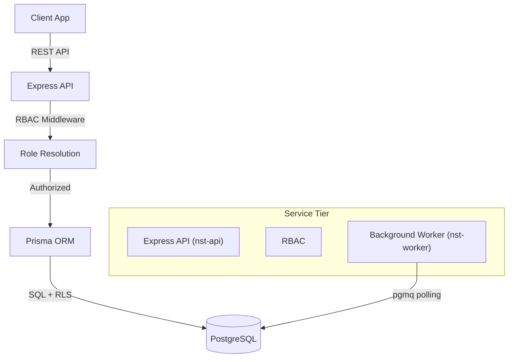

# API Architecture

## API Philosophy
NST-Events operates as a **Standard REST Architecture**: `Client → Express API → Prisma → PostgreSQL`.

The Express backend is the single entry point for all client applications. Clients (Expo mobile app and Next.js dashboard) communicate exclusively with the Express REST API — they never interact with the database directly.

## Trust Boundaries
* **Untrusted**: Mobile Clients, Web Browsers.
* **Trusted**: Express Backend, PostgreSQL Database.

## Client Trust Model
Clients are inherently untrusted. All requests must carry a valid JWT issued by the Express backend after successful Google OAuth. The Express RBAC middleware verifies the JWT and resolves the user's role before any route handler or database query executes. The database additionally enforces RLS as a secondary safety net.

## Execution Layers

### 1. Express REST API
All client-facing operations go through Express route handlers. Simple reads, writes, business logic, and complex atomic operations are all Express responsibilities. The concept of clients querying the database directly does not exist in this architecture.

### 2. PostgreSQL RPCs (called by Express via Prisma)
For complex atomic operations requiring `SELECT FOR UPDATE` locks or multi-table transactions (e.g., `register_event`, `mark_attendance`), the Express backend calls PostgreSQL stored procedures via Prisma's `$queryRaw` or `$executeRaw`. These RPCs run entirely within the database transaction boundary.

### 3. Express Route Handlers (Server-Side Logic)
Tasks that require external integrations or compute (QR token generation, webhook delivery) run as Express route handlers within the Node.js process.

### 4. Background Worker (nst-worker)
Heavy asynchronous tasks (like polling `pgmq` for notifications and calling the Expo Push API) are delegated to a separate Kubernetes Deployment (`nst-worker`) to avoid blocking the main API HTTP request loop.

### 4. Storage Access (TBD)
<!-- NEEDS REVIEW: Storage strategy TBD for V1. Options include Cloudflare R2, AWS S3, MinIO on NST Cluster, or deferring file uploads to V2. -->
File uploads will be pre-authorized by the Express backend — clients will receive signed upload URLs and never access storage with raw credentials.
