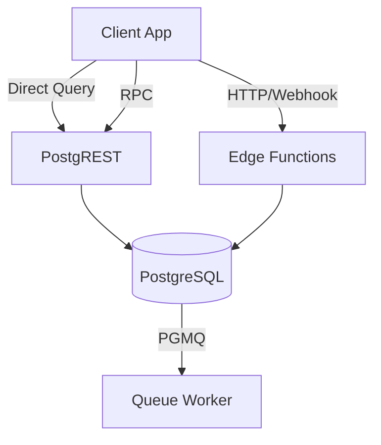

# API Architecture

## API Philosophy
NST-Events operates as a "Thick Client / Thin Serverless" architecture using Supabase. The PostgreSQL database *is* the API. We expose data via PostgREST and enforce authorization dynamically at the query layer via RLS.

## Trust Boundaries
* **Untrusted**: Mobile Clients, Web Browsers.
* **Trusted**: PostgreSQL Database, Supabase Auth, Deno Edge Functions.

## Client Trust Model
Clients are inherently untrusted. All requests must carry a valid Supabase JWT. The database does not trust the client to validate business logic (e.g., checking if a user is allowed to attend an event); the database computes this live during the transaction.

## Execution Layers

### 1. Direct Queries
Used exclusively for simple, non-destructive reads and basic inserts that do not require complex transactional locks.

### 2. RPCs (Remote Procedure Calls)
Used for complex database transactions, atomic operations (`SELECT FOR UPDATE`), and business logic that must execute purely within SQL to guarantee integrity.

### 3. Edge Functions
Used for external integrations, compute-heavy tasks, QR token cryptographic generation, and processing background queues.

### 4. Storage Access
Direct client uploads to Supabase Storage, secured by Storage RLS policies.\n