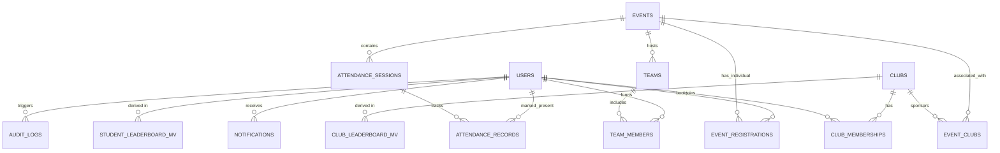

# Complete ER Diagram

## Relationship Explanations
* **USERS to CLUB_MEMBERSHIPS**: A user can hold different roles across different clubs. This is the core RBAC lookup.
* **EVENTS to ATTENDANCE_SESSIONS**: Every event has at least one session. Multi-day workshops will have multiple sessions. Attendance is always linked to a session.
* **EVENTS to TEAMS**: Registration can either be individual (`event_registrations` tied directly to user) or team-based.
