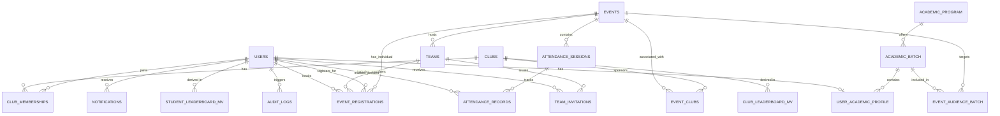

# Complete ER Diagram

```mermaid
erDiagram
    USERS ||--o{ CLUB_MEMBERSHIPS : joins
    CLUBS ||--o{ CLUB_MEMBERSHIPS : has
    CLUBS ||--o{ EVENT_CLUBS : sponsors
    EVENTS ||--o{ EVENT_CLUBS : associated_with
    EVENTS ||--o{ ATTENDANCE_SESSIONS : contains
    EVENTS ||--o{ EVENT_REGISTRATIONS : has_individual
    EVENTS ||--o{ TEAMS : hosts
    USERS ||--o{ EVENT_REGISTRATIONS : registers_for
    TEAMS ||--o{ EVENT_REGISTRATIONS : includes_members
    TEAMS ||--o{ TEAM_INVITATIONS : issues
    USERS ||--o{ TEAM_INVITATIONS : receives
    USERS ||--o{ EVENT_REGISTRATIONS : books
    ATTENDANCE_SESSIONS ||--o{ ATTENDANCE_RECORDS : tracks
    USERS ||--o{ ATTENDANCE_RECORDS : marked_present
    USERS ||--o{ NOTIFICATIONS : receives
    USERS ||--o{ STUDENT_LEADERBOARD_MV : "derived in"
    CLUBS ||--o{ CLUB_LEADERBOARD_MV : "derived in"
    USERS ||--o{ AUDIT_LOGS : triggers
    ACADEMIC_PROGRAM ||--o{ ACADEMIC_BATCH : offers
    ACADEMIC_BATCH ||--o{ USER_ACADEMIC_PROFILE : contains
    USERS ||--o| USER_ACADEMIC_PROFILE : has
    EVENTS ||--o{ EVENT_AUDIENCE_BATCH : targets
    ACADEMIC_BATCH ||--o{ EVENT_AUDIENCE_BATCH : included_in
```

## Relationship Explanations
* **USERS to CLUB_MEMBERSHIPS**: A user can hold different roles across different clubs. This is the core RBAC lookup.
* **EVENTS to ATTENDANCE_SESSIONS**: Every event has at least one session. Multi-day workshops will have multiple sessions. Attendance is always linked to a session.
* **EVENTS to TEAMS**: Registration can either be individual (`event_registrations` tied directly to user) or team-based.
* **ACADEMIC_PROGRAM to ACADEMIC_BATCH to USER_ACADEMIC_PROFILE**: Academic identity model. Email inference populates the batch, but admin assignment is authoritative. A student has exactly one current batch in V1.
* **EVENTS to EVENT_AUDIENCE_BATCH**: For `SPECIFIC_BATCHES` events, maps which `AcademicBatch` cohorts are eligible to view/register.
* **TEAMS to TEAM_INVITATIONS**: Team invitations operate distinctly from active membership (`event_registrations`), tracking the PENDING/ACCEPTED/DECLINED workflow for prospective team members.
