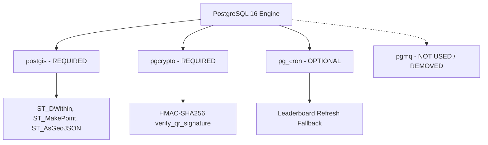

# PostgreSQL Architecture

This document defines the authoritative database architecture for the NST-Events platform deployed on the college K3s Kubernetes cluster.

---

## 1. Engine & Version Requirements

| Parameter | Value | Verification Source |
| :--- | :--- | :--- |
| **Database Engine** | PostgreSQL | `packages/database/prisma/schema.prisma` |
| **Exact Version Required** | **PostgreSQL 16** (specifically 16.3 / 16.4) | `docker/Dockerfile.postgres` (`postgis/postgis:16-3.4`), K8s StatefulSet specs |
| **Base Docker Image** | `postgis/postgis:16-3.4` (or `postgis/postgis:16-3.4-alpine`) | `docker/Dockerfile.postgres:1` |
| **SQL Dialect / Features** | PL/pgSQL, JSONB, GIN, BRIN, Advisory Locks, `SKIP LOCKED` | Migration history, stored procedures |

> [!IMPORTANT]
> **Image Discrepancy Resolution:**
> The repository previously contained conflicting container definitions:
> - `docker/Dockerfile.postgres`: `FROM postgis/postgis:16-3.4`
> - `infrastructure/kubernetes/postgres-statefulset.yaml`: `image: quay.io/tembo/pg16-pgmq:latest`
> 
> **Resolution:** The Tembo `pg16-pgmq` image is **REJECTED** and must NOT be used. It does not package PostGIS (causing instant migration crashes on `CREATE EXTENSION postgis`), and the `pgmq` extension is completely unused by the application. The production standard is `postgis/postgis:16-3.4`.

---

## 2. PostgreSQL Extensions Audit

Every extension in the migration history has been verified against actual codebase usage:



### Detailed Extension Matrix

| Extension | Required? | First Introduced | Codebase Usage & Purpose |
| :--- | :--- | :--- | :--- |
| **`postgis`** | **YES (MANDATORY)** | `20260803000000_init` | Core geospatial features. `events.location_geofence` is a `geography(Point, 4326)` column. Spatial checks use `ST_DWithin`, `ST_SetSRID`, `ST_MakePoint`, `ST_AsGeoJSON`. Without PostGIS, core event and attendance systems fail. |
| **`pgcrypto`** | **YES (MANDATORY)** | `20260812000001_phase18b_remediation` | Cryptographic functions. Specifically `hmac(..., 'sha256')` and `encode(..., 'base64')` used inside `verify_qr_signature` stored procedure for dynamic QR TOTP validation. (Note: `gen_random_uuid()` is native to PG 13+, but `hmac` requires `pgcrypto`). |
| **`pg_cron`** | **NO (OPTIONAL / DEGRADED SAFE)** | `20260806120000_phase5_attendance_leaderboard` | Attempted cron schedule for `REFRESH MATERIALIZED VIEW CONCURRENTLY` on leaderboard views. Wrapped in `DO $$ ... EXCEPTION WHEN OTHERS THEN RAISE NOTICE ... END $$;`. If unavailable, migrations succeed cleanly. `apps/api` independently refreshes materialized views via `leaderboard.service.ts`. |
| **`pgmq`** | **NO (UNSUPPORTED / UNUSED)** | Referenced only in old docs & K8s YAML | Zero usage across `apps/api`, `apps/worker`, and `packages/database`. The queue is implemented via `notification_jobs` using native `SELECT ... FOR UPDATE SKIP LOCKED`. Do not install `pgmq`. |

---

## 3. Database Deployment Architecture

### 3.1 College K3s Topology
PostgreSQL is deployed as a single-replica `StatefulSet` inside the K3s cluster:

- **Namespace:** `nst-events`
- **Workload Type:** `StatefulSet` (`nst-postgres`)
- **Service:** `nst-postgres-service` (`ClusterIP: 5432`, headless service `nst-postgres-service.nst-events.svc.cluster.local`)
- **Storage:** Longhorn PersistentVolumeClaim (`storageClassName: longhorn`), 3-way replicated across worker nodes `nst-n2` through `nst-n7`.
- **Probes:**
  - Liveness: `pg_isready -U postgres -d nst_events` (initial delay 30s, period 10s)
  - Readiness: `pg_isready -U postgres -d nst_events` (initial delay 10s, period 5s)

### 3.2 Resource Allocations
- **CPU Request / Limit:** `500m` / `2000m`
- **Memory Request / Limit:** `1Gi` / `4Gi`
- **Storage Request:** `20Gi` (initial baseline for data + WAL + indexes)

---

## 4. Operational & Memory Tuning

For the dedicated 16-3.4 container under a 4GB memory ceiling:

```ini
# Memory Configuration (Assuming 4GB container limit)
shared_buffers = 1GB                  # 25% of memory
effective_cache_size = 3GB            # 75% of memory
maintenance_work_mem = 256MB
work_mem = 16MB                       # Sized for max_connections = 100
wal_buffers = 16MB

# Checkpoints & WAL
min_wal_size = 512MB
max_wal_size = 2GB
checkpoint_completion_target = 0.9

# Connection Limits
max_connections = 100                 # API (2 pods * 15) + Worker (1 pod * 10) + Admins/Jobs (10) + Headroom

# Query Optimization
random_page_cost = 1.1                # Fast SSD / Longhorn storage
effective_io_concurrency = 200
default_statistics_target = 100
```

---

## 5. Security & Isolation Boundaries

PostgreSQL acts as an active security boundary through:
1. **Network Isolation:** No public LoadBalancer or Ingress exposes port 5432. The database is reachable solely inside the Kubernetes overlay network via `nst-postgres-service.nst-events.svc.cluster.local:5432`.
2. **Strict Role Separation:** 
   - `postgres`: Superuser / DDL administrator (only used for `prisma migrate deploy` and database administration).
   - `nst_app`: API runtime user. `NOSUPERUSER`, `NOBYPASSRLS`. Bound strictly by Row Level Security policies.
   - `nst_worker`: Background worker user. Isolated permissions restricted to job claiming, push token reads, and notification status updates.
3. **Transaction Context Security:** User identity is injected per-transaction using `SELECT set_config('app.user_id', ${userId}, true)` preventing cross-connection identity leaking in connection pools.
