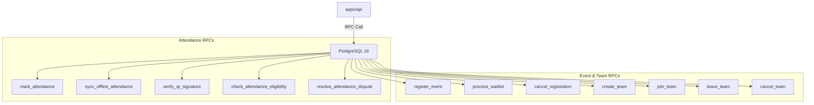

# PostgreSQL Functions, Triggers, & Views Catalog

This document details all stored procedures (RPCs), database triggers, standard views, and materialized views running in PostgreSQL, along with the application behaviors that depend on them.

---

## 1. Core Stored Procedures (Atomic RPCs)

NST-Events executes critical, race-condition-sensitive workflows inside PostgreSQL using PL/pgSQL stored procedures. This guarantees ACID transactional atomicity, eliminating concurrency bugs such as double-booking and registration over-capacity.



### 1.1 Attendance & Check-In Functions

#### `mark_attendance` (and versioned variant `mark_attendance_v5`)
- **Signature:**
  ```sql
  mark_attendance(
    p_session_id uuid,
    p_totp_token text,
    p_latitude double precision,
    p_longitude double precision,
    p_device_id text,
    p_device_os text,
    p_gps_accuracy double precision,
    p_mock_location_detected boolean,
    p_app_version text
  ) RETURNS attendance_records
  ```
- **Security:** `LANGUAGE plpgsql SECURITY DEFINER SET search_path TO 'public', 'pg_catalog'`
- **Application Flow:**
  1. Validates `current_user_id()` is authenticated (`U0001`).
  2. Verifies session exists, is open (`now() BETWEEN open_at AND close_at`), event is `PUBLISHED`, not locked (`U0005`, `U0006`).
  3. Executes strict geolocation checks: non-null (`U0009`), bounds check (`U0010`), accuracy $\le 100$m (`U0011`), mock location detection (`U0008`).
  4. Evaluates `ST_DWithin` with Phase 30 buffer: `v_geofence_radius + LEAST(p_gps_accuracy, 100.0)`.
  5. Evaluates academic batch eligibility via `check_attendance_eligibility`.
  6. Takes a PostgreSQL transaction-level advisory lock on `(session_id, device_id)` to serialize concurrent attempts on the same device.
  7. Detects device collision: if another user scanned on this device for this session, flags `device_collision_detected = true` and logs to `audit_logs`.
  8. Inserts record into `attendance_records` (`ON CONFLICT DO NOTHING`).
  9. If newly inserted and unflagged, atomically awards 5 points in `leaderboard_scores`.

#### `sync_offline_attendance` (and versioned variant `sync_offline_attendance_v9`)
- **Signature:** `sync_offline_attendance(p_payloads jsonb) RETURNS jsonb`
- **Application Flow:** Processes offline check-ins queued locally on student mobile devices during network blackouts.
- **Key Safeguards:**
  - Enforces `v_user_id := current_user_id();` ensuring an actor can only submit scans for themselves.
  - Sorts by device and scan timestamp to evaluate temporal order.
  - Validates event was not locked at the historical `scan_timestamp`.
  - Re-evaluates geofence against the historical coordinates.
  - Returns a detailed breakdown: `{"processed": N, "skipped": N, "errors": [...]}`.

#### `check_attendance_eligibility(p_event_id uuid, p_user_id uuid)`
- **Signature:** `check_attendance_eligibility(p_event_id uuid, p_user_id uuid) RETURNS boolean`
- **Application Flow:**
  - Checks if user is host club officer (club admins, core members, and faculty mentors have automatic attendance eligibility on their own events).
  - Verifies event is not locked.
  - For `SPECIFIC_BATCHES` events, checks if the user's batch matches `event_audience_batches` (`U0031`).
  - Verifies user has an active registration (`U0032`).

#### `verify_qr_signature(p_session_id uuid, p_scan_timestamp timestamptz, p_payload text, p_qr_secret text)`
- **Signature:** `verify_qr_signature(...) RETURNS boolean IMMUTABLE`
- **Application Flow:**
  - Parses payload `v1:<session_id>:<signature>`.
  - Computes 15-second epoch window: `floor(extract(epoch from p_scan_timestamp) / 15.0)`.
  - Computes HMAC-SHA256 via `pgcrypto` across windows `[epoch, epoch - 1, epoch + 1]` to allow 15-second clock drift.
  - Encodes to Base64URL and compares first 16 characters.

#### `resolve_attendance_dispute(p_dispute_id uuid, p_resolution text, p_review_notes text)`
- **Signature:** `resolve_attendance_dispute(...) RETURNS attendance_disputes`
- **Application Flow:**
  - Verifies caller has club admin or mentor authority for the event.
  - Updates dispute status to `APPROVED` or `REJECTED`.
  - If approved, updates or inserts the associated `attendance_records` status to `EXCUSED` (and `method = 'SYSTEM'`).

---

### 1.2 Event, Team, & Waitlist Functions

#### `register_event(p_event_id uuid)`
- **Application Flow:**
  - Locks event row `SELECT * FROM events WHERE id = p_event_id FOR UPDATE`.
  - Verifies event is published, registration type is `INDIVIDUAL`, and not locked.
  - Validates academic batch eligibility.
  - If `registration_count < max_capacity` (or capacity is unlimited):
    - Increments `registration_count`.
    - Inserts `event_registrations` with `registration_status = 'REGISTERED'`.
  - If full:
    - Inserts `event_registrations` with `registration_status = 'WAITLISTED'`.

#### `process_waitlist(p_event_id uuid)`
- **Application Flow:**
  - Called automatically after cancellations or capacity expansions.
  - Finds the oldest `WAITLISTED` registration ordered by `registered_at ASC`.
  - Promotes the status to `REGISTERED`.
  - Queues an atomic notification payload into `notification_jobs` for the promoted user.

#### `create_team(p_event_id uuid, p_name text)`
- **Application Flow:**
  - Normalizes team name: `lower(trim(p_name))`.
  - Enforces uniqueness within the event: checks unique constraint on `(event_id, normalized_name)`.
  - Inserts team with `status = 'FORMING'`, setting caller as `leader_id`.
  - Inserts initial leader registration.

#### `join_team`, `leave_team`, `cancel_team`, `transfer_leadership`
- Manage atomic membership transitions, capacity releases, and waitlist triggers without race conditions.

---

## 2. Database Triggers

| Trigger Name | Target Table | Timing / Event | Function Called | Purpose |
| :--- | :--- | :--- | :--- | :--- |
| **`enforce_global_role_protection`** | `users` | `BEFORE UPDATE` | `enforce_global_role_protection()` | Blocks non-admins from changing `global_role`. Prevents accidental or malicious self-demotion of the platform's last `PLATFORM_ADMIN`. |
| **`audit_club_memberships_trigger`** | `club_memberships` | `AFTER INSERT OR UPDATE OR DELETE` | `audit_club_membership_changes()` | Automatically captures old and new states for any role promotion/demotion and inserts an immutable record into `audit_logs`. |
| **`audit_attendance_records_trigger`** | `attendance_records` | `AFTER INSERT OR UPDATE OR DELETE` | `audit_attendance_records_changes()` | Automatically logs manual modifications, deletions, or status overrides into `audit_logs`. |

---

## 3. Database Views

### 3.1 Standard View: `public_profiles`
- **Definition:**
  ```sql
  CREATE OR REPLACE VIEW public_profiles AS
  SELECT 
    id,
    full_name,
    avatar_url,
    global_role,
    created_at,
    updated_at,
    deleted_at
  FROM users;
  ```
- **Prisma Representation:** Declared in `schema.prisma` via `view PublicProfile` (`@@map("public_profiles")`).
- **Security Purpose:** Exposes non-sensitive user metadata for public lookups (e.g. event organizers, member directories) while strictly shielding sensitive PII (`email` and `google_sub`). Granted to `nst_app`.

---

## 4. Materialized Views

### 4.1 `club_leaderboard_mv`
- **Purpose:** Pre-aggregates cumulative gamification points for all active clubs.
- **Index:** `CREATE UNIQUE INDEX club_leaderboard_mv_club_id_idx ON club_leaderboard_mv(club_id);`
- **Refresh Strategy:** `REFRESH MATERIALIZED VIEW CONCURRENTLY club_leaderboard_mv;` executed on demand and via `apps/api` leaderboard service endpoints.

### 4.2 `student_leaderboard_mv`
- **Purpose:** Pre-aggregates cumulative points for students for campus-wide ranking.
- **Index:** `CREATE UNIQUE INDEX student_leaderboard_mv_user_id_idx ON student_leaderboard_mv(user_id);`
- **Refresh Strategy:** Refreshed concurrently alongside `club_leaderboard_mv`.
