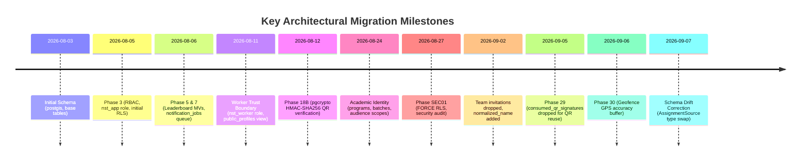
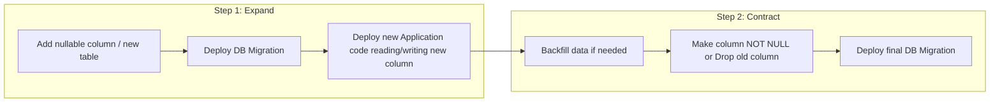

# Database Migration History & Deployment Strategy

This document details the complete 103-migration history of NST-Events, documents historical defects and breaking changes, and establishes the authoritative deployment rules for database migrations.

---

## 1. Migration History Summary

The repository contains 103 sequential migrations under `packages/database/prisma/migrations/`.



---

## 2. Destructive Migrations & Breaking Changes Audit

| Migration | Category | Changes Made | Production Impact & Rationale |
| :--- | :--- | :--- | :--- |
| **`20260902213638_remove_invitations_add_normalized_name`** | **DESTRUCTIVE (TABLE DROP)** | `DROP TABLE team_invitations CASCADE;`<br>`DROP TYPE InvitationStatus;` | Team invitations model was eliminated. Teams now use direct code/link joining with `join_team` RPC. Added `teams.normalized_name` with unique constraint `(event_id, normalized_name)`. |
| **`20260905000000_phase29_qr_reuse`** | **DESTRUCTIVE (TABLE DROP)** | `DROP TABLE consumed_qr_signatures CASCADE;` | Single-use QR signature tracking caused false rejections when multiple students scanned projected lecture hall codes. Table dropped; fraud mitigated via device collision detection. |
| **`20260902000000_event_banner` & `20260902000001_remove_event_banner`** | **SCHEMA REVERT** | Added `banner_url` to `events`, then immediately removed it in next migration. | File upload features were deferred in Database Freeze V1. Kept `events` lean without orphaned upload columns. |
| **`20260907000000_corrective_schema_drift`** | **TYPE SWAP & INDEX DROP** | Dropped orphaned `teams_event_id_name_key` index.<br>Type-swap on `AssignmentSource` enum. | Cleaned up 4 unused enum variants (`EMAIL_INFERENCE`, `ADMIN`, `SSO_PROVIDER_INFERENCE`, `MANUAL_SELECTION`) preserving only `INSTITUTIONAL_EMAIL_INFERENCE` and `ADMIN_OVERRIDE`. |

---

## 3. Historical Defects & Critical Lessons Learned

### The Enum Transaction Trap (PostgreSQL Error 55P04)
- **Defective Migration:** `20260827212000_hotfix_academic_enum`
- **Root Cause:** PostgreSQL enforces: *"New enum values must be committed before they can be used in data modifications."* Because Prisma wraps every `migration.sql` file in an atomic `BEGIN ... COMMIT` block, running `ALTER TYPE ... ADD VALUE 'NEW_VAL';` followed by `UPDATE ... SET col = 'NEW_VAL';` inside the same file unconditionally crashes on fresh databases with `55P04`.
- **Resolution:**
  1. Never alter an enum and update rows using that new value in the same migration file.
  2. To safely drop or mutate enum variants, execute a Type Swap: create `EnumType_new`, alter column using `USING col::text::EnumType_new`, rename old, rename new, drop old.

---

## 4. The Expand-and-Contract Deployment Rule

All future database migrations touching production MUST adhere to the **Expand-and-Contract Pattern** to ensure zero-downtime rolling updates:



### Prohibited Operations in a Single Pass
1. **Never drop or rename a column in use by the running API:** The old API pod will crash immediately upon issuing queries referencing the removed column before rolling update completes.
2. **Never add a `NOT NULL` column without a `DEFAULT`:** This breaks concurrent inserts from old API replicas.
3. **Never modify RPC parameter signatures in place:** Create a versioned RPC (e.g. `mark_attendance_v5`), migrate client callers, then drop the legacy function.

---

## 5. Kubernetes Migration Deployment Procedure

In the college K3s cluster, database migrations must NEVER run automatically on container startup within application pods (`apps/api` or `apps/worker`).

### Production Deployment Order
1. **Database Migration Job (Pre-Deploy Hook):**
   A dedicated Kubernetes `Job` executes before application pods roll:
   ```yaml
   apiVersion: batch/v1
   kind: Job
   metadata:
     name: nst-db-migrate-{{ .Release.Revision }}
     namespace: nst-events
   spec:
     template:
       spec:
         restartPolicy: Never
         containers:
           - name: migrate
             image: ghcr.io/nstsdc/nst-events-api:latest
             command: ["pnpm", "--filter", "@nst/database", "db:migrate:deploy"]
             env:
               - name: DATABASE_URL
                 valueFrom:
                   secretKeyRef:
                     name: nst-secrets
                     key: ADMIN_DATABASE_URL
   ```
2. **Application Rolling Update:**
   Once the migration Job terminates with exit code 0, Kubernetes rolls `apps/api` and `apps/worker` deployments.
