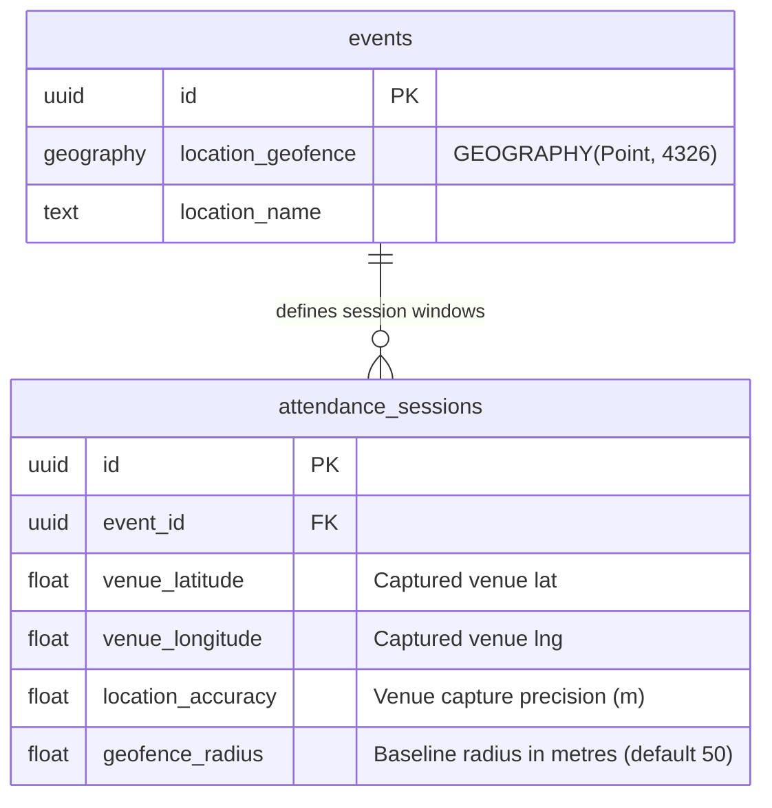
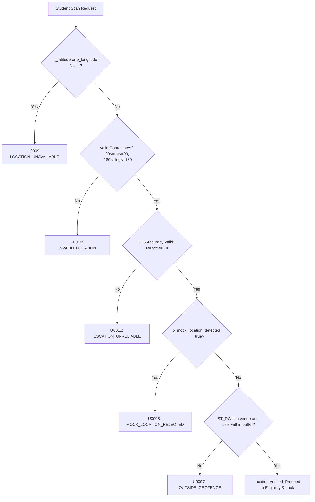

# PostGIS & Geospatial Verification Architecture

This document defines the authoritative geospatial architecture, coordinate systems, distance calculation formulas, and fraud-detection rules implemented in NST-Events via PostGIS.

---

## 1. Spatial Standards & Coordinate Reference System

| Parameter | Standard | Description / Implementation |
| :--- | :--- | :--- |
| **Spatial Extension** | **PostGIS** | Enabled via `CREATE EXTENSION IF NOT EXISTS postgis CASCADE;` |
| **Coordinate Reference System** | **EPSG:4326 (WGS 84)** | Standard global latitude/longitude coordinate system used by GPS and mobile devices. |
| **Spatial Type** | **`geography(Point, 4326)`** | Calculations are performed on the WGS 84 ellipsoidal surface with distance units in **metres**, avoiding planar projection distortion. |
| **Point Ordering** | **`(Longitude, Latitude)`** | `ST_MakePoint(x, y)` requires **longitude (X)** followed by **latitude (Y)**. Inverting them results in coordinates on wrong hemispheres. |

```sql
-- Canonical Point Constructor:
ST_SetSRID(ST_MakePoint(p_longitude, p_latitude), 4326)::geography
```

---

## 2. Storage Architecture



1. **`events.location_geofence`:** 
   - Stores the canonical geofence centroid as a PostGIS `GEOGRAPHY(Point, 4326)` column.
   - Indexed via a GiST index for fast spatial bounding box searches:
     ```sql
     CREATE INDEX IF NOT EXISTS "events_location_geofence_idx" 
     ON "events" USING GIST ("location_geofence");
     ```
2. **`attendance_sessions` Venue Snapshot:**
   - When an attendance session is created, the organizer's captured GPS fix is recorded into `venue_latitude`, `venue_longitude`, and `location_accuracy`.
   - These fields are immutable once initialized to prevent moving targets during active scan windows.
   - The default baseline `geofence_radius` is **50.0 metres**.

---

## 3. Geofence Distance Calculation & Validation

Geofence checks are executed inside the atomic PL/pgSQL stored procedures (`mark_attendance` and `sync_offline_attendance`).

### 3.1 The Spatial Predicate: `ST_DWithin`
Distance evaluation uses `ST_DWithin` on `geography` objects:

```sql
ST_DWithin(
    ST_SetSRID(ST_MakePoint(v_venue_longitude, v_venue_latitude), 4326)::geography,
    ST_SetSRID(ST_MakePoint(p_longitude, p_latitude), 4326)::geography,
    v_geofence_radius + LEAST(p_gps_accuracy, v_max_gps_buffer)
)
```

### 3.2 Phase 30 Geofence Accuracy Buffer
In migration `20260906000000_phase30_geofence_accuracy_buffer`, a critical operational fix was introduced:

Inside campus auditoriums, concrete structures cause mobile GPS horizontal accuracy (`p_gps_accuracy`) to degrade from 5m to 25m–40m. A strict 50m radius caused legitimate students sitting at the edges of lecture halls to be rejected with `OUTSIDE_GEOFENCE`.

- **Constant:** `v_max_gps_buffer FLOAT := 100.0;` (Maximum dynamic allowance in metres)
- **Effective Geofence Radius Formula:**
  $$\text{Effective Radius} = \text{v\_geofence\_radius} + \min(\text{p\_gps\_accuracy}, 100.0)$$

This expands the acceptance boundary by the device's reported GPS error margin up to a hard ceiling of 100m, preventing false rejections while maintaining boundary security.

---

## 4. Location Verification Pipeline (Anti-Fraud)

Every attendance scan passes through a strict sequential validation pipeline before the spatial query executes:



### Error Code Reference
| SQLSTATE Code | Error Constant | Trigger Condition |
| :--- | :--- | :--- |
| **`U0009`** | `LOCATION_UNAVAILABLE` | Latitude or longitude parameter is `NULL` |
| **`U0010`** | `INVALID_LOCATION` | Latitude $< -90$ or $> 90$, Longitude $< -180$ or $> 180$ |
| **`U0011`** | `LOCATION_UNRELIABLE` | GPS accuracy is `NULL`, negative, or $> 100.0$ metres |
| **`U0008`** | `MOCK_LOCATION_REJECTED` | Hardware/OS flags mock location or virtual GPS provider |
| **`U0007`** | `OUTSIDE_GEOFENCE` | Calculated physical distance exceeds effective radius |

---

## 5. Device Collision & Replay Protection

Physical proximity alone does not stop proxy check-ins (e.g., one student carrying multiple phones or scanning for absent friends):

1. **Advisory Transaction Lock:**
   ```sql
   PERFORM pg_advisory_xact_lock(hashtext(p_session_id::text), hashtext(p_device_id));
   ```
   Serializes concurrent scan attempts using the same hardware device identifier for a given session.
2. **Device Collision Detection:**
   If a device ID has already checked in for another user during the same session:
   - The scan is recorded with `audit_metadata.device_collision_detected = true`.
   - An audit trail entry `ATTENDANCE_DEVICE_COLLISION` is written to `audit_logs`.
   - Gamification leaderboard points (`leaderboard_scores`) are suppressed (0 points awarded instead of 5).
3. **Identity Binding:**
   In `sync_offline_attendance`, the scanned record is strictly bound to `current_user_id()`, preventing batch uploads on behalf of third-party user IDs.
