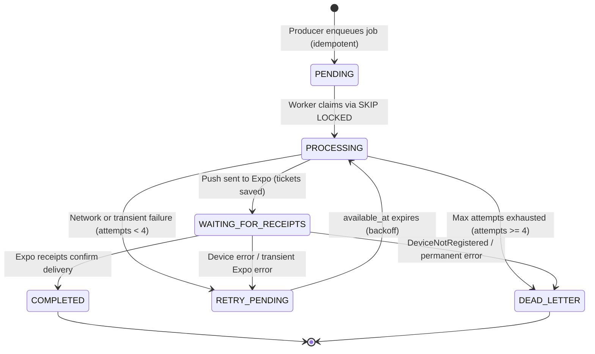

# Queue Architecture & Background Job Processing

This document definitively details the asynchronous queue architecture used in NST-Events, resolving previous conflicting references to queue mechanisms.

---

## 1. Authoritative Queue Engine Confirmation

| Mechanism | Used for Background Queue? | Actual Codebase Role | Verification |
| :--- | :---: | :--- | :--- |
| **`notification_jobs` (`FOR UPDATE SKIP LOCKED`)** | **YES (PRIMARY QUEUE)** | The sole background job queue mechanism for notification dispatching and push worker execution. | `apps/worker/src/worker.ts:50-57`, `apps/api/src/modules/notifications/notifications.producer.ts` |
| **`pgmq` Extension** | **NO (REJECTED / UNUSED)** | Zero implementation. Lingered only in outdated documentation and a single unverified K8s manifest image reference (`tembo/pg16-pgmq`). | Verified: zero imports, zero SQL extension calls across entire repo. |
| **PostgreSQL `LISTEN / NOTIFY`** | **NO (NOT FOR QUEUES)** | Used **strictly for SSE real-time events** (`event_<id>_live`), delivering instant browser/mobile UI updates. It is NOT a durable queue. | `apps/api/src/modules/sse/pg-listener.ts` |

---

## 2. The `notification_jobs` Table Architecture

The queue is stored in the public schema of PostgreSQL, enabling **transactional enqueueing**: an event state change, registration promotion, or announcement insertion can enqueue a notification job within the exact same database transaction.

```prisma
model NotificationJob {
  id             String                @id @default(uuid()) @db.Uuid
  status         NotificationJobStatus @default(PENDING)
  payload        Json
  priority       String                @default("NORMAL")
  attemptCount   Int                   @default(0) @map("attempt_count")
  maxAttempts    Int                   @default(4) @map("max_attempts")
  availableAt    DateTime              @default(now()) @map("available_at") @db.Timestamptz(6)
  lockedAt       DateTime?             @map("locked_at") @db.Timestamptz(6)
  workerId       String?               @map("worker_id")
  idempotencyKey String                @unique @map("idempotency_key")
  lastError      String?               @map("last_error")
  ticketIds      Json?                 @map("ticket_ids")
  createdAt      DateTime              @default(now()) @map("created_at") @db.Timestamptz(6)
  updatedAt      DateTime              @default(now()) @updatedAt @map("updated_at") @db.Timestamptz(6)

  @@map("notification_jobs")
}
```

### 2.1 Queue Lifecycle States


---

## 3. Worker Job Lifecycle (Claiming & Processing)

The background worker (`apps/worker`) runs a continuous polling loop with graceful shutdown capabilities:

### Step 1: Atomic Claiming with `FOR UPDATE SKIP LOCKED`
In `apps/worker/src/worker.ts`, jobs are claimed in a fast, isolated transaction:

```sql
SELECT * FROM notification_jobs 
WHERE 
  (status IN ('PENDING', 'RETRY_PENDING') AND available_at <= now())
  OR (status = 'PROCESSING' AND locked_at <= now() - interval '5 minutes')
  OR (status = 'WAITING_FOR_RECEIPTS' AND available_at <= now())
LIMIT :batch_size 
FOR UPDATE SKIP LOCKED;
```

- **Locking Semantics:** `FOR UPDATE SKIP LOCKED` guarantees that multiple worker pods or concurrent batch loops never compete for or double-process the same job.
- **Lease Recovery:** If a worker pod crashes mid-execution, jobs stuck in `PROCESSING` whose `locked_at` exceeds 5 minutes are automatically reclaimed.
- **Short Transaction:** Inside the claim transaction, the worker updates claimed jobs to `status = 'PROCESSING'` and sets `locked_at = now()`. The transaction commits immediately.

### Step 2: Out-of-Transaction Dispatching
The worker processes and transmits notifications **outside the database transaction**:
1. Groups notification recipients into batches.
2. Formats Expo push payloads.
3. Dispatches HTTP requests to `https://exp.host/--/api/v2/push/send` using `expo-server-sdk`.

### Step 3: Receipt Tracking (`WAITING_FOR_RECEIPTS`)
Expo push dispatching is asynchronous:
- The push response returns Expo **ticket IDs**.
- The worker saves these tickets:
  ```sql
  UPDATE notification_jobs 
  SET status = 'WAITING_FOR_RECEIPTS', 
      ticket_ids = :ticketIds, 
      available_at = now() + interval '15 minutes'
  WHERE id = :jobId;
  ```
- 15 minutes later, the worker polls `https://exp.host/--/api/v2/push/getReceipts`.
- If receipts confirm delivery: updates `status = 'COMPLETED'` and marks in-app `notifications` as `delivered_at = now()`.
- If receipts return `DeviceNotRegistered`: deactivates stale `push_tokens` and marks the job failed.

---

## 4. Retries, Backoff, & Dead Letter Queue (DLQ)

When an error occurs during dispatching:
- **Exponential Backoff:** Next attempt delay is calculated with exponential backoff and jitter:
  $$\text{Delay (seconds)} = 2^{\text{attempt\_count}} \times 10 + \text{jitter}(0, 5)$$
- **Retry Schedule:**
  - Attempt 1: ~10 seconds
  - Attempt 2: ~20 seconds
  - Attempt 3: ~40 seconds
  - Attempt 4: Max attempts reached
- **Transition to `DEAD_LETTER`:**
  Once `attempt_count >= max_attempts`, the status transitions to `DEAD_LETTER` with `last_error` recorded. Platform Admins can inspect, re-trigger, or purge DLQ jobs via the Admin Dashboard (`/admin/queues`).

---

## 5. Security & Isolation

1. **Producer (`apps/api` as `nst_app`):**
   - Has `INSERT` privileges on `notification_jobs`.
   - Cannot claim, update status, or delete jobs.
2. **Consumer (`apps/worker` as `nst_worker`):**
   - Has `SELECT`, `UPDATE`, and `DELETE` on `notification_jobs`.
   - Has `SELECT` on `push_tokens` and `notification_preferences`.
   - Has `UPDATE (delivered_at, delivery_failed_at, delivery_error)` on `notifications`.
   - Cannot read sensitive user credentials or modify business tables.
