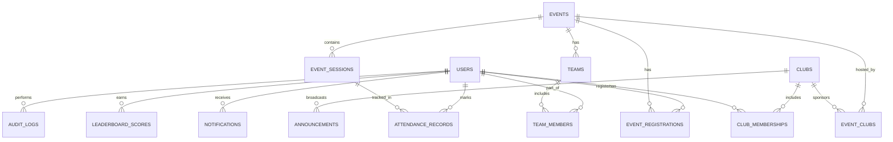

# Database Schema Architecture

## 1. Entity-Relationship (ER) Diagram

## 2. Enums
* `global_role`: `STUDENT`, `FACULTY_ADMIN`, `PLATFORM_ADMIN`
* `club_role`: `MEMBER`, `CORE_MEMBER`, `CLUB_ADMIN`, `FACULTY_MENTOR`
* `event_type`: `WORKSHOP`, `HACKATHON`, `GUEST_LECTURE`, `COMPETITION`, `SOCIAL`, `OTHER`
* `event_state`: `DRAFT`, `PENDING_APPROVAL`, `PUBLISHED`, `ARCHIVED`
* `event_visibility`: `PUBLIC`, `PRIVATE`
* `registration_type`: `INDIVIDUAL`, `TEAM`
* `attendance_status`: `PRESENT`, `ABSENT`, `EXCUSED`
* `attendance_method`: `QR`, `MANUAL`, `SYSTEM`

## 3. Tables & Relationships

### Core Identity & Access
* **`users`**: Base identity for authentication and profiles.
  * Columns: `id` (PK, UUID), `auth_id` (FK to Supabase Auth), `email`, `full_name`, `avatar_url`, `global_role` (Enum).
* **`clubs`**: Organizations within NST.
  * Columns: `id` (PK, UUID), `name`, `description`, `banner_url`, `status`, `created_at`.
* **`club_memberships`**: Resolves the many-to-many relationship, granting specific RBAC roles per club.
  * Columns: `id` (PK), `user_id` (FK), `club_id` (FK), `role` (Enum: club_role), `joined_at`.

### Event Domain
* **`events`**: The core generic event model.
  * Columns: `id` (PK, UUID), `title`, `description`, `start_time`, `end_time`, `location_name`, `location_geofence` (JSONB/PostGIS), `event_type` (Enum), `state` (Enum: event_state), `visibility` (Enum: event_visibility), `registration_type` (Enum), `metadata` (JSONB), `created_by` (FK), `created_at`.
* **`event_clubs`**: Many-to-Many mapping for multi-club collaborative events.
  * Columns: `event_id` (FK), `club_id` (FK), `is_primary` (Boolean).
* **`event_sessions`**: Granular time blocks (Handles multi-day events or multiple check-ins per event).
  * Columns: `id` (PK, UUID), `event_id` (FK), `title`, `start_time`, `end_time`.

### Registration & Teams
* **`teams`**: For team-based hackathons or competitions.
  * Columns: `id` (PK, UUID), `event_id` (FK), `name`, `leader_id` (FK to users), `created_at`.
* **`team_members`**:
  * Columns: `team_id` (FK), `user_id` (FK), `joined_at`.
* **`event_registrations`**: Individual or team registrations for an event.
  * Columns: `id` (PK, UUID), `event_id` (FK), `user_id` (FK), `team_id` (FK, Nullable), `registered_at`.

### Attendance & Gamification
* **`attendance_records`**: Verified physical check-ins.
  * Columns: `id` (PK, UUID), `session_id` (FK), `user_id` (FK), `marked_by` (FK to users), `marked_at`, `method` (Enum), `status` (Enum), `audit_metadata` (JSONB).
* **`leaderboard_scores`**: Immutable ledger for gamification points.
  * Columns: `id` (PK, UUID), `user_id` (FK), `club_id` (FK, Nullable), `points` (Int), `reason` (String), `source_id` (UUID, e.g., attendance_id), `created_at`.

### Communication & Auditing
* **`notifications`**: Persistent in-app alerts.
  * Columns: `id` (PK, UUID), `user_id` (FK), `title`, `body`, `type`, `read_at`, `metadata` (JSONB).
* **`announcements`**: Global or club-specific broadcasts.
  * Columns: `id` (PK, UUID), `club_id` (FK, Nullable), `title`, `content`, `created_by` (FK), `created_at`.
* **`audit_logs`**: Immutable ledger of destructive or high-impact actions.
  * Columns: `id` (PK, UUID), `actor_id` (FK), `action`, `entity_type`, `entity_id`, `previous_state` (JSONB), `new_state` (JSONB), `ip_address`, `created_at`.

## 4. JSONB Usage
* **`events.metadata`**: Extends the generic event model based on `event_type`.
  * *Hackathon Example*: `{"team_size_min": 2, "team_size_max": 4, "prizes": ["MacBook", "Keyboard"]}`
  * *Workshop Example*: `{"prerequisites": ["Python"], "speaker_name": "John Doe"}`
* **`attendance_records.audit_metadata`**: Forensic data for fraud prevention (ADR-030).
  * Example: `{"gps_lat": 18.123, "gps_lng": 73.456, "device_os": "iOS", "mock_location_detected": false}`
* **`notifications.metadata`**: Routing payloads for the mobile app (e.g., `{"screen": "EventDetails", "event_id": "123"}`).
* **`audit_logs.(previous|new)_state`**: Stores complete row snapshots for historical diffs and rollback capabilities.

## 5. Constraints
* **Email Domains**: `CHECK (email LIKE '%@adypu.edu.in' OR email LIKE '%@newtonschool.co')` on `users`.
* **Unique Memberships**: `UNIQUE (club_id, user_id)` on `club_memberships`.
* **Unique Event Registrations**: `UNIQUE (event_id, user_id)` on `event_registrations`.
* **Unique Session Attendance**: `UNIQUE (session_id, user_id)` on `attendance_records` to prevent double counting.
* **Team Integrity**: `team_members` can only reference users who have an active `event_registrations` row for the parent event (enforced via database triggers).

## 6. Indexes
* **Foreign Keys**: B-Tree indexes on every `_id` column (e.g., `user_id`, `event_id`, `club_id`) to optimize JOINs.
* **Full Text Search**: GIN indexes on `to_tsvector('english', title || ' ' || description)` for `events` and `clubs` (ADR-023).
* **JSONB Queries**: GIN index on `events.metadata` to quickly filter events by specific attributes.
* **Time-Series / Ledger**: BRIN or B-Tree indexes on `created_at` for `audit_logs` and `leaderboard_scores` for fast analytical roll-ups.

## 7. Row Level Security (RLS) Strategy

The complex authorization matrix is strictly enforced at the database layer (ADR-006, ADR-012).

* **Users Table**: Users can `SELECT` and `UPDATE` their own row. Public profile fields are visible to all authenticated users.
* **Events Table**:
  * `SELECT`: All users can view `PUBLISHED` AND `PUBLIC` events. For `PRIVATE` events, RLS checks if `auth.uid()` has an active `club_memberships` record for the event's associated clubs.
  * `INSERT`: Allowed for users with `CLUB_ADMIN` or `CORE_MEMBER` roles (creates in `DRAFT` state).
  * `UPDATE`: 
    * `DRAFT`/`PENDING_APPROVAL` states: Updatable by `CLUB_ADMIN`.
    * State transitions (e.g., moving to `PUBLISHED`): Explicitly restricted to `FACULTY_MENTOR` and `FACULTY_ADMIN`.
* **Attendance Records**:
  * `INSERT`: Users can insert their own row ONLY IF `method = 'QR'` and the event state is `PUBLISHED`.
  * `UPDATE`/`DELETE`: Denied for all roles except `PLATFORM_ADMIN` (Faculty cannot modify attendance).
  * `SELECT`: Students can view their own. `CLUB_ADMIN` and `FACULTY` can view all records for events tied to their clubs.
* **Leaderboard Scores**: `INSERT` restricted to secure Supabase Edge Functions (triggered asynchronously by attendance validations). Read-only for all client applications.
* **Audit Logs**: Completely locked down. `INSERT` happens natively via Database Triggers using `security definer`. `SELECT` is strictly restricted to `PLATFORM_ADMIN` and `FACULTY_ADMIN`.
