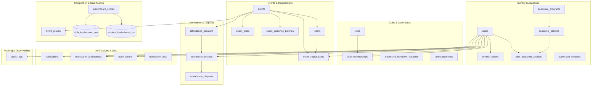

# Database Schema & Domain Catalog

This document provides a comprehensive, domain-by-domain architectural explanation of the NST-Events PostgreSQL schema.

---

## 1. Domain Overview

The schema is partitioned into 7 core functional domains comprising 24 application tables, 1 PostGIS reference table, 1 standard view, and 2 materialized views:

---

## 2. Core Domains & Table Catalog

### 2.1 Identity & Academic Domain

#### `users`
- **Purpose:** Primary user identity record created upon Google OAuth sign-in.
- **Primary Key:** `id` (UUID, default `uuid()`)
- **Key Columns:**
  - `email`: `TEXT UNIQUE` (Institutional email address)
  - `google_sub`: `TEXT UNIQUE` (Immutable Google subject identifier)
  - `full_name`: `TEXT`
  - `avatar_url`: `TEXT NULL` (Deferred in V1)
  - `global_role`: `GlobalRole` (Enum: `STUDENT`, `FACULTY_MENTOR`, `FACULTY_ADMIN`, `PLATFORM_ADMIN`. Default `STUDENT`)
  - `security_version`: `INT` (Default 1; incremented on role changes to instantly invalidate active JWTs)
  - `created_at`, `updated_at`, `deleted_at`: Soft-delete timestamp.
- **Indexes:** `users(email)`, `users(google_sub)`.
- **Triggers:** `enforce_global_role_protection` (BEFORE UPDATE prevents unauthorized role elevation and self-demotion of the last platform admin).

#### `refresh_tokens`
- **Purpose:** Secure OAuth session refresh token management with token family rotation.
- **Primary Key:** `id` (UUID)
- **Key Columns:**
  - `user_id`: `UUID FK -> users(id) ON DELETE CASCADE`
  - `token_hash`: `TEXT UNIQUE` (SHA-256 hash of raw token; raw token is never persisted)
  - `family_id`: `UUID` (Links rotated tokens together; if a revoked token is presented, the entire family is revoked)
  - `expires_at`: `TIMESTAMPTZ`
  - `revoked_at`: `TIMESTAMPTZ NULL`
  - `user_agent`, `ip_address`: Forensic tracking
- **Indexes:** `refresh_tokens(user_id)`, `refresh_tokens(expires_at)`, `refresh_tokens(family_id)`.

#### `academic_programs`
- **Purpose:** Degree/branch catalog (e.g., Computer Science, Mechanical).
- **Primary Key:** `id` (UUID)
- **Key Columns:** `code` (`TEXT UNIQUE`), `name` (`TEXT`).

#### `academic_batches`
- **Purpose:** Cohort definition by admission year and graduation year.
- **Primary Key:** `id` (UUID)
- **Foreign Keys:** `program_id -> academic_programs(id) ON DELETE RESTRICT`
- **Unique Constraint:** `[program_id, admission_year, graduation_year]`
- **Indexes:** `academic_batches(program_id)`.

#### `user_academic_profiles`
- **Purpose:** Links a student to their verified degree program and batch cohort.
- **Primary Key:** `id` (UUID)
- **Foreign Keys:** 
  - `user_id -> users(id) ON DELETE CASCADE UNIQUE` (1:1 per user)
  - `batch_id -> academic_batches(id) ON DELETE RESTRICT`
  - `assigned_by -> users(id) ON DELETE SET NULL`
- **Key Columns:** `assignment_source` (`AssignmentSource` Enum: `INSTITUTIONAL_EMAIL_INFERENCE`, `ADMIN_OVERRIDE`).
- **Indexes:** `user_academic_profiles(batch_id)`.

#### `authorized_students`
- **Purpose:** Pre-whitelisted directory of authorized students by email, allowing verification prior to first login.
- **Primary Key:** `id` (UUID)
- **Key Columns:** `normalized_email` (`TEXT UNIQUE`), `status` (`DirectoryStatus`: `ACTIVE`, `REVOKED`).

---

### 2.2 Clubs & Governance Domain

#### `clubs`
- **Purpose:** Student clubs, technical chapters, and campus organizations.
- **Primary Key:** `id` (UUID)
- **Key Columns:** `name` (`TEXT UNIQUE`), `description`, `banner_url`, `status` (`ClubStatus`: `ACTIVE`, `INACTIVE`, `DISSOLVED`), soft-delete timestamps.
- **Indexes:** `clubs(name)`.

#### `club_memberships`
- **Purpose:** Contextual role-based access for club officers and members.
- **Primary Key:** `id` (UUID)
- **Foreign Keys:** `user_id -> users(id)`, `club_id -> clubs(id)`.
- **Key Columns:** `role` (`ClubRole`: `MEMBER`, `CORE_MEMBER`, `CLUB_ADMIN`, `FACULTY_MENTOR`).
- **Indexes:** `club_memberships(club_id, user_id)`, `club_memberships(user_id)`.
- **Triggers:** `audit_club_memberships_trigger` (logs all role changes to `audit_logs`).

#### `leadership_handover_requests`
- **Purpose:** Multi-step approval workflow for transferring club leadership to successors.
- **Primary Key:** `id` (UUID)
- **Foreign Keys:** `club_id -> clubs(id)`, `initiated_by -> users(id)`, `successor_id -> users(id)`, `faculty_mentor_id -> users(id)`.
- **Key Columns:** `status` (`HandoverStatus`: `PENDING`, `APPROVED`, `REJECTED`), `review_notes`.
- **Indexes:** `leadership_handover_requests(club_id)`.

#### `announcements`
- **Purpose:** Broadcasts to members or campus.
- **Primary Key:** `id` (UUID)
- **Foreign Keys:** `club_id -> clubs(id) NULL` (NULL indicates platform-wide global announcement), `created_by -> users(id)`.

---

### 2.3 Events & Registrations Domain

#### `events`
- **Purpose:** Central entity for campus events, workshops, hackathons, and seminars.
- **Primary Key:** `id` (UUID)
- **Foreign Keys:** `created_by -> users(id)`.
- **Key Columns:**
  - `title`, `description`
  - `start_time`, `end_time`: `TIMESTAMPTZ`
  - `location_name`: `TEXT`
  - `location_geofence`: `geography(Point, 4326) NULL` (PostGIS spatial geometry)
  - `event_type`: `EventType` (`WORKSHOP`, `SEMINAR`, `COMPETITION`, `MEETUP`, `HACKATHON`, `CULTURAL`, `SPORTS`, `OTHER`)
  - `state`: `EventState` (`DRAFT`, `PENDING_APPROVAL`, `PUBLISHED`, `ARCHIVED`, `CANCELLED`)
  - `visibility`: `EventVisibility` (`PUBLIC`, `PRIVATE`)
  - `registration_type`: `RegistrationType` (`INDIVIDUAL`, `TEAM`)
  - `attendance_type`: `AttendanceType` (`SINGLE`, `MULTI_SESSION`)
  - `audience`: `EventAudience` (`ALL_STUDENTS`, `SPECIFIC_BATCHES`)
  - `is_locked`: `BOOLEAN` (Hard lock preventing state/time changes once execution commences)
  - `max_capacity`: `INT NULL` (NULL means unlimited capacity)
  - `registration_count`: `INT` (Atomically maintained count of registered attendees)
  - `metadata`: `JSONB` (Type-specific metadata)
  - `search_vector`: `tsvector` (Auto-generated from title + description for full-text search)
- **Indexes:** `events(start_time)`, `events(state)`, GIN index on `events(search_vector)`, GiST index on `events(location_geofence)`.

#### `event_clubs`
- **Purpose:** Associative table mapping co-organizing clubs to an event.
- **Primary Key:** `[event_id, club_id]` (Composite)
- **Foreign Keys:** `event_id -> events(id)`, `club_id -> clubs(id)`.
- **Key Columns:** `is_primary` (`BOOLEAN`, true for the host club holding primary administrative authority).

#### `event_audience_batches`
- **Purpose:** When `events.audience = 'SPECIFIC_BATCHES'`, defines which batches are eligible.
- **Primary Key:** `id` (UUID)
- **Unique Constraint:** `[event_id, batch_id]`
- **Foreign Keys:** `event_id -> events(id)`, `batch_id -> academic_batches(id)`.

#### `teams`
- **Purpose:** Team entity for team-based events.
- **Primary Key:** `id` (UUID)
- **Foreign Keys:** `event_id -> events(id)`, `leader_id -> users(id)`.
- **Key Columns:** 
  - `name`: Raw display name.
  - `normalized_name`: `lower(trim(name))` enforced for case-insensitive uniqueness within an event.
  - `status`: `TeamStatus` (`FORMING`, `REGISTERED`, `WAITLISTED`, `CANCELLED`).
- **Unique Constraints:** `[id, event_id]`, `[event_id, normalized_name]`.

#### `event_registrations`
- **Purpose:** Attendee participation records and waitlist positions.
- **Primary Key:** `id` (UUID)
- **Foreign Keys:** 
  - `event_id -> events(id)`
  - `user_id -> users(id)`
  - `team_id -> teams(id) NULL`
  - `[team_id, event_id] -> teams([id, event_id])` (Composite FK ensures team belongs to same event)
- **Key Columns:**
  - `registration_status`: `RegistrationStatus` (`REGISTERED`, `WAITLISTED`, `CANCELLED`)
  - `participation_role`: `ParticipationRole` (`ATTENDEE`, `VOLUNTEER`, `ORGANIZER`, `SPEAKER`, `MENTOR`)
  - `eligibility_scope_snapshot`: `EventAudience NULL`
  - `academic_batch_id_snapshot`: `UUID NULL`
- **Indexes:** `event_registrations(event_id, user_id)`, `event_registrations(userId)`, `event_registrations(teamId, eventId)`.

---

### 2.4 Attendance & Fraud Prevention Domain

#### `attendance_sessions`
- **Purpose:** Specific scan window during an event with geofence parameters.
- **Primary Key:** `id` (UUID)
- **Foreign Keys:** `event_id -> events(id)`, `created_by -> users(id)`.
- **Key Columns:**
  - `open_at`, `close_at`: Window bounds
  - `geofence_radius`: `FLOAT` (metres, default 50.0m)
  - `venue_latitude`, `venue_longitude`: `FLOAT NULL` (Coordinates of venue when session was initialized)
  - `location_accuracy`: `FLOAT NULL` (Accuracy of recorded venue coordinate)
  - `qr_secret`: `TEXT` (Cryptographic secret generating TOTP rotating QR codes)
- **Indexes:** `attendance_sessions(event_id)`.

#### `attendance_records`
- **Purpose:** Immutable proof-of-attendance check-in record.
- **Primary Key:** `id` (UUID, default `gen_random_uuid()`)
- **Foreign Keys:** `session_id -> attendance_sessions(id)`, `user_id -> users(id)`, `marked_by -> users(id) NULL`.
- **Unique Constraint:** `[session_id, user_id]` (Strict 1 scan per student per session).
- **Key Columns:**
  - `method`: `AttendanceMethod` (`QR`, `MANUAL`, `SYSTEM`)
  - `status`: `AttendanceStatus` (`PRESENT`, `ABSENT`, `EXCUSED`)
  - `audit_metadata`: `JSONB` containing forensic telemetry: `device_id`, `device_os`, `gps_accuracy`, `mock_location_detected`, `app_version`, `device_collision_detected`.
- **Triggers:** `audit_attendance_records_trigger` (logs all insertions/modifications to `audit_logs`).

#### `attendance_disputes`
- **Purpose:** Formal dispute filing when attendance was missed due to technical or medical issues.
- **Primary Key:** `id` (UUID)
- **Foreign Keys:** `attendance_record_id NULL`, `session_id`, `event_id`, `user_id`, `reviewed_by -> users(id) NULL`.
- **Unique Constraint:** `[session_id, user_id]` (1 dispute per student per session).
- **Key Columns:** `status` (`DisputeStatus`: `PENDING`, `APPROVED`, `REJECTED`), `reason`, `evidence_urls` (`TEXT[]`), `dispute_window_expires_at`.

---

### 2.5 Gamification & Results Domain

#### `event_results`
- **Purpose:** Final competition outcomes (winners, runner-ups).
- **Primary Key:** `id` (UUID)
- **Foreign Keys:** `event_id -> events(id)`, `user_id -> users(id)`, `created_by -> users(id)`.
- **Unique Constraint:** `[event_id, user_id]`.
- **Key Columns:** `result_type`: `CompetitionResult` (`WINNER`, `RUNNER_UP`, `SECOND_RUNNER_UP`, `TOP_10`, `PARTICIPANT`).

#### `leaderboard_scores`
- **Purpose:** Granular points ledger for campus student and club leaderboards.
- **Primary Key:** `id` (UUID)
- **Foreign Keys:** `user_id -> users(id)`, `club_id -> clubs(id) NULL`.
- **Key Columns:** `points` (`INT`), `reason` (`TEXT`), `source_id` (`UUID` linking to source record).
- **Indexes:** `leaderboard_scores(user_id)`, `leaderboard_scores(club_id)`, BRIN index on `leaderboard_scores(created_at)`.

#### `club_leaderboard_mv` & `student_leaderboard_mv`
- **Purpose:** Materialized views aggregating points for rapid ranking queries.
- **Indexes:** Unique index on `club_id` and `user_id` allowing `REFRESH MATERIALIZED VIEW CONCURRENTLY`.

---

### 2.6 Notifications & Background Processing Domain

#### `notification_jobs`
- **Purpose:** Native PostgreSQL job queue for background dispatching.
- **Primary Key:** `id` (UUID)
- **Key Columns:**
  - `idempotency_key`: `TEXT UNIQUE`
  - `status`: `NotificationJobStatus` (`PENDING`, `PROCESSING`, `WAITING_FOR_RECEIPTS`, `COMPLETED`, `RETRY_PENDING`, `FAILED`, `DEAD_LETTER`, `ARCHIVED`)
  - `payload`: `JSONB` (Notification body, recipients, channels)
  - `priority`: `TEXT` (`NORMAL`, `HIGH`)
  - `attempt_count`: `INT` (Default 0)
  - `max_attempts`: `INT` (Default 4)
  - `available_at`, `locked_at`: `TIMESTAMPTZ`
  - `worker_id`: `TEXT NULL`
  - `ticket_ids`: `JSONB NULL` (Expo push ticket references for async receipt polling)
  - `last_error`: `TEXT NULL`
- **Claiming Mechanism:** `SELECT ... FOR UPDATE SKIP LOCKED` by `apps/worker`.

#### `notifications`, `notification_preferences`, `push_tokens`
- Direct storage for student in-app notifications and Expo mobile push tokens with platform tracking (`ios`, `android`).

---

### 2.7 Dropped / Deprecated Schema Elements

| Element | Type | Dropped In | Rationale |
| :--- | :--- | :--- | :--- |
| `team_invitations` | Table & Enum | `20260902213638` | Replaced by simplified direct team joining and atomic registration via `join_team` and normalized team naming. |
| `consumed_qr_signatures` | Table | `20260905000000_phase29_qr_reuse` | 15-second rotating TOTP QR codes are projected in lecture halls; multiple legitimate students scan the same code simultaneously. Storing single-use signatures caused false rejections. Fraud is prevented via device collision detection and session identity binding. |
