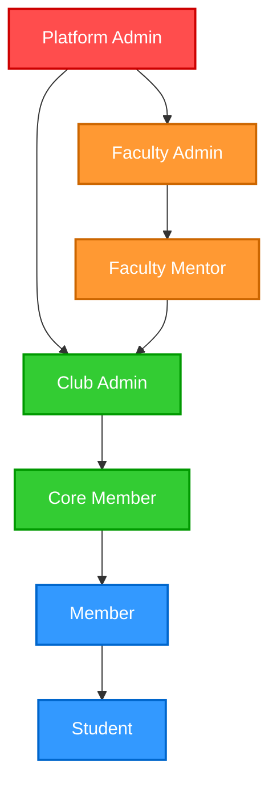

# 02 Role Hierarchy

This diagram details the hierarchical structure of user roles within NST-Connect, including their inheritance and authority. Platform Admins hold supreme authority, while Faculty and Club Admins manage their respective domains down to individual students.

