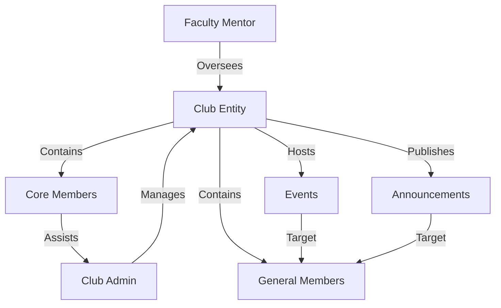

# 03 Club Architecture

This diagram visualizes the ownership and relationship structures within a Club. It shows how Faculty Mentors and Club Admins govern the club, which in turn manages events, announcements, and its member hierarchy.

