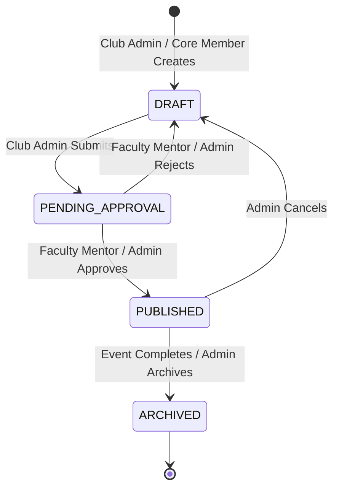

# 04 Event Lifecycle

This state diagram models the transition states an event undergoes from creation to completion, detailing which roles possess the authority to execute specific state transitions.

