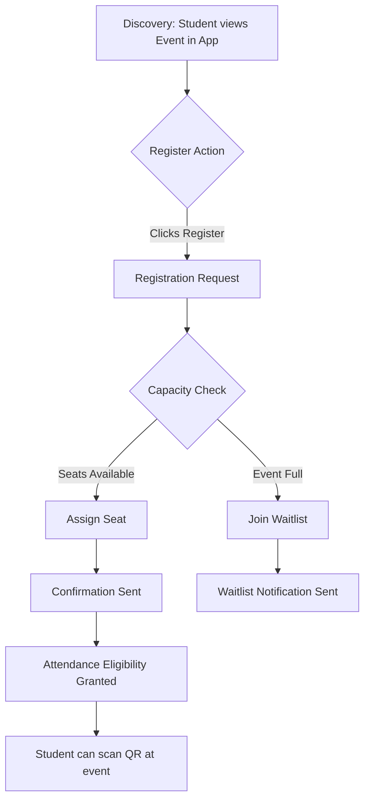

# 05 Event Registration Flow

This flowchart outlines the end-to-end student experience when registering for an event, emphasizing capacity checks, waitlisting, and attendance eligibility confirmation.

