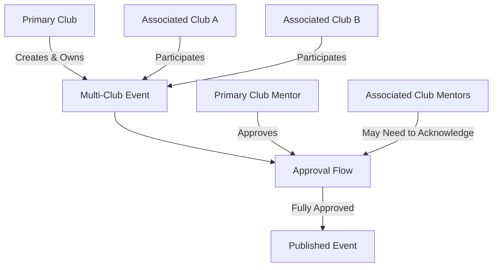

# 06 Multi-Club Event Architecture

This diagram demonstrates the architecture for events hosted by multiple clubs, outlining primary ownership versus associated club participation and the resulting approval flows.

