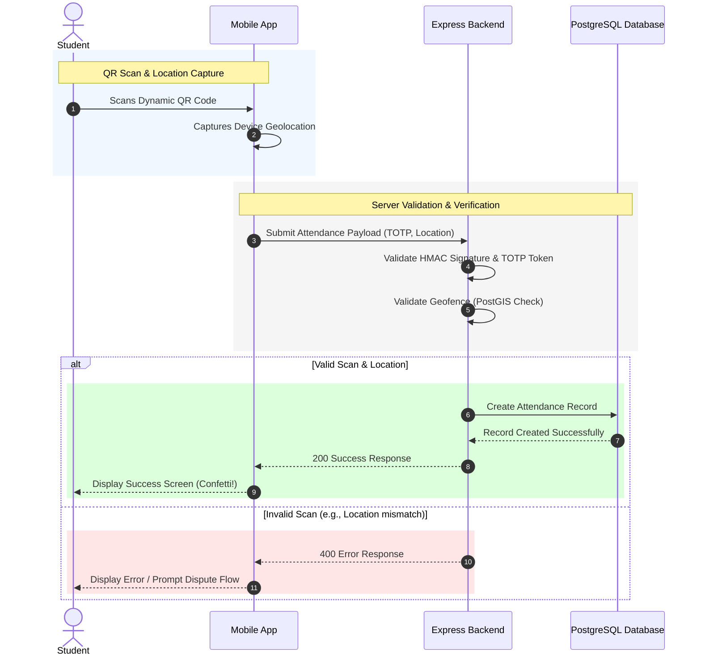

# 08 Attendance Sequence Flow

This sequence diagram provides a step-by-step breakdown of the attendance marking process from the student's mobile app to the backend database.

```mermaid
sequenceDiagram
    autonumber
    actor Student
    participant App as Mobile App
    participant Backend as Express Backend
    participant DB as PostgreSQL Database
    
    rect rgb(240, 248, 255)
    Note over Student,App: QR Scan & Location Capture
    Student->>App: Scans Dynamic QR Code
    App->>App: Captures Device Geolocation
    end
    
    rect rgb(245, 245, 245)
    Note over App,DB: Server Validation & Verification
    App->>Backend: Submit Attendance Payload (TOTP, Location)
    Backend->>Backend: Validate HMAC Signature & TOTP Token
    Backend->>Backend: Validate Geofence (PostGIS Check)
    end
    
    alt Valid Scan & Location
        rect rgb(220, 255, 220)
        Backend->>DB: Create Attendance Record
        DB-->>Backend: Record Created Successfully
        Backend-->>App: 200 Success Response
        App-->>Student: Display Success Screen (Confetti!)
        end
    else Invalid Scan (e.g., Location mismatch)
        rect rgb(255, 230, 230)
        Backend-->>App: 400 Error Response
        App-->>Student: Display Error / Prompt Dispute Flow
        end
    end
```
