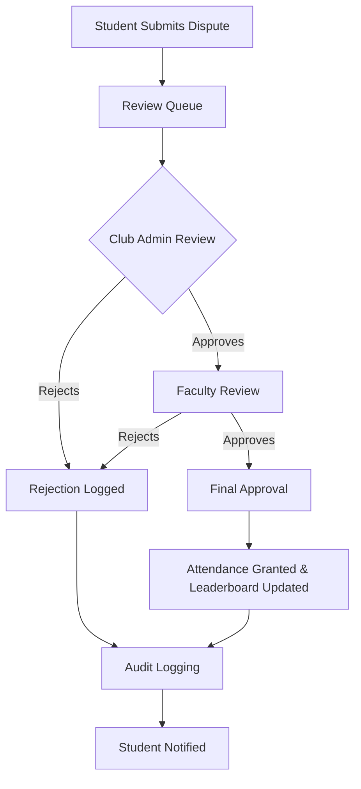

# 09 Attendance Dispute Workflow

This flowchart outlines the process for handling attendance disputes when a student fails to mark attendance successfully.

```mermaid
graph TD
    A[Student Submits Dispute] --> B[Review Queue]
    B --> C{Club Admin Review}
    
    C -->|Approves| D[Faculty Review]
    C -->|Rejects| E[Rejection Logged]
    
    D -->|Approves| F[Final Approval]
    D -->|Rejects| E
    
    F --> G[Attendance Granted & Leaderboard Updated]
    
    E --> H[Audit Logging]
    G --> H
    
    H --> I[Student Notified]
```
