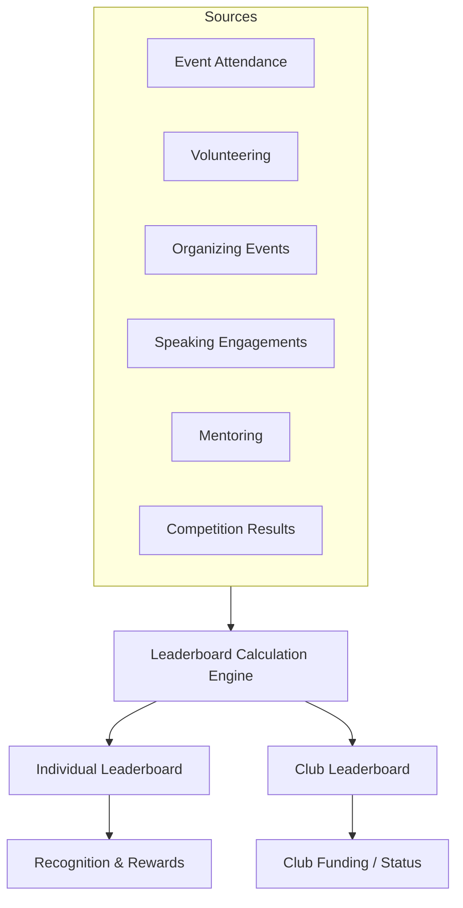

# 10 Merit-Based Leaderboard System

This diagram maps out the various components contributing to the merit-based leaderboard, showing how points from different activities aggregate to individual and club scores.

