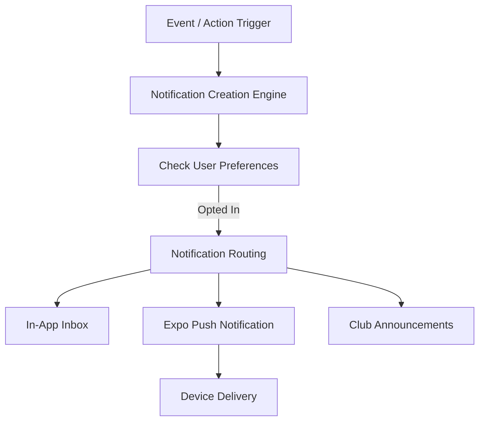

# 11 Notification System

This architecture diagram highlights the flow of notifications from creation to delivery, handling multiple channels like push notifications and an in-app inbox.

```mermaid
graph TD
    Trigger[Event / Action Trigger] --> Creation[Notification Creation Engine]
    
    Creation --> Preferences[Check User Preferences]
    
    Preferences -->|Opted In| Routing[Notification Routing]
    
    Routing --> InApp[In-App Inbox]
    Routing --> Push[Expo Push Notification]
    Routing --> Announcements[Club Announcements]
    
    Push --> Delivery[Device Delivery]
```
