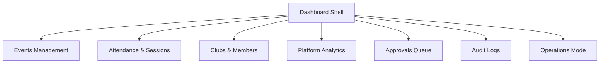

# 12 Dashboard Architecture

This structure maps out the main areas of the web dashboard used by Admins and Mentors for managing platform operations.

```mermaid
graph TD
    DashboardShell[Dashboard Shell] --> Events[Events Management]
    DashboardShell --> Attendance[Attendance & Sessions]
    DashboardShell --> Clubs[Clubs & Members]
    DashboardShell --> Analytics[Platform Analytics]
    DashboardShell --> Approvals[Approvals Queue]
    DashboardShell --> AuditLogs[Audit Logs]
    DashboardShell --> OperationsMode[Operations Mode]
```
