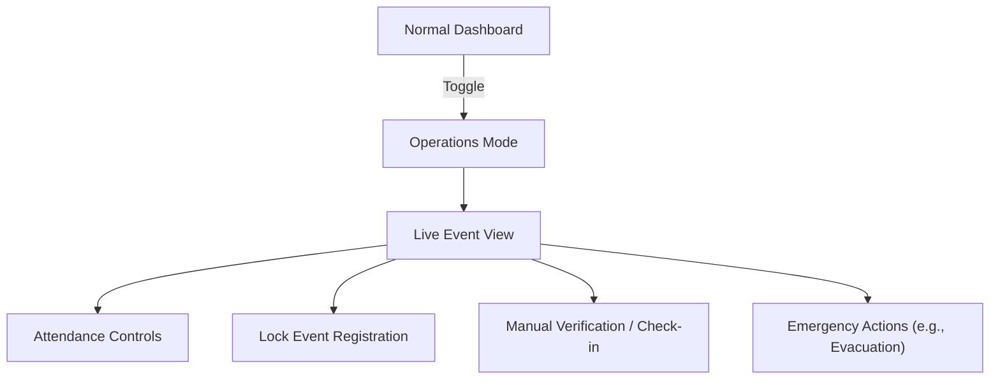

# 13 Operations Mode

This flowchart contrasts the normal dashboard environment with the specialized Operations Mode, which provides real-time controls during live events.

```mermaid
graph TD
    Normal[Normal Dashboard] -->|Toggle| OpsMode[Operations Mode]
    
    OpsMode --> LiveEvent[Live Event View]
    
    LiveEvent --> Controls[Attendance Controls]
    LiveEvent --> Lock[Lock Event Registration]
    LiveEvent --> Manual[Manual Verification / Check-in]
    LiveEvent --> Emergency["Emergency Actions (e.g., Evacuation)"]
```
