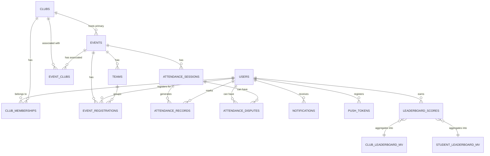

# 14 High-Level ERD

This Entity-Relationship Diagram outlines the core database entities and their relationships within the PostgreSQL database.

```mermaid
erDiagram
    USERS ||--o{ CLUB_MEMBERSHIPS : "belongs to"
    CLUBS ||--o{ CLUB_MEMBERSHIPS : "has"
    
    CLUBS ||--o{ EVENTS : "hosts primary"
    CLUBS ||--o{ EVENT_CLUBS : "associated with"
    EVENTS ||--o{ EVENT_CLUBS : "has associated"
    
    EVENTS ||--o{ EVENT_REGISTRATIONS : "has"
    USERS ||--o{ EVENT_REGISTRATIONS : "registers for"
    
    EVENTS ||--o{ TEAMS : "has"
    TEAMS ||--o{ EVENT_REGISTRATIONS : "groups"

    EVENTS ||--o{ ATTENDANCE_SESSIONS : "has"
    ATTENDANCE_SESSIONS ||--o{ ATTENDANCE_RECORDS : "generates"
    USERS ||--o{ ATTENDANCE_RECORDS : "marks"
    
    USERS ||--o{ ATTENDANCE_DISPUTES : "can have"
    ATTENDANCE_SESSIONS ||--o{ ATTENDANCE_DISPUTES : "can have"
    
    USERS ||--o{ NOTIFICATIONS : "receives"
    USERS ||--o{ PUSH_TOKENS : "registers"
    
    USERS ||--o{ LEADERBOARD_SCORES : "earns"
    LEADERBOARD_SCORES }o--|| CLUB_LEADERBOARD_MV : "aggregates into"
    LEADERBOARD_SCORES }o--|| STUDENT_LEADERBOARD_MV : "aggregates into"
```
