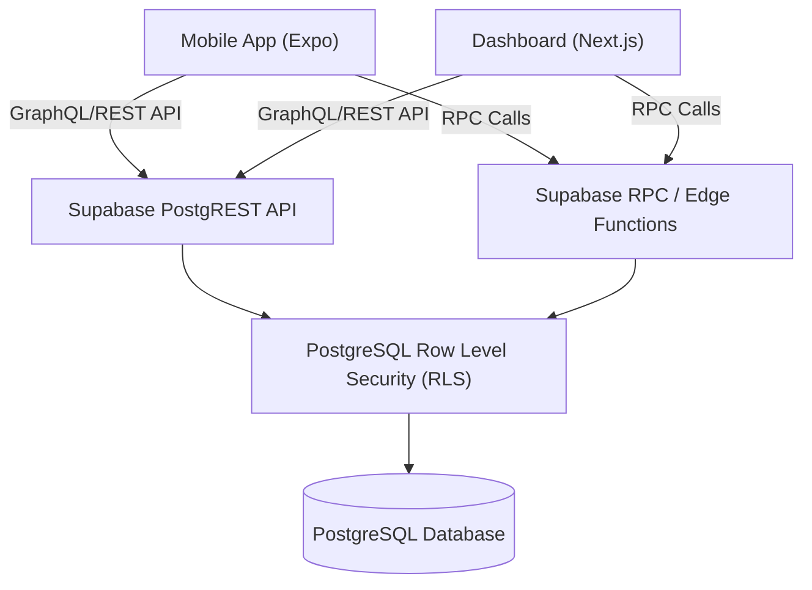

# 15 API / RPC Architecture

This diagram shows the flow of requests from client applications through the Supabase Backend and RPC layers to the underlying database, utilizing Row Level Security (RLS).

