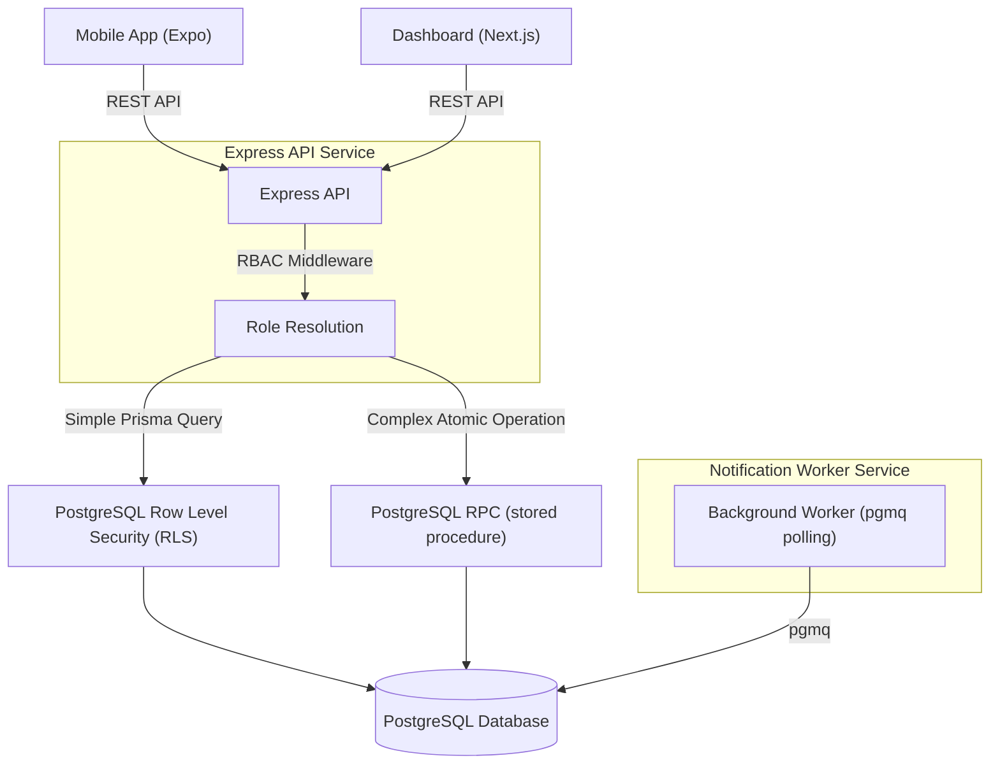

# 15 API / RPC Architecture

This diagram shows the flow of requests from client applications through the Express API and RLS layers to the underlying database.

```mermaid
graph TD
    Mobile["Mobile App (Expo)"]
    Dashboard["Dashboard (Next.js)"]

    Mobile -->|REST API| API["Express API"]
    Dashboard -->|REST API| API

    API -->|RBAC Middleware| RBAC["Role Resolution"]

    RBAC -->|Simple Prisma Query| RLS["PostgreSQL Row Level Security (RLS)"]
    RBAC -->|Complex Atomic Operation| RPC["PostgreSQL RPC (stored procedure)"]

    RLS --> Database[("PostgreSQL Database")]
    RPC --> Database

    subgraph Express API Service
        API
        RBAC
    end

    subgraph Notification Worker Service
        Worker["Background Worker (pgmq polling)"]
    end

    Worker -->|pgmq| Database
```
