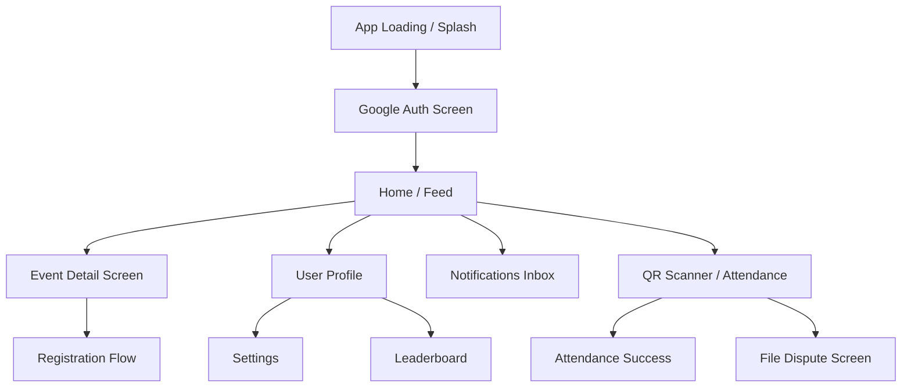

# 17 Mobile Navigation Map

This diagram outlines the complete screen navigation hierarchy for the Expo React Native mobile application.

```mermaid
graph TD
    AppLoading[App Loading / Splash] --> Auth[Google Auth Screen]
    Auth --> Home[Home / Feed]
    
    Home --> EventDetail[Event Detail Screen]
    EventDetail --> Registration[Registration Flow]
    
    Home --> Profile[User Profile]
    Profile --> Settings[Settings]
    Profile --> Leaderboard[Leaderboard]
    
    Home --> Notifications[Notifications Inbox]
    
    Home --> Scanner[QR Scanner / Attendance]
    Scanner --> AttendanceSuccess[Attendance Success]
    Scanner --> Dispute[File Dispute Screen]
```
