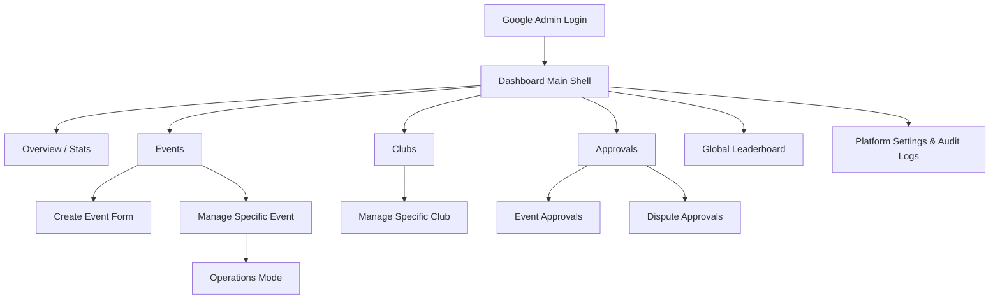

# 18 Dashboard Navigation Map

This flowchart maps the page structure of the Next.js Web Dashboard for administrative users.

```mermaid
graph TD
    Login[Google Admin Login] --> Main[Dashboard Main Shell]
    
    Main --> Home[Overview / Stats]
    
    Main --> Events[Events]
    Events --> CreateEvent[Create Event Form]
    Events --> ViewEvent[Manage Specific Event]
    ViewEvent --> Operations[Operations Mode]
    
    Main --> Clubs[Clubs]
    Clubs --> ClubDetail[Manage Specific Club]
    
    Main --> Approvals[Approvals]
    Approvals --> EventApprovals[Event Approvals]
    Approvals --> DisputeApprovals[Dispute Approvals]
    
    Main --> Leaderboard[Global Leaderboard]
    
    Main --> Settings[Platform Settings & Audit Logs]
```
