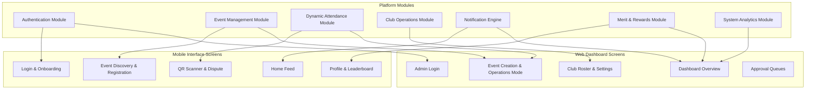

# 19 Complete Product Surface Map

This is the master onboarding diagram showing all modules, screens, and major features across the platform, illustrating the overarching relationship map.

```mermaid
graph TD
    subgraph Platform Modules
        Auth[Authentication Module]
        Events[Event Management Module]
        Attendance[Dynamic Attendance Module]
        Clubs[Club Operations Module]
        Notifications[Notification Engine]
        Leaderboard[Merit & Rewards Module]
        Analytics[System Analytics Module]
    end

    subgraph Mobile Interface Screens
        MobileAuth[Login & Onboarding]
        MobileHome[Home Feed]
        MobileEvent[Event Discovery & Registration]
        MobileScanner[QR Scanner & Dispute]
        MobileProfile[Profile & Leaderboard]
    end

    subgraph Web Dashboard Screens
        WebAuth[Admin Login]
        WebHome[Dashboard Overview]
        WebEvents[Event Creation & Operations Mode]
        WebClubs[Club Roster & Settings]
        WebApprovals[Approval Queues]
    end

    Auth --> MobileAuth
    Auth --> WebAuth

    Events --> MobileEvent
    Events --> WebEvents

    Attendance --> MobileScanner
    Attendance --> WebEvents

    Clubs --> WebClubs

    Leaderboard --> MobileProfile
    Leaderboard --> WebHome

    Notifications --> MobileHome
    Notifications --> WebHome
    
    Analytics --> WebHome
```
