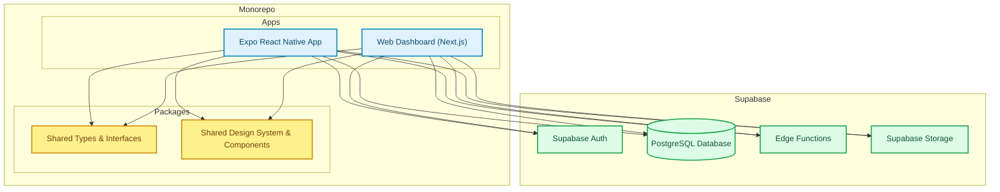

# 20 Codebase Architecture

This diagram breaks down the development architecture, detailing the specific technologies used across the monorepo for the frontend clients, backend, and shared components.

