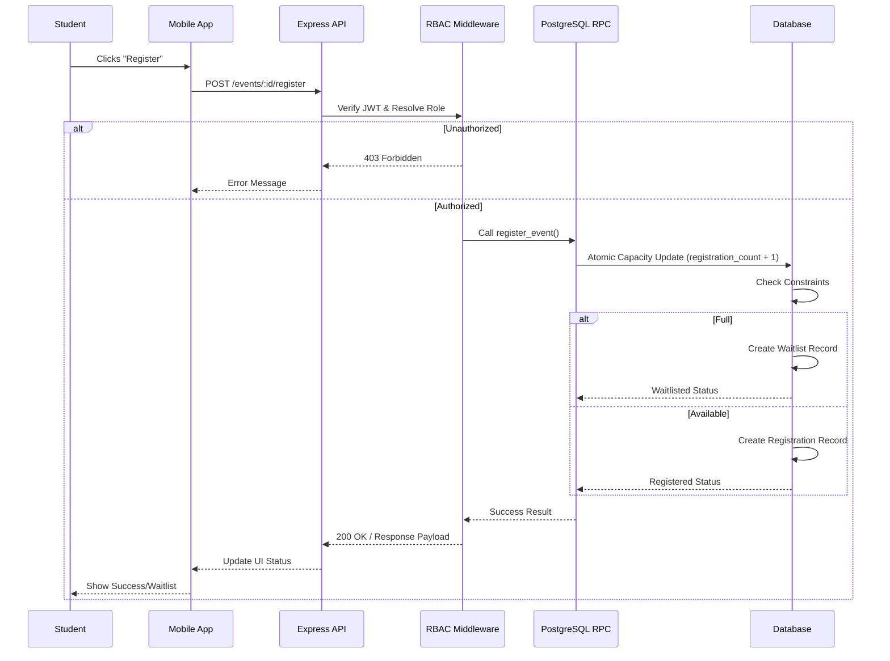

# 21 End-to-End Request Lifecycle

This sequence diagram exemplifies a complete request lifecycle, specifically detailing a student registering for an event, traversing from the client to the database.

