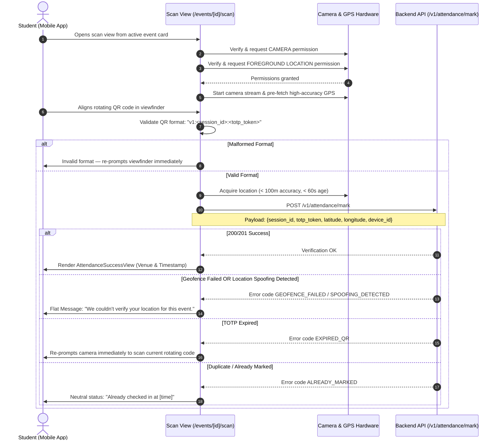

# NST-Events Mobile V1 — Final Student App Specification

**Document Version:** 1.1 (Authoritative V1 Freeze Contract)
**Target Codebase:** `apps/mobile` (Expo React Native)
**Reference Platform:** Android (Visual & Functional Reference)
**Cross-Platform Requirement:** iOS must match Android 1:1 in design, routes, and behavior
**Document Status:** FROZEN V1 SPECIFICATION
**Primary Source of Truth:** Active implementation in `apps/mobile`, active Prisma schema, and frozen backend routing matrix (`docs/api/02-api-routing-matrix.md`).

---

## 1. V1 Scope & System Boundaries

The NST-Events Mobile Application is strictly an **in-person student participation companion and personal attendance ledger**. It is designed for high-speed physical attendance check-in, tracking commitments, and managing personal records.

### 1.1 Core Boundaries

1. **Student Participation Only**: Mobile is built exclusively for enrolled students attending campus events. All administrative, faculty, and club management workflows are strictly desktop web dashboard operations (`apps/dashboard`).
2. **Server-Authoritative Mutations**: All state-changing actions (QR scanning, dispute submission, invitation responses) require synchronous backend confirmation. No optimistic state transitions are permitted.
3. **Strict Android Reference Parity**: Android is the primary functional, performance, and visual design reference. iOS must match Android V1 exactly—no iOS-only or Android-only design systems, tabs, or user flows exist in V1.
4. **No V2 / Eventyay Features in V1**: Digital certificate issuance, ticketing/payments, photo galleries, live video streams, multi-campus switching, and liquid-glass GPU shaders are out of scope.

---

## 2. Complete Student Capabilities (What a Student CAN Do)

Enrolled students with `global_role === 'STUDENT'` can perform the following actions on mobile:

1. **Authenticate via Institutional SSO**: Log in with Google OAuth restricted to approved institutional domains (`@adypu.edu.in` and `@newtonschool.co`).
2. **Domain Rejection Escalation**: If an institutional email is valid but unrostered, initiate an immediate structured email escalation to university coordinators.
3. **View Live & Priority Event Companion (Home)**: View live/ongoing events with active attendance sessions dynamically elevated to the top of the feed with `[ LIVE NOW ]` indicators.
4. **Perform Ephemeral In-Person QR Check-In**: Launch the camera overlay during active session windows, acquire high-accuracy GPS coordinates, scan the rotating TOTP QR code, and verify attendance against backend geofencing.
5. **Review Historical Attendance Records**: Browse an infinite-scroll chronological ledger of all past attended and missed sessions with verified `PRESENT` and `ABSENT` status badges.
6. **Inspect Attendance Session Details**: View check-in timestamps, session venue, attendance verification details, and active dispute windows.
7. **Submit Attendance Disputes**: File a formal attendance dispute (with reason and session context) for marked absences while the event's `disputeWindowExpiresAt` deadline remains open.
8. **Track Dispute Resolution**: Monitor active and historical claims across `PENDING`, `APPROVED`, and `REJECTED` states, including admin review notes.
9. **View & Respond to Team Invitations**: View pending invitations from peer team leaders to join teams for team-based events, with the ability to `ACCEPT` or `DECLINE`.
10. **Receive Real-Time Notifications**: View in-app notifications with unread counts, supported by real-time SSE stream updates (`/v1/notifications/live`) and deep linking to relevant events or invitations.
11. **Manage Notifications**: Mark individual notifications as read or bulk-acknowledge all notifications.
12. **Configure Granular Notification Preferences**: Independently toggle master push notifications, event reminders, club announcements, and attendance alerts via `GET/PATCH /v1/notifications/preferences`.
13. **Review Identity & Affiliations**: Inspect verified institutional credentials (full name, email, global role, academic program, graduation year/batch) and active club memberships with assigned roles (`MEMBER`, `CORE_MEMBER`, `CLUB_ADMIN`).
14. **Configure Appearance**: Select between `LIGHT`, `DARK`, and `SYSTEM` high-contrast Neo-Brutalist themes.
15. **Access Institutional Policies**: Open official university privacy guidelines.
16. **Revoke Session (Log Out)**: Securely terminate session, purge hardware-backed tokens from `expo-secure-store`, and clear private React Query caches.

---

## 3. Mobile-Only Capabilities

The following capabilities exist **exclusively** on the mobile client and are not present on the student web dashboard:

* **In-Person Dynamic QR Code Scanning**: Hardware camera viewfinder (`expo-camera`) scanning dynamic, rotating TOTP tokens (`v1:<session_id>:<totp_token>`).
* **Hardware GPS Geofence Verification**: Foreground high-accuracy location acquisition (`expo-location`) passing real-time latitude, longitude, and accuracy radius to the backend.
* **Hardware Device Binding**: Retrieval and transmission of persistent, hardware-backed device UUIDs (`getPersistentDeviceId()`) for attendance fraud prevention.
* **Native Push Notification Token Synchronization**: Hardware device registration with Expo Push Service (`POST /users/me/push-token`) with deep-link routing.

---

## 4. Desktop-Only Capabilities (Strictly Excluded from Mobile)

The following workflows belong **strictly to the desktop web application (`apps/dashboard`)** and must never be implemented on mobile:

* **Event Creation, Editing, Approval & Deletion**: Only club organizers and faculty mentors manage events on web.
* **Attendance Session Management**: Creating attendance sessions, starting/stopping check-in windows, and setting geofence coordinates/radius.
* **QR Code Generation & Projection**: Dynamic TOTP QR code generation and presentation for attendee scanning.
* **Manual Attendance Overrides**: Organizers manually marking attendees present or reviewing attendee rosters.
* **Event Registration & Cancellation Mutations**: Performing solo event registration or cancellation. Mobile only displays read-only registration status.
* **Team Formation & Team Roster Management**: Creating teams, searching students by name/email, sending invites, transferring leadership, removing members, and disbanding teams.
* **Waitlist Administration & Manual Promotions**: Viewing event waitlist queues and manually promoting waitlisted participants.
* **Club Governance & Member Management**: Creating clubs, editing club details, adding/removing members, and assigning club roles.
* **Attendance CSV / Excel Exports**: Exporting session check-in spreadsheets.
* **Student Directory Management**: Provisioning students, CSV batch importing, and academic batch assignment.

---

## 5. Club Admin & Core Member Mobile Restrictions

Students who hold `CLUB_ADMIN` or `CORE_MEMBER` roles in campus organizations are subject to strict mobile safeguards:

### 5.1 Global Role Check

Mobile validates the user's `global_role`. If the user is a `PLATFORM_ADMIN`, `FACULTY_ADMIN`, or `FACULTY_MENTOR`, access is blocked at the root layout (`_layout.tsx`) with an `[ACCESS_RESTRICTED]` view.

### 5.2 Club Leadership Participation Governance

When a student has `global_role === 'STUDENT'` but also holds a club role (`CLUB_ADMIN` or `CORE_MEMBER`):

1. **Role Visibility**: Their club roles are displayed transparently in their Profile (`/profile`) as status badges: `[ CLUB_NAME / ROLE ]`.
2. **Organizer Event Lockdown (Crucial Rule)**:
   * If an event's primary organizing club matches a club where the student is a `CLUB_ADMIN` or `CORE_MEMBER`, **all event-management actions are suppressed on mobile**.
   * On the Event Detail screen (`/events/[id]`), the action tray renders:
     ```
     [ ORGANIZER — USE DESKTOP TO MANAGE ]
     ```
   * Primary `CLUB_ADMIN` users are strictly barred from registering or participating in their own club's events (per system contract).
3. **No Organizer Tools**: Organizers cannot launch attendance sessions, project QR codes, or mark attendees from their phones.

---

## 6. Exact Navigation Shell & Route Inventory

The mobile application implements a frozen **3-Tab Navigation Hierarchy** plus dedicated stack and modal screens.

```
┌─────────────────────────────────────────────────────────────┐
│  NST EVENTS // MOBILE COMPANION           [🔔 Unread Badge] │
├─────────────────────────────────────────────────────────────┤
│                                                             │
│                      PAGE CONTENT AREA                      │
│                                                             │
├─────────────────────────────────────────────────────────────┤
│  [ ⊡ ATTENDANCE ]        [ ⟲ HISTORY ]        [ 👤 PROFILE ]│
│       Tab 1                  Tab 2                Tab 3     │
└─────────────────────────────────────────────────────────────┘
```

### 6.1 Bottom Navigation Tabs

| Tab Name             | Route Key   | File Path                             | Purpose & Primary Views                                                                      |
| -------------------- | ----------- | ------------------------------------- | -------------------------------------------------------------------------------------------- |
| **ATTENDANCE** | `index`   | `apps/mobile/app/(app)/index.tsx`   | Context-aware feed of live sessions, active check-in CTAs, and upcoming events.              |
| **HISTORY**    | `history` | `apps/mobile/app/(app)/history.tsx` | Chronological ledger of session check-ins (`PRESENT`/`ABSENT`) & shortcut to disputes.   |
| **PROFILE**    | `profile` | `apps/mobile/app/(app)/profile.tsx` | Verified student credentials, academic batch, club affiliations, settings links, and logout. |

### 6.2 Stack & Modal Routes Inventory

| Route                         | File Path                                        | Type   | Access / Purpose                                                                 |
| ----------------------------- | ------------------------------------------------ | ------ | -------------------------------------------------------------------------------- |
| `/(auth)`                   | `apps/mobile/app/(auth)/index.tsx`             | Screen | Google OAuth Sign-In, domain validation, and email escalation.                   |
| `/(app)/events/[id]`        | `apps/mobile/app/(app)/events/[id]/index.tsx`  | Stack  | Event overview, venue, schedule, status badges, and contextual action tray.      |
| `/(app)/events/[id]/teams`  | `apps/mobile/app/(app)/events/[id]/teams.tsx`  | Stack  | Read-only notice: Team registration & rosters are restricted to desktop web.     |
| `/(app)/events/[id]/scan`   | `apps/mobile/app/(app)/events/[id]/scan.tsx`   | Modal  | Ephemeral camera viewfinder & GPS geofence check-in screen.                      |
| `/(app)/history/[id]`       | `apps/mobile/app/(app)/history/[id].tsx`       | Stack  | Attendance session detail, verification metadata, and dispute launch CTA.        |
| `/(app)/disputes`           | `apps/mobile/app/(app)/disputes/index.tsx`     | Stack  | List of submitted attendance disputes (`PENDING`, `APPROVED`, `REJECTED`). |
| `/(app)/disputes/new`       | `apps/mobile/app/(app)/disputes/new.tsx`       | Stack  | Dispute submission form (reason input and active deadline check).                |
| `/(app)/disputes/submitted` | `apps/mobile/app/(app)/disputes/submitted.tsx` | Stack  | Post-submission confirmation receipt.                                            |
| `/(app)/disputes/[id]`      | `apps/mobile/app/(app)/disputes/[id].tsx`      | Stack  | Dispute detail view displaying admin resolution and review notes.                |
| `/(app)/invitations`        | `apps/mobile/app/(app)/invitations.tsx`        | Stack  | Received team invitations list with`ACCEPT` and `DECLINE` buttons.           |
| `/(app)/notifications`      | `apps/mobile/app/(app)/notifications.tsx`      | Stack  | In-app notification center, unread counters, and mark-all-read.                  |
| `/(app)/settings`           | `apps/mobile/app/(app)/settings.tsx`           | Stack  | Notification preferences toggles, appearance switcher, and privacy policy.       |

### 6.3 Authentication & Domain Rejection Flow (`/(auth)/index.tsx`)

The sign-in gateway implements dual-state detection:

```
┌────────────────────────────────────────────────────────┐
│                   [ ACCESS DENIED ]                    │
│                                                        │
│  State A: Non-Institutional Domain                     │
│  "NST Events is restricted to institutional accounts.  │
│   Please sign in with your @adypu.edu.in or            │
│   @newtonschool.co Google account."                    │
│                                                        │
│  [ SWITCH GOOGLE ACCOUNT ]                             │
│                                                        │
│  - - - - - - - - - - - - - - - - - - - - - - - - - - - │
│                                                        │
│  State B: Institutional Domain, Unlisted in Roster     │
│  "Account Recognized, but Not Enrolled:                │
│   [email] is not listed in the active NST Student      │
│   Directory."                                          │
│                                                        │
│  [ SWITCH ACCOUNT ]                                    │
│                                                        │
│  Not listed in your batch roster?                      │
│  [ Contact Academic Coordinator (Email Form) ]         │
└────────────────────────────────────────────────────────┘
```

1. **State A — Unsupported Domain (`INSTITUTIONAL_DOMAIN_NOT_ALLOWED`)**:
   * Message: *"NST Events is restricted to institutional accounts. Please sign in with your @adypu.edu.in or @newtonschool.co Google account."*
   * CTA: `[ SWITCH GOOGLE ACCOUNT ]` (triggers `GoogleSignin.signOut()` and opens account picker).
2. **State B — Authorized Domain but Unlisted (`STUDENT_ACCESS_NOT_AUTHORIZED`)**:
   * Message: *"Account Recognized, but Not Enrolled: [email] is not listed in the active NST Student Directory."*
   * Primary CTA: `[ SWITCH ACCOUNT ]`
   * Secondary Passive Link: `[ Contact Academic Coordinator ]` opening a structured `mailto:` link:
     ```
     mailto:events-support@adypu.edu.in?subject=Student%20Directory%20Inquiry%20-%20[email]&body=Student%20Name:%0AProgram:%0ABatch%20Year:%0AStudent%20ID:%0AProblem:%20Institutional%20account%20not%20authorized%20in%20NST%20Events.
     ```

---

## 7. Exact Attendance, QR & Location Verification Flow

Attendance check-in is an ephemeral modal interaction executed via `/events/[id]/scan`. It never exists as a permanent tab.



### 7.1 Security & Fraud Prevention Safeguards

* **Persistent Device UUID**: Every scan transmits `device_id` retrieved from `expo-secure-store`.
* **Identical Anti-Spoofing Copy**: When check-in is rejected for `GEOFENCE_VERIFICATION_FAILED` or `LOCATION_SPOOFING_DETECTED`, the app renders the exact same neutral error message to avoid signaling detection heuristics to bad actors.
* **Server-Authoritative Rate Limiting**: The client does not enforce artificial lockouts or cooldown timers; rate limiting is governed by backend middleware.

---

## 8. Event & Home Behavior

### 8.1 Home Priority System

The Home feed (`apps/mobile/app/(app)/index.tsx`) sorts and surfaces events dynamically using deterministic priority rules (`src/lib/home-events.ts`):

1. **Active Attendance Session (Top Priority)**:
   * If an event the user is registered for has an open attendance session (`isSessionActive = true`) and attendance is not yet marked, an **`ActiveAttendanceCard`** dominates the top of the screen with a `[ LIVE NOW ]` tag and a direct `[ SCAN QR / MARK ATTENDANCE ]` CTA.
   * If the student already checked in, it displays `[ ATTENDANCE MARKED ]`.
2. **Ongoing Events**: Events currently in progress appear in the ongoing list with red `LIVE` badges.
3. **Upcoming Events**: Chronologically sorted upcoming commitments.

### 8.2 Event Detail Action Tray Rules

On `/events/[id]`, the bottom action tray adapts strictly to server state:

* **Offline**: `[ OFFLINE — ACTIONS UNAVAILABLE ]`
* **Organizer Club Admin / Core Member**: `[ ORGANIZER — USE DESKTOP TO MANAGE ]`
* **Event Locked / Ended**: `[ EVENT LOCKED ]` or `[ EVENT ENDED ]`
* **Registered & Session Active**: `[ SCAN QR / MARK ATTENDANCE ]` button
* **Registered & Waiting for Session**: `[ REGISTERED — WAITING FOR SESSION ]`
* **Unregistered**: `[ STATUS: NOT REGISTERED ]` (No inline register mutation)

---

## 9. History & Attendance Disputes

### 9.1 Attendance History (`/history`)

* Pulls paginated attendance records via `GET /v1/users/me/attendance`.
* Displays session title, event title, date, time, and status badge (`PRESENT` or `ABSENT`).
* Provides a quick header shortcut to Claims & Disputes (`/disputes`).

### 9.2 Dispute Submission & Tracking (`/disputes`)

* Students can dispute an `ABSENT` status only while the event's `disputeWindowExpiresAt` deadline has not expired.
* Form requires entering a detailed explanation.
* Submits via `POST /v1/attendance/disputes`.
* Submitted claims appear in `/disputes` and `/disputes/[id]` with real-time status tracking (`PENDING`, `APPROVED`, `REJECTED`) and reviewer notes.

---

## 10. Notifications & Settings

### 10.1 In-App Notifications (`/notifications`)

* Fetches paginated notifications via `GET /v1/notifications`.
* Connects to SSE live stream (`/v1/notifications/live`) for real-time alerts.
* Unread counter displays in the top navigation header.
* Individual read mutation (`PATCH /v1/notifications/:id/read`) and bulk read (`PATCH /v1/notifications/read-all`).
* Notification tapping deep-links to `/invitations` (for team invites) or `/events/[id]` (for event updates).

### 10.2 Settings & Notification Preferences (`/settings`)

#### 1. Hook Specification: `useNotificationPreferences`

```ts
// apps/mobile/src/hooks/use-notification-preferences.ts
export interface NotificationPreferences {
  push_enabled: boolean;
  event_reminders: boolean;
  club_announcements: boolean;
  attendance_alerts: boolean;
}

export function useNotificationPreferences() {
  const queryClient = useQueryClient();

  const query = useQuery<NotificationPreferences>({
    queryKey: ['notification-preferences'],
    queryFn: () => apiClient('/v1/notifications/preferences'),
  });

  const mutation = useMutation({
    mutationFn: (patch: Partial<NotificationPreferences>) =>
      apiClient('/v1/notifications/preferences', {
        method: 'PATCH',
        body: JSON.stringify(patch),
      }),
    onMutate: async (patch) => {
      await queryClient.cancelQueries({ queryKey: ['notification-preferences'] });
      const prev = queryClient.getQueryData(['notification-preferences']);
      queryClient.setQueryData(['notification-preferences'], (old: any) => ({ ...old, ...patch }));
      return { prev };
    },
    onError: (_err, _vars, context) => {
      if (context?.prev) {
        queryClient.setQueryData(['notification-preferences'], context.prev);
      }
    },
    onSettled: () => {
      queryClient.invalidateQueries({ queryKey: ['notification-preferences'] });
    },
  });

  return { ...query, updatePreferences: mutation.mutate };
}
```

#### 2. Settings Screen Layout

Under an **`ALERTS & NOTIFICATIONS`** section, four independent Neo-Brutalist toggles are presented:

1. **MASTER PUSH** (`push_enabled`): Master toggle for all mobile push notifications. If toggled OFF, subordinate switches are dimmed and disabled.
2. **EVENT REMINDERS** (`event_reminders`): Real-time countdowns & notifications for registered events starting within 15–30 minutes.
3. **CLUB UPDATES** (`club_announcements`): News and broadcasts from clubs where the student holds membership.
4. **ATTENDANCE & CLAIMS** (`attendance_alerts`): Alerts when an attendance window opens, or when an attendance dispute is resolved (`APPROVED`/`REJECTED`).

---

## 11. Registration & Team Boundaries

1. **Read-Only Registration Status**: Mobile inspects `GET /v1/events/:id/my-registration` to display whether the user is `REGISTERED`, `WAITLISTED`, or `NOT_REGISTERED`. Registration mutations are performed on the web dashboard.
2. **Automated Waitlist Promotions**: Waitlist promotion is 100% automated on the server. When capacity opens, the database automatically promotes the next eligible student and fires a push alert. There is no manual "claim spot" action.
3. **Team Roster Notice**: `/events/[id]/teams` is strictly an informational notice informing students that team creation, user search, and roster modifications are desktop web features.
4. **Received Invitations Exception**: Students **can** view received team invitations in `/invitations` and execute `ACCEPT` (`POST /v1/teams/:id/invitations/:id/accept`) or `DECLINE` (`POST /v1/teams/:id/invitations/:id/decline`).

---

## 12. Android & iOS Parity Requirement

* **Visual Tokens**: Identical Neo-Brutalist typography (Space Mono, Syne, Inter), sharp corners, and high-contrast borders across both platforms.
* **Navigation**: Identical 3-tab layout and modal animations.
* **Permissions Handling**: Camera and location permission workflows handle Android and iOS permission lifecycles identically.
* **Device ID**: Hardware UUID retrieval utilizes `expo-secure-store` on both platforms with graceful fallback.

---

## 13. Explicit V1 Exclusions & Deferred Features

### 13.1 Deferred Backend APIs (Client Must NOT Call)

* `GET /v1/home/feed` (Deferred; mobile aggregates queries in parallel)
* `GET /v1/events/:id/waitlist` (Deferred; no participant waitlist view in V1)
* `POST /v1/admin/points/adjust` (Deferred)
* `GET /v1/analytics/*` (Deferred)
* `GET /v1/announcements` (Deferred)

### 13.2 Formally Deferred Features

* **Offline Attendance Sync Queue (`POST /v1/attendance/sync-offline`)**: **FORMALLY DEFERRED FOR V1**. Real-time check-in requires live cellular or Wi-Fi connectivity. The persistent on-device FIFO buffer and batch sync endpoint are deferred to post-V1 backlog.
* **Digital Certificates**: Deferred.
* **Event Photo/Video Galleries**: Deferred.
* **Multi-Campus Switching**: Deferred.
* **In-App Payments / Ticket Sales**: Deferred.

---

## 14. Known Specification Gaps & Status

1. **Domain Rejection Escalation Path**:
   * *Status*: **RESOLVED IN V1 SPECIFICATION** (Accepted Solution 1). Implemented as dual-state differentiation (`INSTITUTIONAL_DOMAIN_NOT_ALLOWED` vs `STUDENT_ACCESS_NOT_AUTHORIZED`) with a pre-formatted `mailto:` academic coordinator escalation link.
2. **Mobile Granular Notification Preferences UI**:
   * *Status*: **RESOLVED IN V1 SPECIFICATION** (Accepted Solution 2). Implemented as `useNotificationPreferences` hook and 4-toggle Neo-Brutalist tray in `settings.tsx`.
3. **Offline Attendance Sync Queue**:
   * *Status*: **FORMALLY DEFERRED FOR V1**. Documented under Section 13.2. Real-time online check-in is required in V1.

---

## 15. Final V1 Acceptance Criteria

To declare the mobile application ready for production release, the build must satisfy:

1. **Role Gate**: Accounts with global role `FACULTY_ADMIN`, `PLATFORM_ADMIN`, or `FACULTY_MENTOR` cannot access tabs and receive the `[ACCESS_RESTRICTED]` screen.
2. **Domain Rejection Escalation**: Unrecognized accounts see the domain requirement button. Unenrolled institutional accounts see the specific error and the `[ Contact Academic Coordinator ]` email link.
3. **Organizer Guard**: Club Admins and Core Members viewing events organized by their own club see `[ ORGANIZER — USE DESKTOP TO MANAGE ]` with zero management controls.
4. **Attendance Scan**: Registered students scanning a valid dynamic TOTP QR code within an active session window while within the geofence receive `[ ATTENDANCE MARKED ]`.
5. **Anti-Spoofing & Geofence Parity**: Geofence failures and spoofing detections render the identical neutral error message: *"We couldn't verify your location for this event."*
6. **Team Bounds**: `/events/[id]/teams` displays the desktop-only notice. `/invitations` permits accepting and declining received invitations.
7. **Notification Preferences**: `settings.tsx` provides 4 operational switches synchronizing with `GET/PATCH /v1/notifications/preferences`.
8. **3-Tab Navigation**: Only `ATTENDANCE`, `HISTORY`, and `PROFILE` tabs exist in the bottom navigation bar.
9. **Cross-Platform Equality**: The app compiles, passes typecheck, and executes with identical visuals and user flows on both Android and iOS devices.
