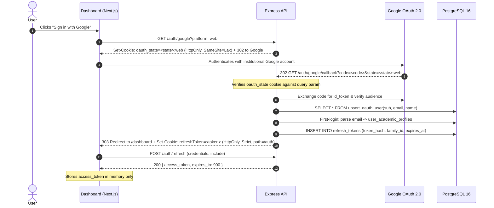
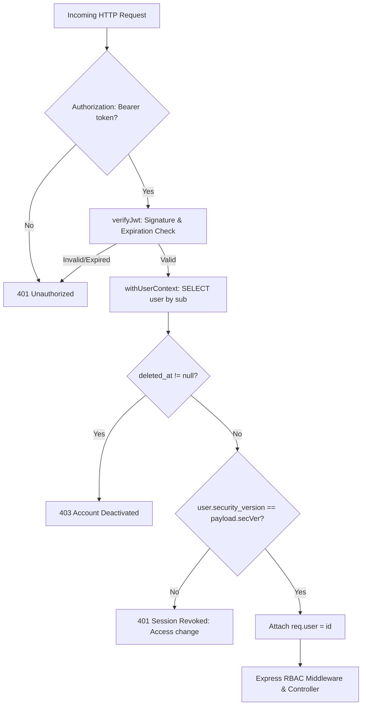

# Authentication Architecture

This document defines the complete end-to-end identity, authentication, and session lifecycle for the NST-Events platform across web and mobile clients.

---

## 1. High-Level Authentication Model

NST-Events uses a **hybrid authentication model**:
- **Identity Provider:** Google OAuth 2.0 (restricted to institutional Google accounts).
- **Access Tokens:** Short-lived (15-minute) stateless JWTs carrying user ID and a security version.
- **Refresh Tokens:** Database-backed, opaque random strings stored as SHA-256 hashes with **Token Family Rotation** and automatic reuse detection.
- **Storage Strategy:**
  - **Web (Dashboard):** In-memory access token + `HttpOnly`, `SameSite=Strict`, `Secure`, `path=/auth` refresh cookie. Access tokens are **never** stored in `localStorage` or `sessionStorage`.
  - **Mobile (Expo / React Native):** Hardware-backed encrypted storage via `expo-secure-store` (iOS Keychain / Android Keystore) for both access and refresh tokens.

---

## 2. End-to-End Authentication Sequences

### 2.1 Web Authentication Flow (Dashboard)



### 2.2 Mobile Authentication Flow (Expo / React Native)

Mobile clients authenticate using either of two secure flows:

#### Method A: Deep-Link Code Exchange (Web Browser OAuth)
1. Mobile app opens system browser to `GET /auth/google?platform=mobile`.
2. After Google callback, the API creates a cryptographically random, single-use **Mobile Auth Code** (`CODE_TTL_MS = 60_000` via `apps/api/src/modules/auth/mobile-auth-codes.ts`).
3. API redirects browser to mobile custom scheme: `nst-events://(auth)/callback?code=<mobileCode>`.
4. Mobile app captures deep link and calls:
   ```http
   POST /auth/mobile/exchange
   Content-Type: application/json

   { "code": "<mobileCode>" }
   ```
5. API consumes the single-use code immediately (deleting it to prevent reuse) and returns:
   ```json
   {
     "access_token": "<jwt>",
     "refresh_token": "<raw_refresh_token>",
     "expires_in": 900
   }
   ```
6. Mobile app saves `access_token`, `refresh_token`, and `user_id` into `expo-secure-store`.

#### Method B: Native Google Sign-In (`id_token` Direct Exchange)
1. Mobile app utilizes native Google Sign-In SDK to acquire a Google `id_token`.
2. Mobile app calls:
   ```http
   POST /auth/mobile/login-id-token
   Content-Type: application/json

   { "id_token": "<google_id_token>" }
   ```
3. API validates the ID token against Google's public keys, enforces domain restrictions, upserts user, issues tokens, and returns the token pair directly in the JSON response.

---

## 3. Authenticated Request & Session Execution

Every authenticated request follows a strict verification pipeline:



---

## 4. Transparent Token Refresh Lifecycle

Access tokens expire after **15 minutes** (`900 seconds`). Both web and mobile implement automatic, transparent token refresh without user disruption:

### 4.1 Web Interceptor Flow (`apps/dashboard/lib/api.ts`)
1. An API request returns `401 Unauthorized`.
2. The dashboard interceptor holds pending requests using a shared `refreshPromise`.
3. Calls `POST /auth/refresh` with `credentials: 'include'`.
4. The browser automatically attaches the `refreshToken` cookie.
5. On `200 OK`, updates the in-memory access token and replays original failed request.
6. If `/auth/refresh` returns `401`, in-memory auth is purged, and the browser redirects to `/login`.

### 4.2 Mobile Interceptor Flow (`apps/mobile/src/store/auth.ts`)
1. An API request returns `401 Unauthorized`.
2. Mobile calls `POST /auth/refresh` using `fetch()` directly with `{ "refresh_token": "<stored_token>" }`.
3. On `200 OK`, updates `expo-secure-store` with new `access_token` and rotated `refresh_token`.
4. If refresh fails, `clearSession()` is called: deletes all SecureStore keys and purges the React Query cache.

---

## 5. Logout & Revocation Lifecycle

When a user logs out (`POST /auth/logout`):
1. **Server-Side Token Revocation:**
   The backend extracts the refresh token from cookie or body, hashes it (`SHA-256`), and calls the PostgreSQL procedure:
   ```sql
   SELECT revoke_refresh_token_by_hash(${tokenHash});
   ```
   This sets `revoked_at = now()`, immediately destroying the session.
2. **Cookie Destruction:**
   The server issues `Set-Cookie: refreshToken=; Max-Age=0; Path=/auth; HttpOnly; SameSite=Strict`.
3. **Client-Side Cache Purge:**
   - **Web:** Clears in-memory access token and redirects to `/login`.
   - **Mobile:** Deletes `access_token`, `user_id`, and `refresh_token` from `expo-secure-store` and executes `queryClient.clear()` to eliminate cross-session data leaks.
