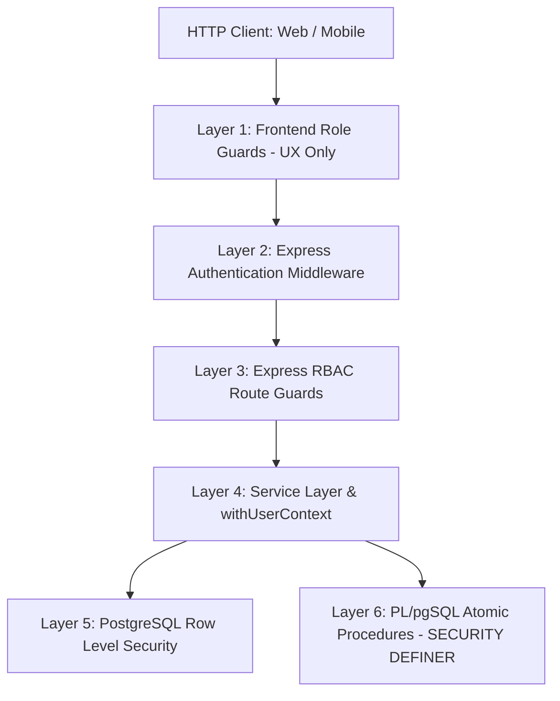
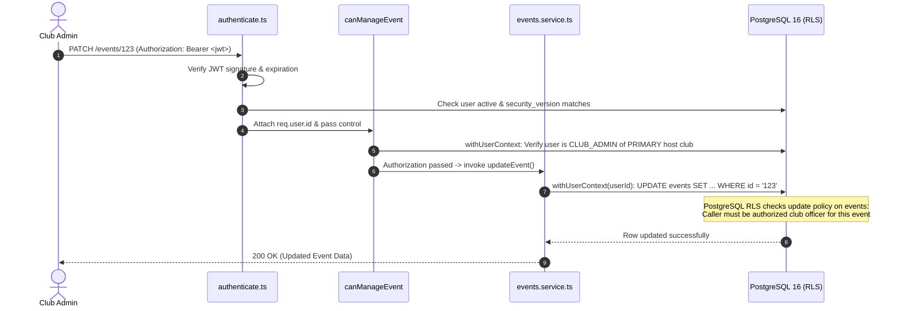

# Authorization Model & Defense-in-Depth Pipeline

This document defines the multi-layered authorization architecture of NST-Events, tracing request execution from client ingress to database row evaluation.

---

## 1. The Multi-Layer Defense-in-Depth Pipeline

Authorization in NST-Events is never entrusted to a single layer. Security boundaries are stacked redundantly:

| Layer | Component | Execution Context | Trust Level & Purpose |
| :--- | :--- | :--- | :--- |
| **Layer 1** | Frontend UI Guards | Next.js / React Native | **ZERO TRUST (UX ONLY).** Conditionally displays buttons, tabs, and navigation links. An attacker can easily bypass this by firing raw HTTP requests. |
| **Layer 2** | `authenticate.ts` | Express Middleware | **PRIMARY IDENTITY GATE.** Verifies JWT signature, expiration, user soft-delete status (`deleted_at IS NULL`), and security version (`security_version == payload.secVer`). |
| **Layer 3** | `authorize.ts` | Express Route Guards | **PRIMARY ROLE GATE.** Evaluates whether the caller holds the necessary global or club-level permissions by issuing live queries to `users` and `club_memberships`. |
| **Layer 4** | `withUserContext` | Service / Transaction Client | **CONTEXT BINDING.** Injects caller identity into the database transaction session (`SELECT set_config('app.user_id', ${userId}, true)`). |
| **Layer 5** | PostgreSQL RLS | Database Engine | **SECONDARY / SAFETY NET.** Tables configured with `FORCE ROW LEVEL SECURITY` evaluate row access natively, ensuring leaked queries cannot cross tenant boundaries. |
| **Layer 6** | Stored Procedures | PL/pgSQL RPCs | **ATOMIC TRANSACTION BOUNDARY.** Complex workflows (event registration, attendance marking, dispute resolution) run with procedural integrity, advisory locking, and fixed `search_path`. |

---

## 2. Request Trace: From Ingress to PostgreSQL

### Example: Updating Event Details (`PATCH /events/:id`)

---

## 3. Route Authorization Classifications

All API endpoints fall into four distinct security tiers:

### 3.1 Public Endpoints (No Authentication Required)
- `GET /health`, `GET /ready`: System health and Kubernetes probes.
- `GET /auth/google`, `GET /auth/google/callback`: OAuth entry points.
- `POST /auth/mobile/exchange`, `POST /auth/mobile/login-id-token`: Token acquisition.

### 3.2 Authenticated General Endpoints (`authenticate` Required)
- `GET /events`: Reads published events (RLS automatically filters out draft/private events for general students).
- `GET /clubs`: Reads active campus clubs directory.
- `POST /events/:id/register`: Gated by caller's user identity, capacity limits, and batch eligibility.
- `POST /attendance/sessions/:id/scan`: Check-in gated by physical location, TOTP validity, and device fingerprints.

### 3.3 Contextual Club Role Endpoints (`canManageClub*`, `canManageEvent`)
- `PATCH /clubs/:id`: Restricted to `PLATFORM_ADMIN`, `FACULTY_ADMIN`, or `CLUB_ADMIN` of that specific club.
- `POST /clubs/:id/members`: Restricted to `PLATFORM_ADMIN` or `CLUB_ADMIN` of that club.
- `PATCH /events/:id`: Restricted to `PLATFORM_ADMIN`, `FACULTY_ADMIN`, or `CLUB_ADMIN`/`CORE_MEMBER` of the **PRIMARY** host club.
- `POST /events/:id/approve`: Restricted to `PLATFORM_ADMIN`, `FACULTY_ADMIN`, or `FACULTY_MENTOR` of the **PRIMARY** host club.

### 3.4 Platform Admin Super-Routes (`requireRole(['PLATFORM_ADMIN'])`)
- `/admin/queue/*`: DLQ inspection, job replay, worker metrics.
- `/admin/audit-logs/*`: System-wide audit log inspection.
- `/admin/students/*`: Whitelist directory mutations.
- `/admin/academic-programs/*`, `/admin/academic-batches/*`: Degree structure mutations.
- `POST /admin/users/:id/role`: Mutating user global roles.

---

## 4. Redundant vs. Single-Boundary Evaluation

| Operation Type | Express Middleware Check | Database RLS / RPC Check | Redundancy Level |
| :--- | :---: | :---: | :--- |
| **Event Modification (`PATCH /events/:id`)** | Verified via `canManageEvent` | Enforced via `events` UPDATE policy | **DUAL LAYER (Redundant)** |
| **Club Role Promotion (`POST /clubs/:id/members`)** | Verified via `canManageClubMembers` | Enforced via `club_memberships` policy + trigger | **DUAL LAYER (Redundant)** |
| **Global Role Elevation (`PATCH /admin/users/:id`)** | Verified via `requireRole(['PLATFORM_ADMIN'])` | Enforced via `enforce_global_role_protection` trigger | **DUAL LAYER (Redundant)** |
| **Attendance Check-In (`POST /attendance/scan`)** | Authenticated user session | Evaluated inside `mark_attendance` RPC | **RPC ENFORCED (ACID Isolated)** |
| **Public Feed (`GET /events`)** | Optional/Authenticated | RLS filters rows where `state = 'PUBLISHED'` | **RLS NATIVE FILTER** |
| **Offline Attendance Sync (`POST /attendance/sync`)** | Authenticated user session | Enforces `v_user_id := current_user_id()` | **RPC ENFORCED (Caller Bound)** |
