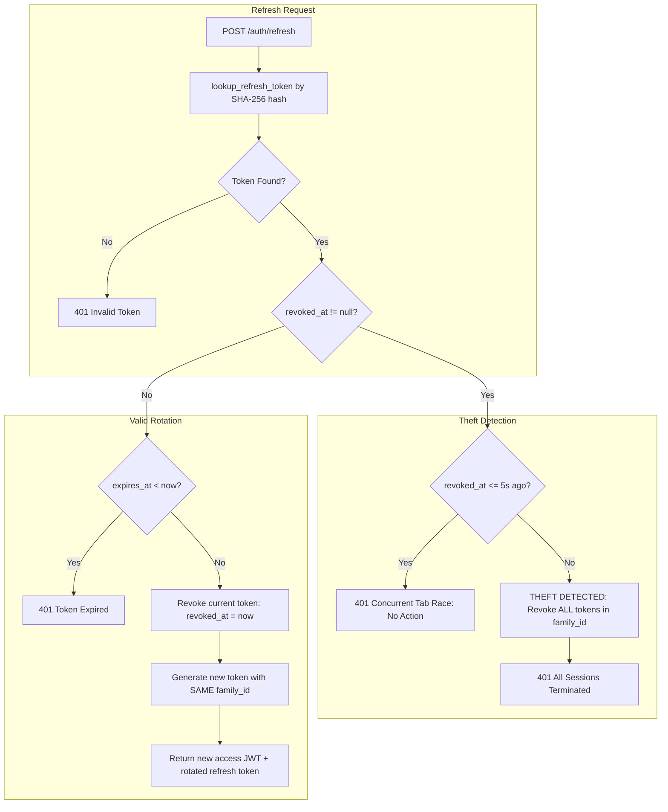

# JWT, Refresh Tokens, & Session Architecture

This document defines the stateless JWT format, security version revocation mechanics, database refresh token rotation, and cookie security attributes.

---

## 1. Access Token (JWT) Specification

| Property | Value | Architectural Rationale |
| :--- | :--- | :--- |
| **Format** | Signed JSON Web Token | Stateless request authentication. |
| **Algorithm** | **`HS256`** | Symmetric signing via `JWT_SECRET`. |
| **Lifespan** | **15 minutes (`900s`)** | Limits the exposure window if a token is intercepted in transit. |
| **Payload Claims** | `{ sub, secVer, iat, exp }` | Intentionally minimal. Roles are **never** baked into JWT claims. |
| **Signing Secret** | `JWT_SECRET` | Cryptographically random string ($\ge 256$ bits) managed in environment secrets. |

```typescript
export interface JwtPayload {
  sub: string;      // User ID (UUID)
  secVer: number;   // Security Version (maps to users.security_version)
  iat?: number;     // Issued At timestamp
  exp?: number;     // Expiration timestamp
}
```

### 1.1 Why Roles Are Omitted from JWTs
Roles, club memberships, and permissions are **never stored in the JWT payload**:
- If a student is demoted from `CLUB_ADMIN` or banned from the platform, baking roles into a token would allow them to continue acting as admin until the token expires.
- Instead, NST-Events resolves user roles **live from the database on every authenticated request**, ensuring immediate enforcement of permission changes.

### 1.2 Instant Revocation via `secVer` (Security Version)
The `users` table maintains an integer column: `security_version INT DEFAULT 1`.
- When an administrator modifies a user's `global_role`, deactivates an account, or when suspicious activity is detected, `security_version` is atomically incremented.
- During authentication middleware validation:
  ```typescript
  if (user.securityVersion !== payload.secVer) {
    throw new UnauthorizedError('Session revoked due to role or access change');
  }
  ```
- This immediately invalidates all active 15-minute access JWTs for that user across all devices without waiting for expiration.

---

## 2. Refresh Token & Token Family Rotation

Refresh tokens are long-lived (30-day) credentials used exclusively to acquire fresh 15-minute access tokens.



### 2.1 Database Schema (`refresh_tokens`)
```sql
CREATE TABLE refresh_tokens (
  id          UUID PRIMARY KEY DEFAULT gen_random_uuid(),
  user_id     UUID NOT NULL REFERENCES users(id) ON DELETE CASCADE,
  token_hash  TEXT NOT NULL UNIQUE,  -- SHA-256 hash (raw token never stored)
  family_id   UUID NOT NULL,         -- Links rotated tokens together
  expires_at  TIMESTAMPTZ NOT NULL,
  revoked_at  TIMESTAMPTZ,           -- Non-null indicates retired or revoked
  user_agent  TEXT,
  ip_address  TEXT,
  created_at  TIMESTAMPTZ NOT NULL DEFAULT now()
);
```

### 2.2 Security Rules
1. **Never Store Raw Tokens:** The server generates a high-entropy random string (`generateRefreshToken()`), computes its `SHA-256` hash (`hashToken()`), and writes only the hash to PostgreSQL.
2. **Strict Rotation:** Every call to `POST /auth/refresh` revokes the incoming token and issues a new one with a fresh 30-day lifespan, carrying the same `family_id`.
3. **Concurrent Request Handling (5-Second Grace Window):**
   If a user opens two browser tabs that refresh simultaneously, the second tab will present an already-revoked token:
   - If $\Delta t = \text{now}() - \text{revoked\_at} \le 5\text{ seconds}$, the backend returns `401` without punishing the user.
   - If $\Delta t > 5\text{ seconds}$, an attacker has replayed an old token. The backend instantly revokes every token sharing that `family_id`, destroying all active sessions across all devices for that user.

---

## 3. Cookie Security Attributes (Web)

For web dashboard sessions, refresh tokens are transmitted exclusively in cookies to defend against Cross-Site Scripting (XSS) extraction:

| Cookie Attribute | Production Setting | Purpose |
| :--- | :--- | :--- |
| **`HttpOnly`** | `true` | Prevents client-side JavaScript (`document.cookie`) from accessing the token. |
| **`Secure`** | `true` | Transmitted only over encrypted HTTPS connections (disabled only for local HTTP dev). |
| **`SameSite`** | **`Strict`** | The browser refuses to send the cookie on any cross-site request, eliminating CSRF vulnerabilities. |
| **`Path`** | **`/auth`** | The cookie is scoped strictly to `/auth` endpoints. It is **never** sent to standard `/events`, `/clubs`, or `/api` routes. |
| **`Max-Age`** | `2,592,000` (30 days) | Matches the refresh token database expiration. |

---

## 4. Mobile Token Storage (`expo-secure-store`)

Because mobile apps do not run inside standard browser cookie jars, tokens are managed natively via `expo-secure-store`:

### 4.1 Storage Implementation
- **iOS:** Stored in the encrypted **iOS Keychain** with accessibility set to `WHEN_UNLOCKED`.
- **Android:** Stored in encrypted SharedPreferences backed by the **Android Keystore system**.
- **Keys Stored:**
  - `access_token`: Active 15-minute JWT.
  - `refresh_token`: Opaque rotating token string.
  - `user_id`: Current user identifier.
  - `nst_persistent_device_id`: Immutable hardware fingerprint for attendance verification.

### 4.2 Cache & Memory Sanitization
On user logout or session expiration, the mobile application strictly executes:
1. Complete deletion of all SecureStore token entries.
2. Complete wipe of the in-memory React Query cache via `queryClient.clear()`, preventing sensitive event or profile data from leaking into subsequent user sessions on shared devices.
