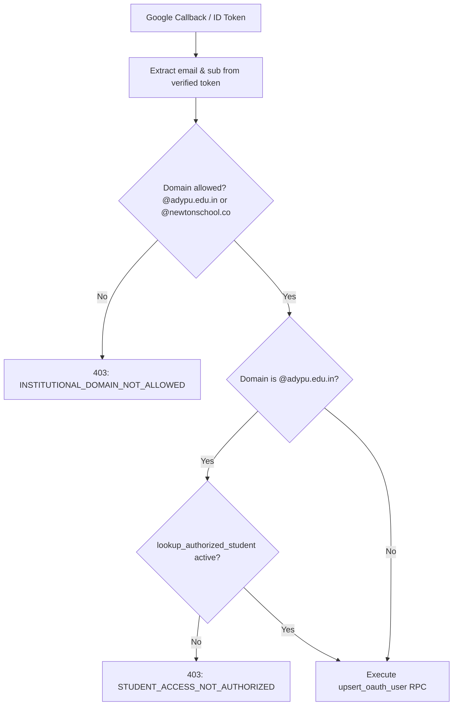

# Google OAuth 2.0 Integration & Identity Ingestion

This document defines the Google OAuth 2.0 architecture, domain verification rules, student directory validation, user upserting, and automatic academic batch inference.

---

## 1. Provider & Configuration

NST-Events exclusively integrates with Google Identity Services using the official `google-auth-library`:

| Configuration Parameter | Environment Variable | Verification & Usage |
| :--- | :--- | :--- |
| **Client ID** | `GOOGLE_CLIENT_ID` | Configured in Google Cloud Console; audience checked on all tokens. |
| **Client Secret** | `GOOGLE_CLIENT_SECRET` | Backend server-side secret used for authorization code exchange. |
| **Callback URL** | `GOOGLE_CALLBACK_URL` | Canonical redirect URI registered with Google (e.g. `https://api.nstsdc.org/auth/google/callback`). |
| **Requested Scopes** | `openid`, `email`, `profile` | Minimum required scopes for verified identity ingestion. |

---

## 2. OAuth State CSRF Mitigation

To defend against OAuth login CSRF and state injection:
1. `GET /auth/google` generates 16 bytes of cryptographically secure randomness.
2. Formats a compound state token: `${randomHex}:${platform}` (where platform is `web` or `mobile`).
3. Persists this token in a signed HTTP cookie:
   - **Name:** `oauth_state`
   - **Attributes:** `HttpOnly`, `SameSite=Lax`, `Path=/auth`, `Max-Age=600` (10 minutes), `Signed=true`.
   - *Note:* `SameSite=Lax` is strictly required to ensure the cookie survives the cross-site top-level redirect back from `accounts.google.com`.
4. On callback (`GET /auth/google/callback`), the query `state` parameter must cryptographically match the `oauth_state` cookie value; otherwise, the request is immediately rejected with `401 Unauthorized`.
5. The state cookie is cleared immediately upon successful verification.

---

## 3. Institutional Domain Restriction & Whitelisting

NST-Events enforces strict zero-trust boundary controls before a user record is touched or created:



### 3.1 Domain Rules
- **Allowed Domains:** `adypu.edu.in`, `newtonschool.co` (controlled via `ALLOWED_EMAIL_DOMAINS`).
- **Student Authorization Directory (`authorized_students`):**
  For `@adypu.edu.in` accounts, the API executes:
  ```sql
  SELECT * FROM lookup_authorized_student(${normalizedEmail});
  ```
  If the student's email is not present in the pre-approved institutional directory or has status `REVOKED`, the login is rejected with `STUDENT_ACCESS_NOT_AUTHORIZED`.

---

## 4. User Upserting & Account Linking

Identity creation and updates run through the PostgreSQL stored procedure `upsert_oauth_user`:

```sql
CREATE OR REPLACE FUNCTION public.upsert_oauth_user(
    p_google_sub text,
    p_email text,
    p_full_name text
) RETURNS SETOF users
LANGUAGE plpgsql SECURITY DEFINER SET search_path TO 'public', 'pg_catalog'
```

### Key Security Safeguards
1. **Immutable Identity Anchor:** `google_sub` serves as the primary unique identity anchor.
2. **Race-Condition Handling (P2002):**
   If concurrent login requests arrive simultaneously for a first-time user, the database catches unique violations on `email` and merges the `googleSub` safely without throwing unhandled exceptions.
3. **Role Assignment on Creation:**
   - Accounts with `@newtonschool.co` are automatically assigned `FACULTY_MENTOR` status upon creation.
   - All other accounts default to `STUDENT`.
   - The stored procedure strictly ignores attempts to override `global_role` or `security_version` during standard OAuth logins.
4. **Soft-Delete Enforcement:**
   If `deleted_at IS NOT NULL`, the login is blocked with `403 Forbidden ('Account deactivated')`.

---

## 5. Automatic Academic Profile Inference

On a student's first successful login, the system automatically detects their degree program and admission cohort using the institutional email parser (`apps/api/src/modules/auth/academic-parser.ts`):

### 5.1 Pattern Matching
Institutional emails follow structured formats, for example: `btechcs2024.john.doe@adypu.edu.in`.
- **Prefix:** `btechcs` (Mapped to degree program code in `academic_programs`).
- **Year:** `2024` (Mapped to admission year in `academic_batches`).

### 5.2 Atomic Profile Binding
If a single matching batch exists in `academic_batches`:
```sql
INSERT INTO user_academic_profiles (
  id, user_id, batch_id, assignment_source
) VALUES (
  gen_random_uuid(), :userId, :batchId, 'INSTITUTIONAL_EMAIL_INFERENCE'
) ON CONFLICT (user_id) DO NOTHING;
```
This enables immediate eligibility verification for cohort-restricted events without requiring manual administrative data entry.
