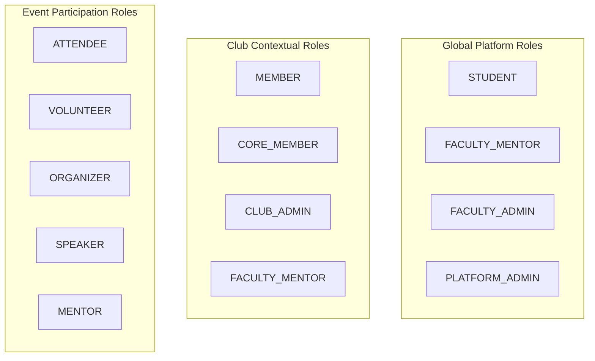

# Role-Based Access Control (RBAC) & Authority Matrix

This document defines the complete role hierarchy, club-level contextual roles, event organizational authority, and the canonical system authorization matrix.

---

## 1. Role Taxonomies

NST-Events maintains three distinct, strictly decoupled role taxonomies:



> [!IMPORTANT]
> **Separation of Global and Club Roles:**
> `GlobalRole` (stored in `users.global_role`) and `ClubRole` (stored in `club_memberships.role`) are completely independent enums. Being a `CLUB_ADMIN` of a robotics club does **not** grant platform-wide administrator privileges. Conversely, a `PLATFORM_ADMIN` bypasses club checks globally.

---

## 2. Global Platform Roles (`GlobalRole`)

| Role | Scope | Key Responsibilities & Capabilities |
| :--- | :--- | :--- |
| **`STUDENT`** | Campus Attendee | Standard default role. Can browse published events, register, form/join teams, check in to attendance sessions, submit disputes, view leaderboards, and join clubs as a member. |
| **`FACULTY_MENTOR`** | Academic Guide | Assigned to verified faculty mentors (default for `@newtonschool.co`). Can be assigned to sponsor specific clubs, approve event proposals, and review attendance disputes. |
| **`FACULTY_ADMIN`** | University Authority | Dean / Institutional administrator. Holds global approval authority over all club events, event locking/unlocking, club oversight data, and student academic batch assignments. |
| **`PLATFORM_ADMIN`** | Technical Superuser | Full system authority. Manages system queues, DLQ replays, audit logs, student whitelists (`authorized_students`), global announcements, and user global role assignments. |

---

## 3. Club Contextual Roles (`ClubRole`)

Club roles apply strictly within the context of a specific `club_id`:

| Role | Context | Operational Privileges |
| :--- | :--- | :--- |
| **`MEMBER`** | Club Roster | General club membership. Can view internal member roster and club announcements. |
| **`CORE_MEMBER`** | Event Organizer | Organizing committee member. Can draft events for the club, manage attendance sessions, and scan attendee QR codes. |
| **`CLUB_ADMIN`** | Club Executive | Club president or lead. Full management authority over club profile, roster appointments/promotions, event creation, team administration, and dispute escalation. |
| **`FACULTY_MENTOR`** | Club Sponsor | The formal faculty guide assigned to that club. Holds primary sign-off authority to approve draft events for publication. |

---

## 4. Multi-Club Collaboration & The Primary Club Rule

Events in NST-Events can be co-hosted by multiple clubs via the `event_clubs` associative table:

```sql
CREATE TABLE event_clubs (
  event_id   UUID REFERENCES events(id),
  club_id    UUID REFERENCES clubs(id),
  is_primary BOOLEAN DEFAULT false,
  PRIMARY KEY (event_id, club_id)
);
```

### The Primary Club Rule
To prevent governance deadlock or conflicting edits between collaborating clubs:
1. **Exactly ONE club** is designated as `is_primary = true`.
2. **Administrative Exclusivity:** Only officers (`CLUB_ADMIN` or `CORE_MEMBER`) of the **PRIMARY club** have authority to:
   - Edit event title, dates, descriptions, capacity, and audience scopes.
   - Lock or unlock the event.
   - Cancel the event.
3. **Approval Exclusivity:** Only the `FACULTY_MENTOR` assigned to the **PRIMARY club** (or global `FACULTY_ADMIN` / `PLATFORM_ADMIN`) can execute `POST /events/:id/approve` to publish the event.
4. **Collaborating Club Privileges:** Co-hosting clubs (`is_primary = false`) share public visibility, branding, and attendance check-in rights, but cannot unilaterally alter core event parameters.

---

## 5. Event Lock Boundary (`is_locked`)

When an event reaches active execution, it is placed into a locked state:
- **Automatic Lock:** Triggered when `now() >= events.end_time + interval '24 hours'`.
- **Manual Lock:** Executed via `lock_event(event_id)` by the primary club admin or faculty admin.
- **Lock Invariants:**
  - No event metadata, venue coordinates, or session times can be updated.
  - No new attendance sessions can be generated.
  - Team rosters are frozen (no `join_team`, `leave_team`, or `cancel_team`).
  - Attendance scans outside the locked boundary are rejected with SQLSTATE `U0006` (`EVENT_LOCKED`).

---

## 6. Comprehensive Authorization Matrix

| Identity / Role | Resource | Read | Create | Update | Delete | Special Conditions & Constraints |
| :--- | :--- | :---: | :---: | :---: | :---: | :--- |
| **Public / Guest** | Health / Probes | YES | NO | NO | NO | System probes only. |
| **Public / Guest** | Events | NO | NO | NO | NO | Read requires authentication. |
| **STUDENT** | `events` | YES | NO | NO | NO | Can only read rows where `state = 'PUBLISHED'`. |
| **STUDENT** | `event_registrations` | OWN | YES | CANCEL | NO | Can register if within capacity and batch eligible. |
| **STUDENT** | `teams` | YES | YES | LEADER | LEADER | Can create teams for team events; can leave or cancel if leader. |
| **STUDENT** | `attendance_records` | OWN | VIA RPC | NO | NO | Check-in via `mark_attendance` (geofence + dynamic TOTP). |
| **STUDENT** | `attendance_disputes`| OWN | YES | NO | NO | 1 dispute per session within dispute window. |
| **STUDENT** | `public_profiles` | YES | NO | NO | NO | Non-sensitive profile directory. |
| **CLUB_ADMIN** (Primary) | `events` (Draft) | OWN | YES | YES | SOFT | Full control over draft/pending events of their club. |
| **CLUB_ADMIN** (Primary) | `attendance_sessions`| YES | YES | YES | SOFT | Creates scan windows, generates dynamic QR secrets. |
| **CLUB_ADMIN** (Any) | `club_memberships` | YES | YES | YES | YES | Appoints members and core members within their club. |
| **CLUB_ADMIN** | Flagged Attendance | YES | NO | NO | NO | Can view device collision flags; cannot override records. |
| **FACULTY_MENTOR** (Primary) | `events` | YES | NO | APPROVE | NO | Can transition event from `PENDING_APPROVAL` to `PUBLISHED`. |
| **FACULTY_MENTOR** | `attendance_disputes`| YES | NO | RESOLVE | NO | Reviews and approves disputes, marking records `EXCUSED`. |
| **FACULTY_ADMIN** | `events` (All) | YES | YES | YES | SOFT | Campus-wide event override and approval bypass. |
| **FACULTY_ADMIN** | `academic_batches` | YES | YES | YES | NO | Academic cohort management. |
| **PLATFORM_ADMIN** | `users.global_role` | YES | NO | YES | NO | Only role permitted to elevate users or assign mentors. |
| **PLATFORM_ADMIN** | `notification_jobs` | YES | NO | REPLAY | DELETE | DLQ inspection and background queue management. |
| **PLATFORM_ADMIN** | `audit_logs` | YES | NO | NO | NO | System-wide immutable forensic logs inspection. |
| **PLATFORM_ADMIN** | `authorized_students`| YES | YES | YES | YES | Pre-approved institutional directory whitelist. |
| **`nst_worker`** | `notification_jobs` | ALL | NO | STATUS | YES | Queue claiming (`SKIP LOCKED`), delivery tracking. |
| **`nst_worker`** | `push_tokens` | YES | NO | NO | NO | Reads tokens to send Expo pushes. |
