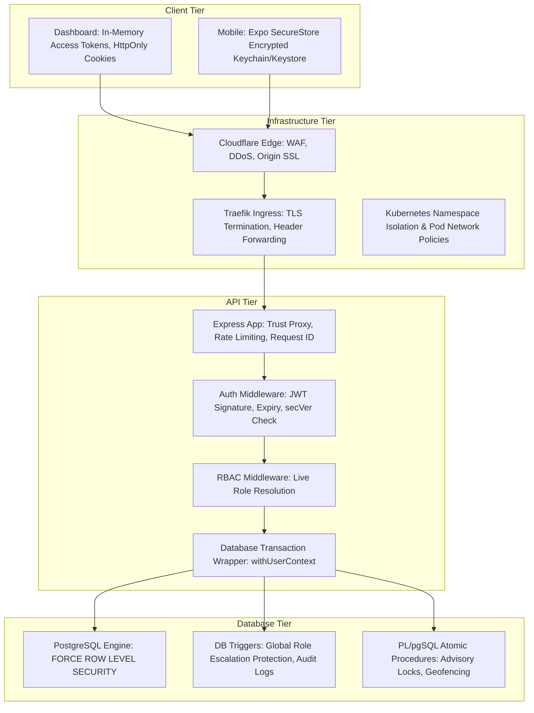

# Platform Security Model & Threat Analysis

This document provides a holistic architectural assessment of the platform security model across Client, API, Database, and Infrastructure tiers, evaluates the STRIDE threat model, and records verified security risks and gaps.

---

## 1. Platform Tier Security Responsibilities



| Tier | Primary Security Invariants |
| :--- | :--- |
| **Infrastructure Tier** | 1. Strict TLS 1.3 encryption from browser to origin via Cloudflare and Traefik.<br>2. Origin port 5432 (PostgreSQL) is strictly cluster-internal and never exposed to the public Internet.<br>3. Secrets are injected at runtime via Kubernetes Secrets (`envFrom: secretRef`). |
| **Client Tier** | 1. Web dashboard stores access tokens strictly in memory; zero persistence in `localStorage`.<br>2. Mobile stores tokens in encrypted hardware keystores via `expo-secure-store`.<br>3. Complete cache sanitization (`queryClient.clear()`) on user logout. |
| **API Tier** | 1. Access tokens are stateless 15-minute JWTs bearing user ID and security version (`secVer`).<br>2. Roles are never cached in tokens; resolved live against PostgreSQL on every request.<br>3. Rate limiters protect authentication callbacks, token refresh, and mobile code exchanges. |
| **Database Tier** | 1. Queries execute under unprivileged role `nst_app` (`NOSUPERUSER`, `NOBYPASSRLS`).<br>2. All sensitive tables enforce `FORCE ROW LEVEL SECURITY`.<br>3. Procedural operations (`SECURITY DEFINER`) enforce strict `SET search_path = public, pg_catalog`.<br>4. Identity is injected transaction-locally (`set_config(..., true)`), preventing connection pool leakage. |

---

## 2. STRIDE Threat Model & Mitigations

### 2.1 Spoofing Identity
- **Threat:** An attacker forges a user ID or claims to be an administrator.
- **Mitigations:**
  - JWTs are cryptographically signed with `HS256` using a high-entropy secret.
  - Role claims are not stored in JWTs; they are evaluated live from the database.
  - Dynamic QR codes for attendance are signed with per-session HMAC secrets (`pgcrypto`), preventing spoofed QR generation.

### 2.2 Tampering with Data
- **Threat:** A student tampers with event capacities, changes attendance records, or alters club rosters.
- **Mitigations:**
  - Row Level Security blocks direct writes from unauthorized accounts.
  - Critical workflows (event registration, attendance marking, team joins) execute via atomic stored procedures using PostgreSQL advisory locks and row locks (`FOR UPDATE`).
  - Immutable `audit_logs` record forensic snapshots of prior and mutated states.

### 2.3 Repudiation
- **Threat:** A student denies checking in, or an officer denies approving a disputed event.
- **Mitigations:**
  - Attendance check-ins record forensic telemetry (`device_id`, `device_os`, `gps_accuracy`, `app_version`, `scan_timestamp`) in `attendance_records.audit_metadata`.
  - Membership promotions and event approval actions capture `actor_id` in `audit_logs`.

### 2.4 Information Disclosure
- **Threat:** Unauthenticated scraping of student rosters, emails, or draft event details.
- **Mitigations:**
  - The `public_profiles` view exposes non-sensitive user metadata, shielding `email` and `google_sub`.
  - Unauthenticated access to `/events` and `/clubs` is restricted; draft and pending events are visible solely to host club officers and platform admins.
  - Refresh tokens are stored in the database exclusively as `SHA-256` hashes.

### 2.5 Denial of Service (DoS)
- **Threat:** Flooding token refresh endpoints or exhausting database connections.
- **Mitigations:**
  - Dedicated Express rate limiters applied to `/auth/google/callback` (10 per 15 min), `/auth/refresh` (60 per min), and `/auth/mobile/exchange` (10 per 15 min).
  - Event registration utilizes atomic capacity increments inside transactions, preventing race-condition lock contention.
  - Database connection pools are capped to ensure requests fail fast under overload rather than exhausting PostgreSQL memory.

### 2.6 Elevation of Privilege
- **Threat:** A compromised student account elevates itself to `PLATFORM_ADMIN`.
- **Mitigations:**
  - Database trigger `enforce_global_role_protection` intercepts `UPDATE` queries on `users.global_role` at the engine level, permitting modifications solely if the caller is verified as `PLATFORM_ADMIN`.
  - Modifying a user's role increments `security_version`, immediately invalidating active JWTs.

---

## 3. Verified Security Implementation Risks & Gaps

During this audit, the following architectural risks were verified against repository code:

### 3.1 Mobile Auth Code In-Memory Store (Multi-Replica Risk)
- **Location:** `apps/api/src/modules/auth/mobile-auth-codes.ts`
- **Current State:** 
  Mobile single-use codes are stored in an in-memory `Map<string, PendingCode>()`:
  ```typescript
  const store = new Map<string, PendingCode>();
  ```
- **Risk:**
  When `apps/api` runs with 2 or more replicas in Kubernetes, a mobile browser callback hitting Pod A will store the code in Pod A's local memory. When the mobile app subsequent calls `POST /auth/mobile/exchange`, if the request routes to Pod B, Pod B will return `401 Unauthorized ('Invalid, expired, or already-used authorization code')`.
- **Remediation Required:**
  Migrate mobile auth code storage to a shared, ephemeral PostgreSQL table or Redis with an atomic single-use delete query.

### 3.2 Reverse Proxy Trust Configuration (`trust proxy`)
- **Location:** `apps/api/src/server.ts`
- **Current State:**
  In a cluster behind Cloudflare and Traefik, client IP addresses are passed via headers (`cf-connecting-ip`, `x-forwarded-for`).
- **Risk:**
  If Express does not have `app.set('trust proxy', 1)` enabled, `req.ip` reflects the Traefik pod IP rather than the real student client IP, corrupting rate limiting and forensic audit logging in `audit_logs` and `refresh_tokens`.
- **Verification:**
  Ensure `app.set('trust proxy', 1)` is actively configured in the Express initialization.

### 3.3 Test Email Bypass in Production Code
- **Location:** `apps/api/src/modules/auth/auth.service.ts` line 44–50
- **Current State:**
  ```typescript
  const allowedTestEmails = env.ALLOWED_TEST_EMAILS.split(',').map((e) => e.trim().toLowerCase()).filter(Boolean);
  if (!allowedTestEmails.includes(normalizedEmail)) {
    // Enforces institutional domain and authorized student whitelist
  }
  ```
- **Risk:**
  Allows arbitrary personal email addresses listed in `ALLOWED_TEST_EMAILS` to bypass domain checks and directory whitelisting.
- **Remediation Required:**
  In production deployments, ensure `ALLOWED_TEST_EMAILS` is strictly empty (`""`) in Kubernetes secrets.
