# Event Lifecycle & Operations

This document maps the complete operational workflows, state machine, lock mechanism, and operational sub-page behaviors for events within the NST Events platform, as implemented in `apps/dashboard`.

---

## Event State Machine

An event's `state` strictly governs its visibility, mutability, and which lifecycle actions are available in the UI.

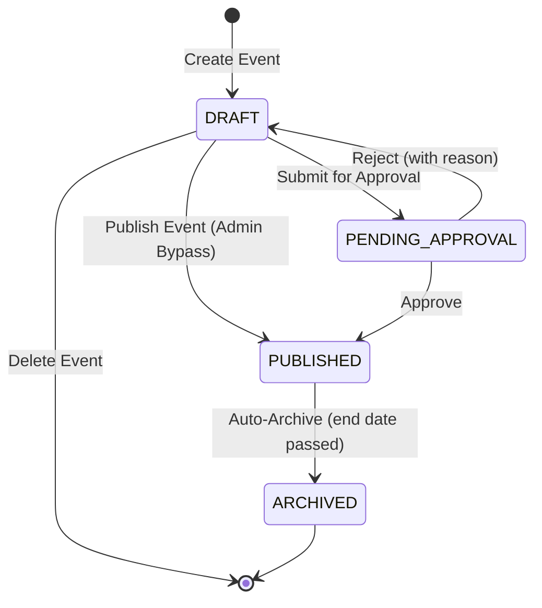

### State Definitions

| State                | Visibility                      | Editability                            | Description                                                                           |
| -------------------- | ------------------------------- | -------------------------------------- | ------------------------------------------------------------------------------------- |
| `DRAFT`            | Hidden from students            | Fully editable                         | Event is being authored. Only visible to organizers.                                  |
| `PENDING_APPROVAL` | Hidden from students            | Locked                                 | Awaiting Faculty Mentor or Admin review.                                              |
| `PUBLISHED`        | Visible per visibility settings | Read-only (details), operations active | Event is live. Registration, teams, and attendance are operational (subject to lock). |
| `ARCHIVED`         | Visible (historical)            | Completely read-only                   | Past event. All operations frozen.                                                    |

---

## Event Lock Mechanism

Independent of the event `state`, a secondary `lockState` is dynamically resolved via [`resolveEventLockState()`](file:///Users/sohamdhande/Docs_Local/nst-events/apps/dashboard/lib/event-utils.ts) to control operational mutations during the `PUBLISHED` state.

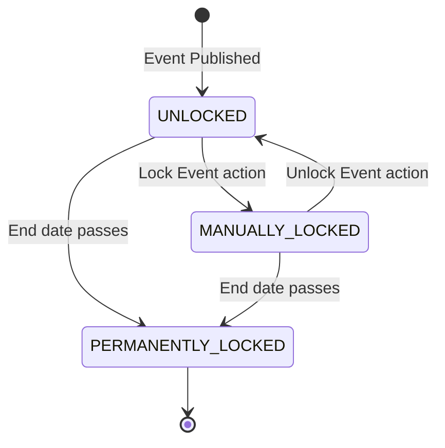

### Lock State Effects

| Lock State             | Effect on Operations                                                                                                                              | Reversible?         |
| ---------------------- | ------------------------------------------------------------------------------------------------------------------------------------------------- | ------------------- |
| `UNLOCKED`           | All operations active. Registration open (capacity permitting). Teams can form/modify.                                                            | N/A                 |
| `MANUALLY_LOCKED`    | Registration frozen. Team operations frozen. Attendance QR generation disabled. All action buttons disabled. "LOCKED — READ-ONLY" tag displayed. | Yes (Unlock button) |
| `PERMANENTLY_LOCKED` | Identical to manual lock but cannot be reversed. "PERMANENTLY LOCKED — READ-ONLY" displayed.                                                     | No                  |

### Lock-Aware UI Behavior

All operational sub-pages (`/registrations`, `/teams`, `/attendance`) check `resolveEventLockState()`:

- Mutation buttons (Cancel Team, Promote Waitlist, Generate QR, End Session) are hidden or disabled.
- Red "LOCKED — READ-ONLY" tag is displayed in page headers.
- QR auto-refresh loop is terminated and fullscreen mode is exited.

---

## Event Creation Workflow

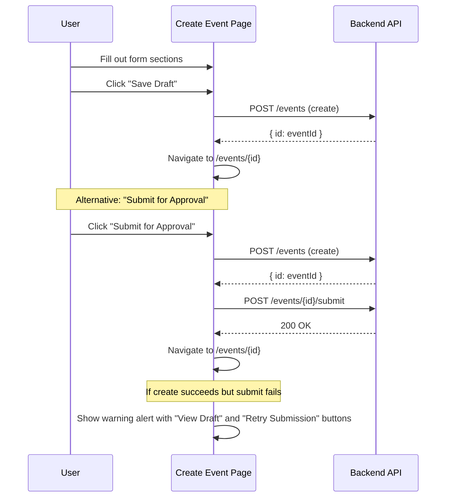

---

## Event Approval Workflow

Two paths exist for transitioning a DRAFT event to PUBLISHED:

### Path A: Standard Approval (Club Admin → Faculty Mentor)

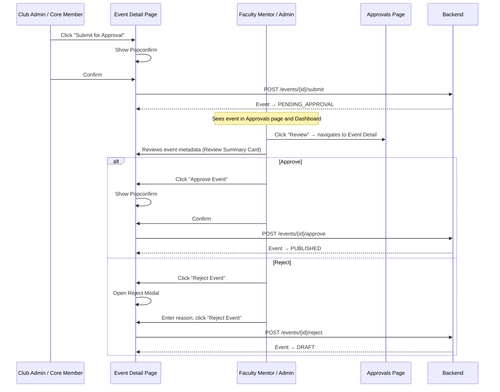

### Path B: Admin Bypass (Global Admin Direct Publish)

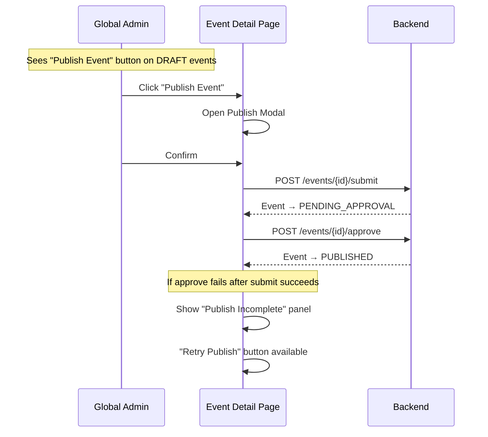

---

## Event Edit & Delete Workflow

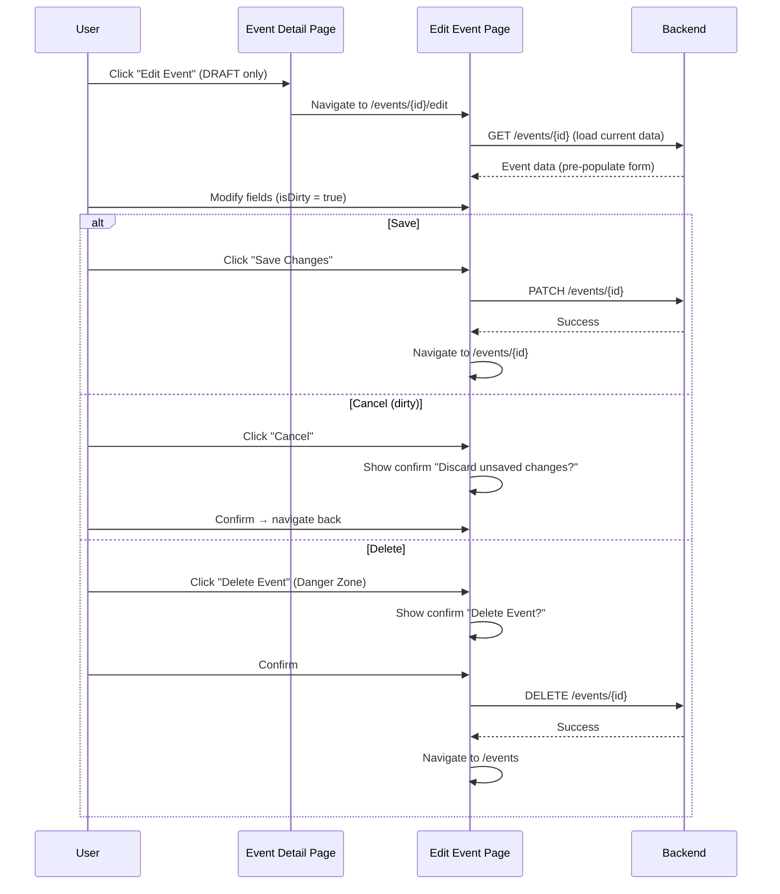

---

## Event Lock/Unlock Workflow

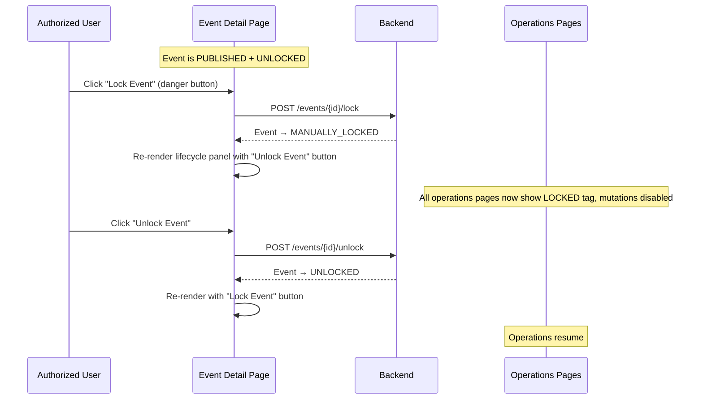

---

## Attendance Session Lifecycle

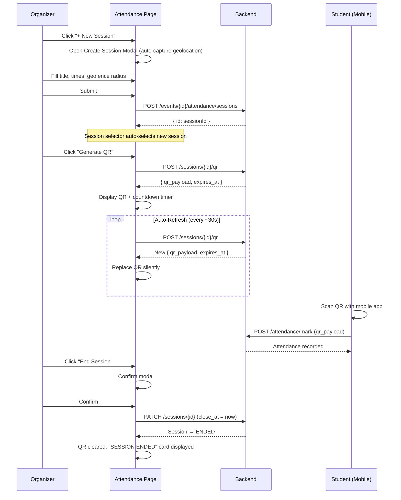

### QR Refresh Lifecycle

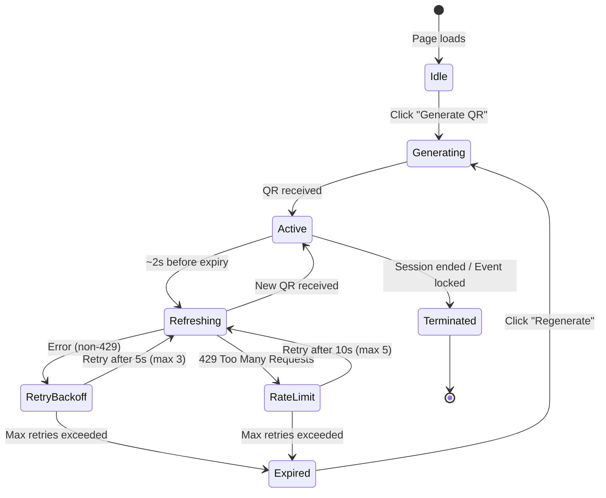

---

## Attendance Dispute Resolution Workflow

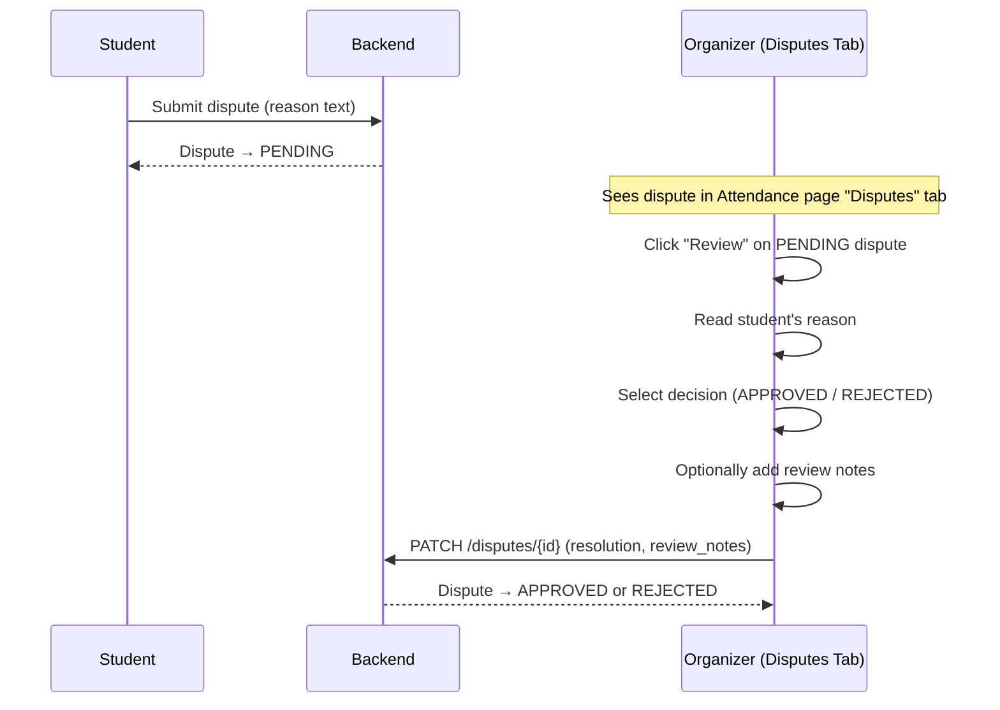

---

## Team Management Workflow

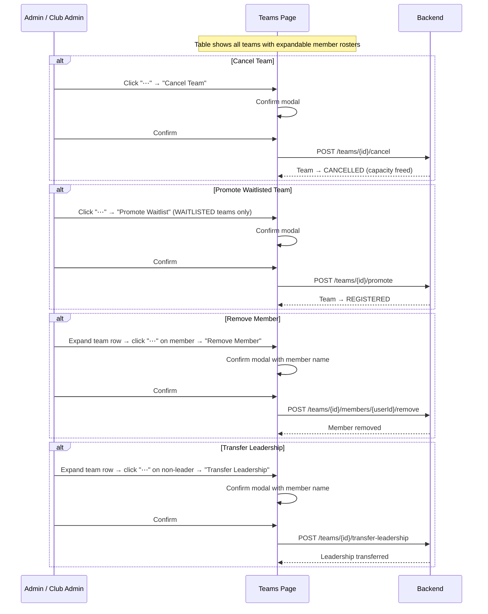

---

## Health Alerts

The dashboard and event detail page surface contextual alerts based on real-time event health:

| Alert                | Condition                                           | Location                    | Visual                                              |
| -------------------- | --------------------------------------------------- | --------------------------- | --------------------------------------------------- |
| `NEAR CAPACITY`    | `registrationCount / maxCapacity >= 0.9`          | Event Detail sidebar        | Warning tag                                         |
| `NEEDS ATTENTION`  | `below_minimum_team_count > 0` and event UNLOCKED | Event Detail main + sidebar | Warning tag + inline alert with "Manage Teams" link |
| `HEALTHY`          | Published, unlocked, no attention flags             | Event Detail sidebar        | Success tag                                         |
| `PENDING APPROVAL` | `state === 'PENDING_APPROVAL'`                    | Event Detail sidebar        | Warning tag                                         |

---

## Live Updates

The event detail page subscribes to real-time updates via the [`useEventLiveUpdates`](file:///Users/sohamdhande/Docs_Local/nst-events/apps/dashboard/hooks/useEventLiveUpdates.ts) hook, which keeps the displayed data in sync with server-side changes (e.g., another admin approving/locking the event, or registrations changing the count).
