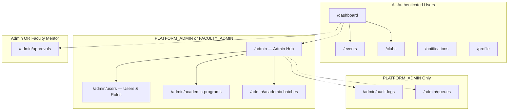

# Admin Information Architecture

This document describes the information architecture, routing structure, and navigation of the NST Events admin experience, reverse-engineered from the `apps/dashboard` codebase.

## Overview

The admin experience is **not a separate application**. It is embedded within the main `apps/dashboard` Next.js web application. Access to specific routes, sidebar links, and inline UI elements (action buttons, lifecycle panels) is gated dynamically on the frontend based on:

1. The user's `global_role` (`PLATFORM_ADMIN`, `FACULTY_ADMIN`, `STUDENT`).
2. The user's `club_memberships` array and the `role` within each club.

**Important**: Frontend checks are cosmetic guards. Authorization is enforced server-side by the backend API and database RLS.

---

## Authentication & Session Architecture

- **Access Token**: Stored in-memory via `lib/auth-store.ts`. Never persisted to `localStorage`.
- **Refresh Token**: HTTP-only cookie, managed by the browser.
- **Auth Bootstrap**: The root `app/(app)/layout.tsx` runs `bootstrapAuth()` on mount. If the user has no valid session, they are redirected to `/login`.
- **Role Gate**: After auth bootstrap, `layout.tsx` inspects `currentUser.global_role` and `club_memberships`. If the user is a pure `STUDENT` with no club roles that grant dashboard access, they are redirected to `/student-access`.

---

## Navigation Structure

The `Sidebar` component (`components/layout/Sidebar.tsx`) dynamically constructs its link list:



### Sidebar Construction Logic

Source: [`Sidebar.tsx`](file:///Users/sohamdhande/Docs_Local/nst-events/apps/dashboard/components/layout/Sidebar.tsx)

```
Base links: Dashboard, Events, Clubs, Notifications, Profile

IF isPlatformAdmin OR isFacultyAdmin:
    ADD Admin Hub, Users & Roles, Academic Programs, Academic Batches

IF isPlatformAdmin OR isFacultyAdmin OR isFacultyMentor:
    ADD Approvals

IF isPlatformAdmin:
    ADD Audit Logs, Queue Monitoring
```

### Context Switcher

A `ContextSwitcher` component appears in the sidebar and allows administrators with multiple roles (e.g., a student who is also a Club Admin) to switch their active perspective context.

---

## Full Route Inventory

### Core Routes (All Roles)

| Route                          | Page                                                                        | File                                   |
| ------------------------------ | --------------------------------------------------------------------------- | -------------------------------------- |
| `/dashboard`                 | Dashboard — Action Required, Operational Summary, Faculty Mentor Oversight | `dashboard/page.tsx`                 |
| `/events`                    | Events List — Search, filter by state/club, role-based action menus        | `events/page.tsx`                    |
| `/events/create`             | Create Event Form (multi-section)                                           | `events/create/page.tsx`             |
| `/events/[id]`               | Event Detail — Lifecycle panel, operations bridge, sidebar status          | `events/[id]/page.tsx`               |
| `/events/[id]/edit`          | Edit Draft Event Form + Danger Zone (Delete)                                | `events/[id]/edit/page.tsx`          |
| `/events/[id]/registrations` | Registration list — filter by status, paginated                            | `events/[id]/registrations/page.tsx` |
| `/events/[id]/teams`         | Teams management — expandable rows, member actions                         | `events/[id]/teams/page.tsx`         |
| `/events/[id]/attendance`    | Attendance ops — sessions, QR, records, disputes                           | `events/[id]/attendance/page.tsx`    |
| `/clubs`                     | Clubs Directory — search, card grid                                        | `clubs/page.tsx`                     |
| `/clubs/[id]`                | Club Detail — tabbed layout (Overview, Members, Events, Administration)    | `clubs/[clubId]/page.tsx`            |
| `/notifications`             | Notifications inbox                                                         | `notifications/page.tsx`             |
| `/profile`                   | User profile                                                                | `profile/page.tsx`                   |

### Admin Routes

| Route                        | Page                                        | Access Gate                                                                           |
| ---------------------------- | ------------------------------------------- | ------------------------------------------------------------------------------------- |
| `/admin`                   | Platform Administration Hub                 | `PLATFORM_ADMIN` or `FACULTY_ADMIN`                                               |
| `/admin/users`             | Users & Roles (Students + Admin Roles tabs) | `canViewStudentDirectory()`                                                         |
| `/admin/approvals`         | Event Approval Queue                        | `PLATFORM_ADMIN`, `FACULTY_ADMIN`, or `FACULTY_MENTOR`                          |
| `/admin/academic-programs` | Academic Program CRUD                       | `PLATFORM_ADMIN` or `FACULTY_ADMIN` (view), `canManageAcademicCatalog()` (edit) |
| `/admin/academic-batches`  | Academic Batch CRUD                         | Same as programs                                                                      |
| `/admin/audit-logs`        | System Audit Log Viewer                     | `PLATFORM_ADMIN`                                                                    |
| `/admin/queues`            | Background Job Queue Monitoring + DLQ       | `PLATFORM_ADMIN`                                                                    |

---

## Layout Components

| Component           | Purpose                                                                        | Source                                   |
| ------------------- | ------------------------------------------------------------------------------ | ---------------------------------------- |
| `AppShell`        | Top-level wrapper providing sidebar + topbar chrome                            | `components/layout/AppShell.tsx`       |
| `Sidebar`         | Left navigation, dynamically built per role                                    | `components/layout/Sidebar.tsx`        |
| `TopBar`          | Top header bar with mobile menu toggle                                         | `components/layout/TopBar.tsx`         |
| `ContextSwitcher` | Role-context switching for multi-role users                                    | `components/ui/ContextSwitcher.tsx`    |
| `AdminPageHeader` | Standardized breadcrumb + title + optional action button for`/admin/*` pages | `components/admin/AdminPageHeader.tsx` |

---

## Key Architectural Patterns

1. **Dynamic Lifecycle Panels**: The Event Detail page conditionally renders entirely different UI panels based on `event.state` and the current user's resolved permissions.
2. **Operations Bridge**: A navigation card injected on Event Detail when `state === 'PUBLISHED'` linking to operational sub-pages (registrations, teams, attendance).
3. **Lock-State Awareness**: All operational sub-pages check `resolveEventLockState()` and disable mutation controls (buttons, actions) when the event is locked.
4. **Inline Pagination**: Most list views use cursor-based infinite scroll with a "Load More" button rather than traditional page numbers.
5. **Responsive Layouts**: All operational tables have a mobile breakpoint at `md` that switches from `<Table>` to card-based `<Flex vertical>` layouts.
