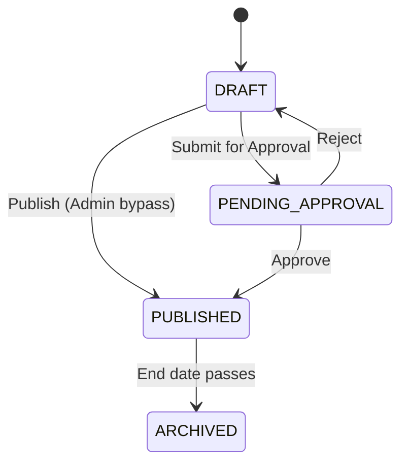

# Admin Screen Inventory

This document details every administrative screen in the NST Events dashboard application, documenting their layout, data display, user interactions, modals, and error states as implemented in `apps/dashboard`.

---

## 1. Dashboard (`/dashboard`)

**Source**: [`dashboard/page.tsx`](file:///Users/sohamdhande/Docs_Local/nst-events/apps/dashboard/app/(app)/dashboard/page.tsx)

The Dashboard is the landing page after authentication. Its content adapts based on the user's global role.

### Layout

The page is divided into two major sections:

1. **Action Required Panel**: Displays a dynamically-computed list of `ManagementAction` items resolved by [`lib/action-utils.ts`](file:///Users/sohamdhande/Docs_Local/nst-events/apps/dashboard/lib/action-utils.ts). Each action links to the relevant page.
2. **Operational Summary Panel**: Shows high-level statistics (total events, clubs, etc.).

### Faculty Mentor Oversight

**Source**: [`FacultyMentorDashboard.tsx`](file:///Users/sohamdhande/Docs_Local/nst-events/apps/dashboard/app/(app)/dashboard/FacultyMentorDashboard.tsx)

Displayed for users with a `FACULTY_MENTOR` club membership. Features:

- **Club Selector**: If the mentor oversees multiple clubs, a `<Select>` dropdown switches the active club context.
- **KPI Cards** (row of 4):
  - Total Events (from club analytics)
  - Average Attendance Rate (%)
  - Pending Approvals (count, highlighted yellow if > 0)
  - Pending Disputes (count, highlighted yellow if > 0)
- **Tabbed Data Panel**:
  - **Pending Approvals Tab**: Table of events in `PENDING_APPROVAL` state for the selected club. Columns: Event Title, Submitted By, Action (→ Review button linking to `/events/[id]`). Badge count on tab label.
  - **Attendance Disputes Tab**: Table of PENDING disputes for the selected club. Columns: Student, Reason (ellipsed), Event, Action (→ Review button linking to `/events/[id]/attendance`). Badge count on tab label.
  - **Club Leaderboard Tab**: Table showing ranked students by `total_points` within the club.
  - **Recent Activity Tab**: Table of audit activity items. Columns: Time, Action, Actor.

---

## 2. Events List (`/events`)

**Source**: [`events/page.tsx`](file:///Users/sohamdhande/Docs_Local/nst-events/apps/dashboard/app/(app)/events/page.tsx)

### Header
- Title: "Events"
- Subtitle: "Manage and view all campus events"
- **+ Create Event** button (conditionally visible based on `canCreateEvent` permission)

### Toolbar
- **Search Input**: Debounced (300ms) text search.
- **State Filter**: Dropdown to filter by event state (`ALL`, `DRAFT`, `PENDING_APPROVAL`, `PUBLISHED`, `ARCHIVED`).
- **Club Filter**: Dropdown populated from the user's clubs or all clubs (for global admins). Supports URL-based pre-filtering via `?filter_club_id=`.

### Data Table
- Columns: Event Name, Club, Type, Date, State (color-coded tag), Actions (dropdown).
- Responsive: switches to card-based layout on mobile.
- Pagination: "Load More" cursor-based pagination.

### Action Menu (per row)
Computed dynamically based on the user's role relative to the event's owning club and the event's current state:

| Condition | Actions Available |
|-----------|-------------------|
| Can manage + DRAFT | View, Edit, Submit for Approval |
| Can manage + PUBLISHED | View, Lock/Unlock |
| Can approve + PENDING | View, Approve, Reject |
| Is Global Admin + DRAFT | View, Edit, Publish (direct bypass) |
| Otherwise | View only |

---

## 3. Event Detail (`/events/[id]`)

**Source**: [`events/[id]/page.tsx`](file:///Users/sohamdhande/Docs_Local/nst-events/apps/dashboard/app/(app)/events/[id]/page.tsx)

The most complex screen in the admin experience. Its entire structure adapts dynamically based on `event.state`, `lockState`, and user permissions.

### Page Structure (Two-Column Layout)

**Left Column (Main, 2/3 width)**:

1. **Header**: Event title, state badge, club name, event type, visibility, audience.
2. **Below-Minimum Team Alert** (conditional): Warning when `below_minimum_team_count > 0`, with a "Manage Teams" action button when unlocked.
3. **Review Summary Card** (conditional): Only shown when `state === PENDING_APPROVAL`. Displays consolidated metadata for approver review: Basic Info, Schedule & Location, Primary Club, Audience, Registration Type, Capacity.
4. **Event Summary Card**: Always visible. 6-metric grid: Date/Time, Location, Registrations (count/capacity), Status (OPEN/CLOSED), Audience, Team Rules. Plus a Lock Status row at the bottom.
5. **Lifecycle Panel**: See below.
6. **Operations Nav**: See below.
7. **Event Description Card**: Full text description.

**Right Column (Sidebar, 1/3 width, sticky)**:

1. **Operational Status Card**: Color-coded tags reflecting current operational health:
   - `LOCKED — READ-ONLY` (warning tag)
   - `PERMANENTLY LOCKED — READ-ONLY` (error tag)
   - `PENDING APPROVAL` (warning tag)
   - `NEEDS ATTENTION` (warning, when below-minimum teams exist)
   - `NEAR CAPACITY` (warning, when registrations ≥ 90% of capacity)
   - `HEALTHY` (success, fallback when none of the above apply)
2. **Registration Card**: Large numerical display of registration count vs. capacity, spots remaining, and OPEN/CLOSED tag.

### Lifecycle Panel (Dynamic Rendering)

The lifecycle panel renders entirely different content based on event state:

#### DRAFT State Panel
- Border: Primary color.
- Title: "Event Lifecycle: Draft"
- Subtitle: "This event is not visible to students until it is published."
- Actions:
  - **Edit Event** (if `canEdit`): Links to `/events/[id]/edit`.
  - **Publish Event** (if Global Admin): Opens `publishModal` → calls `submitMutation` then `approveMutation` in sequence.
  - **Submit for Approval** (if `canSubmit` and NOT Global Admin): Popconfirm → `submitMutation`.

#### PENDING_APPROVAL State Panel
- *If partial publish failure occurred*: Error-bordered panel with "Retry Publish" button.
- *Normal*: Warning-bordered panel.
  - Title: "Action Required: Pending Approval"
  - Actions:
    - **Reject Event**: Opens modal with required `TextArea` reason. Calls `rejectMutation`.
    - **Approve Event**: Popconfirm → `approveMutation`.

#### PUBLISHED State Panel
- Displays based on lock state:
  - If `MANUALLY_LOCKED`: Shows "Unlock Event" button.
  - If `UNLOCKED`: Shows "Lock Event" (danger) button.
  - If `PERMANENTLY_LOCKED`: Text indicator only, no action.

#### ARCHIVED State Panel
- Info alert: "ARCHIVED — Read-only event. This event has been archived and can no longer be modified."

### Operations Nav ("Event Bridge")
Only rendered when `state === 'PUBLISHED' || state === 'ARCHIVED'` and user has operational permissions.

Three link cards rendered in a column:
1. **Registrations** → `/events/[id]/registrations` (if `canManageRegistrations`)
2. **Teams** → `/events/[id]/teams` (if `canManageTeams`, only for `TEAM` registration type events)
3. **Attendance** → `/events/[id]/attendance` (if `canManageAttendance`)

### Modals

1. **Reject Event Modal**: Title "Reject Event". TextArea for reason (required, validated). OK button: "Reject Event" (danger). Calls `rejectMutation({ eventId, reason })`.
2. **Publish Event Modal**: Title "Publish this event?". Informational text. OK button: "Publish Event". Calls `handlePublish()` which chains `submitMutation` → `approveMutation`.

---

## 4. Create Event (`/events/create`)

**Source**: [`events/create/page.tsx`](file:///Users/sohamdhande/Docs_Local/nst-events/apps/dashboard/app/(app)/events/create/page.tsx)

### Access Gate
Unauthorized users (no club admin or global admin role) see a `403` Result page.

### Form Sections (Cards)

1. **Basic Information**: Event Name (required, 3-255 chars), Description (max 5000 chars), Event Type (dropdown: Workshop, Seminar, Competition, Meetup, Hackathon, Cultural, Sports, Other).
2. **Schedule & Location**: Date Range Picker (start/end with time), Venue Name.
3. **Registration**: Registration Type (Individual/Team), Team Size constraints (min/max, conditional), Max Capacity (optional).
4. **Audience & Access**: Primary Club (required, filtered to eligible clubs), Collaborating Clubs (multi-select), Visibility (Public/Private), Audience (All Students / Specific Batches with batch selector).
5. **Attendance**: Attendance Type (Single Session / Multi Session).

### Actions
- **Cancel**: Links back to `/events`.
- **Save Draft**: Creates event in DRAFT state, navigates to detail page.
- **Submit for Approval**: Creates event then immediately calls `submitApproval()`, navigates to detail page.

### Error Handling
- Creation failure: Inline error alert.
- Draft created but submission failed: Warning alert with "View Draft" link and "Retry Submission" button.

---

## 5. Edit Event (`/events/[id]/edit`)

**Source**: [`events/[id]/edit/page.tsx`](file:///Users/sohamdhande/Docs_Local/nst-events/apps/dashboard/app/(app)/events/[id]/edit/page.tsx)

### Access Gates
- Event not in DRAFT → "Not Editable" Result page.
- Event locked → "Event Locked" Result page.
- User not authorized → `403` Result page.

### Form
Same sections as Create Event, pre-populated from `useEventDetail()`. Does NOT include club assignment fields (those cannot be changed after creation).

### Dirty State Tracking
- `beforeunload` handler warns on unsaved changes.
- Cancel button shows confirm modal when `isDirty === true`.

### Danger Zone
A red-bordered card at the bottom with:
- **Delete Event** button (danger). Opens confirm modal: "Delete Event? This action is permanent and cannot be undone."
- Calls `deleteMutation` → navigates to `/events`.

### Error Handling
- `EVENT_LOCKED` or `EVENT_MUST_BE_DRAFT` from API → warning modal, redirect to detail.
- `403` → inline permission error.

---

## 6. Registrations Management (`/events/[id]/registrations`)

**Source**: [`events/[id]/registrations/page.tsx`](file:///Users/sohamdhande/Docs_Local/nst-events/apps/dashboard/app/(app)/events/[id]/registrations/page.tsx)

### Header
- Title: "Registrations" with lock status tag if applicable.
- Summary bar: Registered count, Capacity, Available spots.

### Toolbar
- Status filter: `REGISTERED`, `WAITLISTED`, `CANCELLED`.
- Clear filters button.

### Data Table
- Columns: Participant (name + email), Status (color-coded tag), Registered At.
- Pagination: "Load More" cursor-based.
- Mobile: Card-based layout.
- Read-only — no mutation actions in the current implementation.

---

## 7. Teams Management (`/events/[id]/teams`)

**Source**: [`events/[id]/teams/page.tsx`](file:///Users/sohamdhande/Docs_Local/nst-events/apps/dashboard/app/(app)/events/[id]/teams/page.tsx)

### Access Gate
- If `registrationType !== 'TEAM'`: Shows informational alert "Individual Registration Event" with back button.

### Header
- Title: "Teams" with lock status tag.
- Team size rules bar: "Minimum Size: X | Maximum Size: Y"

### Data Table (Expandable)
- Columns: Team Name, Leader, Members (count), Status (FORMING/REGISTERED/WAITLISTED/CANCELLED), Attention (BELOW MINIMUM / WAITLISTED), Actions.
- **Expandable Rows**: Clicking a row reveals the **Member Roster** sub-table:
  - Columns: Name, Role (Leader tag / "Member"), Actions.
  - Per-member actions (when unlocked):
    - **Transfer Leadership** (for non-leaders)
    - **Remove Member** (danger)

### Per-Team Actions (Dropdown)
Only shown when event is unlocked:
- **Cancel Team**: Confirm modal → `cancelTeam()`. Frees capacity for waitlist.
- **Promote Waitlist**: Confirm modal → `promoteWaitlist()`. Only for WAITLISTED teams.

### Error Handling
- Backend `403` or `422 LOCKED` errors are displayed via `message.error()`.
- On `422 LOCKED`, event and teams data are refetched to reflect the new state.

---

## 8. Attendance Operations (`/events/[id]/attendance`)

**Source**: [`events/[id]/attendance/page.tsx`](file:///Users/sohamdhande/Docs_Local/nst-events/apps/dashboard/app/(app)/events/[id]/attendance/page.tsx)

The most operationally complex screen, with real-time QR generation, session lifecycle management, and dispute resolution.

### Header
- Title: "Attendance" with LOCKED tag if applicable.
- Action buttons:
  - **Mark Manually** (only `PLATFORM_ADMIN`, only when session is ACTIVE and event is unlocked)
  - **Export CSV** (always available)

### Tabbed Content

#### Tab 1: Session Records (Two-Column Layout)

**Left Column (Session Controls, 1/3 width)**:

1. **Session Selector**: Dropdown listing all attendance sessions with status badges (ACTIVE/UPCOMING/ENDED). Auto-selects if only one session exists.
2. **Action Buttons** (conditional):
   - **Generate QR**: Creates a live, auto-refreshing QR code for the selected session. Only shown when session is ACTIVE and event is unlocked.
   - **End Session**: Danger button to immediately close the session. Confirm modal: "End attendance session?"
   - **+ New Session**: Only shown when `canCreateSession` and event allows more sessions.
3. **QR Display Area** (conditional states):
   - *No QR generated*: Informational card.
   - *QR active*: Displays the QR code (280px), a "Click to present" label, refresh countdown timer, and error/expired states. Clicking opens fullscreen presentation mode.
   - *Session ended*: Red "SESSION ENDED" card.

**Right Column (Records Table, 2/3 width)**:
- Columns: Participant, Marked At, Method, Status (PRESENT/ABSENT/EXCUSED).
- Pagination: "Load More" cursor-based.
- Mobile: Card-based layout.

#### Tab 2: Attendance Disputes

**Source**: [`AttendanceDisputes.tsx`](file:///Users/sohamdhande/Docs_Local/nst-events/apps/dashboard/app/(app)/events/[id]/attendance/AttendanceDisputes.tsx)

- Table of dispute records. Columns: Event, Student, Status (PENDING/APPROVED/REJECTED), Reason (truncated), Submitted date, Actions.
- **PENDING disputes**: "Review" button → opens resolve modal.
- **Resolved disputes**: "View Details" button → info modal showing reason, resolution, and notes.

### QR Presentation Mode (Fullscreen Overlay)

- Dark overlay (`#020617` background) with fade-in animation.
- Two-column on desktop, stacked on mobile:
  - **Left**: "Live Scan" badge with pulsing dot, session title, event title, status panel (Active/Expired), countdown timer.
  - **Right**: Large QR code with glow animation. Expired state shows faded QR with "Regenerate" button overlay.
- Close: `Escape` key, close button, or click outside.
- QR auto-refreshes ~2s before expiry, with 30s minimum refresh interval to avoid 429 rate limits.
- Rate-limit backoff: On 429, backs off to 10s and retries up to 5 times before showing expired state.

### Modals

1. **Create Attendance Session**:
   - Fields: Session Title (required), Start/End Time (pre-filled from event), Attendance Open/Close At (15min buffer), Geofence Radius (10-1000m, default 50).
   - Auto-captures browser geolocation on modal open. Shows location detection status (loading / error / success with lat/lng/accuracy).
   - Validation: start < end, open < close.

2. **Mark Attendance Manually**:
   - Field: User ID (UUID). No user search — raw UUID input.
   - Only available for `PLATFORM_ADMIN`.

3. **Resolve Attendance Dispute**:
   - Shows student's reason in a highlighted block.
   - Fields: Decision (Approve/Reject dropdown), Review Notes (optional textarea).

---

## 9. Clubs Directory (`/clubs`)

**Source**: [`clubs/page.tsx`](file:///Users/sohamdhande/Docs_Local/nst-events/apps/dashboard/app/(app)/clubs/page.tsx)

### Header
- Title: "Clubs Directory"
- **+ Create Club** button (only `PLATFORM_ADMIN`)

### Search
- Debounced search input (300ms).

### Data Grid
- 3-column responsive card grid.
- Each card shows: Banner image (or "No Banner" placeholder), Club Name, Description (2-line truncated), Status tag (ACTIVE/INACTIVE/DISSOLVED), Event count, Member count.
- **Overflow menu** (for authorized editors): "Edit Club" → opens `EditClubModal`.
- Cards are clickable → navigates to `/clubs/[id]`.

### Modals
- **CreateClubModal**: Creates a new club (PLATFORM_ADMIN only).
- **EditClubModal**: Edits club name, description, banner.

---

## 10. Club Detail (`/clubs/[clubId]`)

**Source**: [`clubs/[clubId]/page.tsx`](file:///Users/sohamdhande/Docs_Local/nst-events/apps/dashboard/app/(app)/clubs/[clubId]/page.tsx)

### Identity Header
- Club avatar (initials-based), name, description, status tag.
- "Edit Club" button (if `canEditClub`).

### Tabbed Layout (URL-synced via `?tab=` query parameter)

#### Tab: Overview
- **KPI Row** (3 cards): Total Members, Total Events, Current Status (with color dot).
- **Two-Column Layout**:
  - Left: Club Information card (name, status, description).
  - Right: Shortcut cards → "View Members" and "View Events" buttons.

#### Tab: Members
- **Header**: "Members · {count}" with subtitle.
- **Toolbar**: Search input, Role filter dropdown (All Roles, Club Admin, Faculty Mentor, Core Member, Member), "+ Add Member" button.
- **Table**: Member avatar/initials, Name, Club Role (color-coded tag), Actions dropdown.
  - Members sorted by role weight (Admin → Mentor/Core → Member).
- **Per-Member Actions** (dropdown):
  - View Member → opens side drawer showing avatar, name, role.
  - Change Role → opens `ChangeRoleModal`.
  - Remove Member → Popconfirm → `removeMemberMutation`.

#### Tab: Events
- Bridge card: Shows total event count with "VIEW EVENTS" button linking to `/events?filter_club_id=[id]`.

#### Tab: Administration
- Displays raw club info (name, description, banner link, status).
- **Change Status** dropdown (PLATFORM_ADMIN only): Active, Inactive, Dissolved. Direct mutation on click.
- "Edit Club" button → opens `EditClubModal`.

### Modals & Drawers
1. **EditClubModal**: Edit club name, description, banner.
2. **AddMemberModal**: Add a new member to the club.
3. **ChangeRoleModal**: Change a member's club role.
4. **View Member Drawer**: Side drawer showing member details (avatar, name, role).

---

## 11. Platform Administration Hub (`/admin`)

**Source**: [`admin/page.tsx`](file:///Users/sohamdhande/Docs_Local/nst-events/apps/dashboard/app/(app)/admin/page.tsx)

### Access Gate
Non-admin users are redirected to `/dashboard`.

### Layout (Two-Column)

**Quick Actions** (PLATFORM_ADMIN only):
- **Point Adjustments**: Disabled. Labeled "DEFERRED TO V2".
- **Leaderboard Recalculation**: "Recalculate Now" button → confirm modal → `recalculateLeaderboard.mutateAsync()`. Success/error toast.

**Recent Audit Logs** (PLATFORM_ADMIN only):
- Table of recent logs. Columns: Action, Actor ID, Target (entity type + ID), Time (relative format: "5m ago", "2h ago").
- No pagination — shows recent entries only.

---

## 12. Users & Roles (`/admin/users`)

**Source**: [`admin/users/page.tsx`](file:///Users/sohamdhande/Docs_Local/nst-events/apps/dashboard/app/(app)/admin/users/page.tsx)

### Access Gate
`canViewStudentDirectory()` required. Otherwise shows 403 Result.

### Tab: Students

**Header**: "Students" title, description. Action buttons: "Add Student", "Import CSV" (PLATFORM_ADMIN only).

**Toolbar**: Search input (URL-synced via `?q=`), Status filter (Active/Revoked, URL-synced via `?status=`).

**Table Columns**: Student (name + email), Program (code tag), Batch (year range), Status (Active/Revoked pill), Actions.

**Per-Student Actions** (dropdown):
- View (disabled — not yet implemented).
- Change Academic Batch (if user is pure student).
- Remove from Directory (PLATFORM_ADMIN, opens confirm modal with warning about data retention).

### Tab: Admin Roles

**Header**: "Admin Roles" title. "Add User" button (PLATFORM_ADMIN only).

**Toolbar**: Search input, Role filter (All Roles, Platform Admin, Faculty Admin, Faculty Mentor, Club Admin, URL-synced via `?role=`).

**Table Columns**: Name, Email, Administrative Role (color-coded badge with popover for club details), Actions.
- Platform Admin count shown above the table.

**Per-User Actions** (dropdown):
- Change Global Role (if `canChangeGlobalRole`): Opens role change modal. Self-demotion disabled.
- View Club(s): Navigates to club detail.
- Force Logout (if `canRevokeUserSessions`): Confirm modal → `revokeSessions`.

### Modals

1. **Change Global Role Modal**: Shows user name, informational text about scope. Select dropdown for new role. Safety confirmation for demoting a Platform Admin.
2. **Change Academic Batch Modal**: Select dropdown showing all batches.
3. **Add Platform User Modal**: Email input with domain-based form switching:
   - `@newtonschool.co` → Global Role select (Faculty Mentor / Faculty Admin / Platform Admin).
   - `@adypu.edu.in` → Fixed "Club Admin" role + Club select dropdown.
   - Other domains → error message.
4. **Add Student Modal**: Email input (must be `@adypu.edu.in`).
5. **Import Students Modal**: CSV file upload (drag & drop, max 2MB). Results page showing Added/Already Present/Rejected counts.

---

## 13. Event Approvals (`/admin/approvals`)

**Source**: [`admin/approvals/page.tsx`](file:///Users/sohamdhande/Docs_Local/nst-events/apps/dashboard/app/(app)/admin/approvals/page.tsx)

### Access Gate
Redirects to `/dashboard` if user is not `PLATFORM_ADMIN`, `FACULTY_ADMIN`, or `FACULTY_MENTOR`.

### Data Table
- Columns: Event (title), Club, Date, Submitted ("Awaiting Review"), Actions.
- Empty state: "No events are awaiting approval."

### Per-Event Actions
- **Review**: Links to `/events/[id]` for full event inspection.
- **Approve**: Confirm modal showing event title, club, date → `approveMutation`.
- **Reject**: Opens rejection modal with TextArea (10-1000 chars validation) → `rejectMutation`.

---

## 14. Audit Logs (`/admin/audit-logs`)

**Source**: [`admin/audit-logs/page.tsx`](file:///Users/sohamdhande/Docs_Local/nst-events/apps/dashboard/app/(app)/admin/audit-logs/page.tsx)

### Data Table
- Columns: Time, Action (color-coded tag: red for DELETE, orange for UPDATE, blue for others), Actor ID (monospace, or "SYSTEM" tag), Entity Type, Target ID, State (View State button).
- Pagination: 20 per page.

### State View Modal
Opens when "View State" is clicked. Shows two-column diff:
- **Previous State**: JSON (monospace, gray background).
- **New State**: JSON (monospace, blue background).

---

## 15. Queue Monitoring (`/admin/queues`)

**Source**: [`admin/queues/page.tsx`](file:///Users/sohamdhande/Docs_Local/nst-events/apps/dashboard/app/(app)/admin/queues/page.tsx)

### Access Gate
Redirects to `/dashboard` if not `PLATFORM_ADMIN`.

### Queue Summary (KPI Cards)
4 statistics cards: Pending, Processing, Failed, Dead Lettered (red text).

### Dead-Lettered Jobs Table
- Toolbar: Search/filter by Job Type, clear filters button.
- Columns: Job Type (tag), Created At, Last Attempt, Attempts, Status (red tag), Actions.
- **Expandable rows** (click to expand): Shows Last Error (red monospace), Payload (JSON monospace).
- Actions dropdown: "Replay" → confirm modal → `replayMutation`.
- Pagination: "Load More" cursor-based.

---

## 16. Academic Programs (`/admin/academic-programs`)

**Source**: [`admin/academic-programs/page.tsx`](file:///Users/sohamdhande/Docs_Local/nst-events/apps/dashboard/app/(app)/admin/academic-programs/page.tsx)

### Data Table
- Columns: Code (blue tag), Program Name, Batch Count, Actions (Edit button).
- No pagination (full list).

### Modal (Create/Edit)
- Fields: Program Name (required), Program Code (required, uppercase alphanumeric pattern).

---

## 17. Academic Batches (`/admin/academic-batches`)

**Source**: [`admin/academic-batches/page.tsx`](file:///Users/sohamdhande/Docs_Local/nst-events/apps/dashboard/app/(app)/admin/academic-batches/page.tsx)

### Data Table
- Columns: Display Name, Program (code tag), Admission Year, Graduation Year, Actions (Edit button).
- No pagination.

### Modal (Create/Edit)
- Fields: Academic Program (required select, disabled on edit), Admission Year (number input), Graduation Year (number input, validated > admission year).
