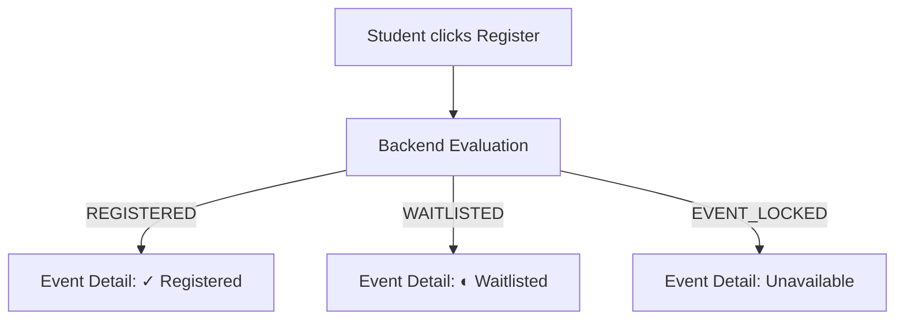
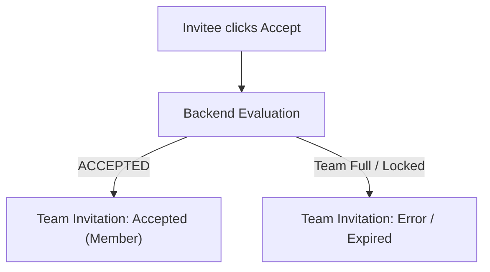

# Cross-Screen Consistency

This document defines the invariants, propagation rules, and real-time resolution behaviors that guarantee a consistent Student UX across the NST Events Web Application.

## 1. State Invariants
These rules must hold true everywhere. The UI must never render a state that violates these invariants.

- **Waitlist Promotion**: If a student is `WAITLISTED`, they are promoted to `REGISTERED` automatically when capacity opens. The UX must NOT require a manual "accept promotion" step.
- **Team Membership**: If an invitation is `ACCEPTED`, the student MUST be represented as a team member globally. 
- **Active Invitations**: If an invitation is `ACCEPTED`, `DECLINED`, `CANCELLED`, or `EXPIRED`, the student MUST NOT see an actionable Accept/Decline button.
- **Duplicate Registration**: If a student is `REGISTERED`, `Event Detail` MUST NOT show `REGISTER` as the primary action.
- **Dispute Singularity**: If a dispute is `PENDING`, `APPROVED`, or `REJECTED`, the student MUST NOT be offered another duplicate `Report an issue` action for the same session.
- **Web App Constraints**: The Student Web App is for viewing attendance history and managing exceptions. It MUST NOT contain any QR scanner, camera permission flow, or manual QR entry mechanism.
- **Club Membership Representation**: If a student is a `MEMBER`, the club MUST be represented consistently in `My Clubs`. If they are not a member, the UX must not falsely show membership. (Self-join is not supported).

## 2. Mutation Propagation
When a successful mutation occurs, the UI must update authoritatively.

- **Registration Success**: `Event Detail` updates immediately to `REGISTERED` or `WAITLISTED`. `My Events` adds the new commitment. `Home` reflects the upcoming commitment.
- **Accept/Decline Invitation**: The `Team Invitation` view updates to reflect the decision. `My Events` updates the team status. `Team` view (for all members) updates member counts.
- **Dispute Submission**: `Attendance History` updates to `PENDING`. `Event Detail` reflects that an issue is pending.
- **Cancellation**: `Event Detail` reverts to `Register` (if still open). `My Events` removes or archives the commitment.

## 3. Real-Time Consistency & Race Conditions
The backend is always the source of truth. The frontend must gracefully handle race conditions.

- **Event Capacity Race**: If the event fills during a student's registration attempt, the backend result (`WAITLISTED` or `Registration unavailable`) is authoritative. The UI MUST NOT display an optimistic `REGISTERED` state before the backend responds.

- **Team Full Race**: If a team fills while an invitee is accepting, the backend returns an error. The UI MUST reflect the error and transition the invitation to `EXPIRED`/`UNAVAILABLE`.

- **Event Lock State**: If an event is locked (`isLocked = true`) by an admin during a mutation, the backend rejects the mutation. The UI MUST reflect the lock state (e.g., `Registration unavailable`).
- **Waitlist Promotion (Real-Time)**: If the backend auto-promotes a waitlist, a `WAITLIST_PROMOTED` notification is generated. If the student is active in the app, `My Events` and `Event Detail` should eventually reflect `REGISTERED`.

## 4. Known Backend Ambiguities / Deliberate Limitations
- **No Self-Join for Clubs**: The backend Prisma schema only provisions `ClubMembership` via admin assignment (`DirectoryStatus` logic). The UI explicitly lacks a "Join Club" flow.
- **No Manual QR Check-in via Web**: `AttendanceMethod.QR` is strictly supported via external mobile/scanner clients. The Web App reads `AttendanceStatus` only.

## 5. Event Lifecycle vs. Student State
Do not mix Event Lifecycle (`EventState`) with Student Participation (`RegistrationStatus`).
- `PUBLISHED` is an event state.
- `REGISTERED` is a student state.
An event can be `PUBLISHED` while a student is `WAITLISTED`. These are separate dimensions.

## 6. Authoritative Terminology Rules
- Always use `Waitlisted` instead of `Queued` or `Pending`.
- Always use `Register / Registered` instead of `Enroll`, `Join event`, or `Registration complete`.
- Always use `Cancel registration` instead of `Leave event`.
- Never expose raw database enums (`WAITLIST_PROMOTED`, `PENDING_APPROVAL`, `EXCUSED`) to the student directly unless they match the approved vocabulary mapping.
