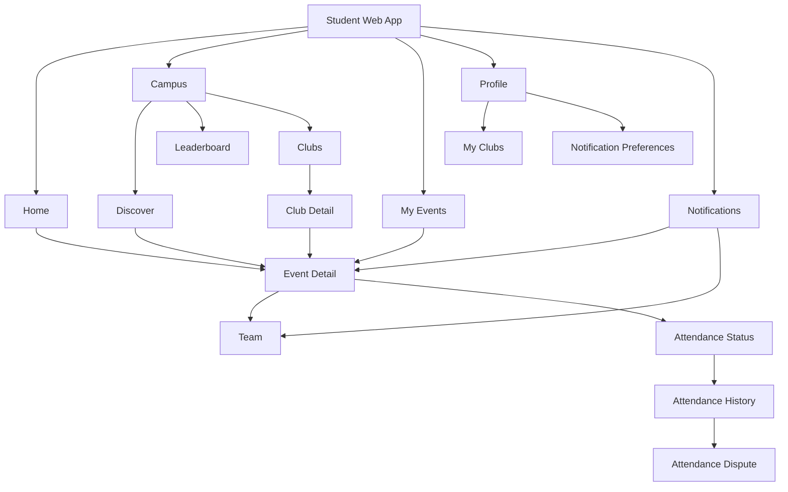

# Final Student Navigation Map

This document defines the authoritative navigation structure for the Student Web Application.

---

## Primary Navigation (Global Sidebar / Header)

These are the persistent, always-visible navigation destinations.

| Destination | Route | Mental Model |
|---|---|---|
| Home | `/dashboard` | "What matters to me right now?" |
| Campus | `/campus` | "What's happening around me?" |
| My Events | `/my-events` | "What am I committed to?" |
| Profile | `/profile` | "Who am I here?" |

**Global Overlay**: Notification Bell (accessible from any screen)

---

## Secondary Navigation (Sub-tabs within Primary)

### Campus
| Sub-tab | Route | Mental Model |
|---|---|---|
| Discover | `/campus/discover` | "What can I participate in?" |
| Leaderboard | `/campus/leaderboard` | "Where do I stand?" |
| Clubs | `/campus/clubs` | "What communities exist?" |

### My Events
| Sub-tab | Route | Mental Model |
|---|---|---|
| Upcoming | `/my-events/upcoming` | "What I'm definitely going to" |
| Waitlist | `/my-events/waitlist` | "What I'm hoping to get into" |
| Past | `/my-events/past` | "What I've already done" |

### Profile
| Sub-section | Route | Mental Model |
|---|---|---|
| My Clubs | `/profile/my-clubs` | "My communities" |
| Notification Preferences | `/profile/preferences` | "What do I want to hear about?" |

---

## Contextual Navigation (State-Driven, Not Primary)

These destinations are reached through context, not primary navigation.

| Destination | Entry Points | Route |
|---|---|---|
| Event Detail | Discover, My Events, Clubs, Notifications, Home | `/events/:id` |
| Club Detail | Campus → Clubs, Profile → My Clubs | `/clubs/:id` |
| Team | Event Detail (team events) | `/events/:id/teams/:teamId` |
| Team Invitation | Notifications, Home | Inline or `/events/:id` (with invitation context) |
| Attendance History | My Events → Past, Event Detail | `/users/me/attendance` or inline |
| Attendance Dispute | Attendance History | `/attendance/disputes/:id` |
| Notifications | Notification Bell (global) | `/notifications` |

---

## Interactions (Not Separate Screens)

These are embedded interactions, not navigation destinations.

| Interaction | Location | Type |
|---|---|---|
| Registration | Event Detail | Confirmation dialog |
| Cancel Registration | Event Detail | Confirmation dialog |
| Accept / Decline Invitation | Team Invitation card | Inline action |
| Leave Team | Team view | Confirmation dialog |
| Transfer Leadership | Team view | Confirmation dialog |
| Submit Dispute | Attendance History | Form / dialog |
| Update Notification Preferences | Preferences screen | Toggle controls |

---

## Navigation Map

---

## Deep Links

The application must support direct URL access to:

| Resource | URL Pattern | Auth Required |
|---|---|---|
| Event Detail | `/events/:id` | Yes |
| Club Detail | `/clubs/:id` | Yes |
| Notifications | `/notifications` | Yes |
| Profile | `/profile` | Yes |

If the user is unauthenticated, redirect to login and return to the original destination on success.

---

## Implementation Note (CURRENT vs PLANNED)

> **CURRENT**: The existing `apps/dashboard` implements admin/organizer routes under `(app)`. The Student Web App routes described here are **PLANNED** — students currently see a `/student-access` placeholder. The navigation structure above is the target architecture for the student experience.
