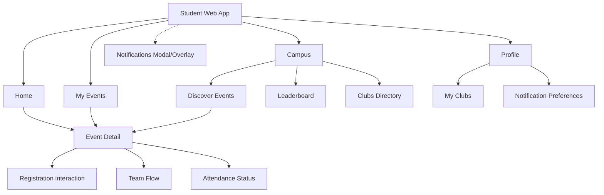

# Student Information Architecture

This document contains the definitive information architecture for the NST Events Student Web Application, based directly on the backend capabilities mapped from the Prisma schema and Express routers.

## 1. Top-Level Structure

The student web app is divided into four primary areas, selected to align with student goals rather than administrative concepts.

1. **Home**: The active, time-sensitive action center.
2. **Campus**: The discovery hub for the broader community.
3. **My Events**: The personal commitment log.
4. **Profile**: Settings and identity.

## 2. Global Navigation Diagram

## 3. Area Definitions

### Home
- **Why it exists**: To answer "What do I need to do right now?"
- **Capabilities**: View active attendance sessions for registered events, review pending team invitations, see newly promoted waitlist items, and view upcoming chronological commitments.
- **Next steps**: Check into an event, accept an invite, or view event details.

### Campus
- **Why it exists**: To answer "What's happening around me?"
- **Capabilities**: Browse all `PUBLISHED` events, view active clubs, and check the global student/club leaderboards.
- **Next steps**: Navigate to Event Detail, view Club details, or filter leaderboards.

### My Events
- **Why it exists**: To answer "What have I committed to?"
- **Capabilities**: View a historical and future log of all event registrations (`REGISTERED`, `WAITLISTED`, `CANCELLED`).
- **Next steps**: Cancel a registration, file an attendance dispute, or manage a team roster.

### Profile
- **Why it exists**: To answer "Who am I in the system?"
- **Capabilities**: View read-only identity data (Name, Batch), view assigned Club Memberships (read-only), and toggle Notification Preferences (Push/Email for specific categories).
- **Next steps**: Logout, or navigate to a specific club from "My Clubs".
