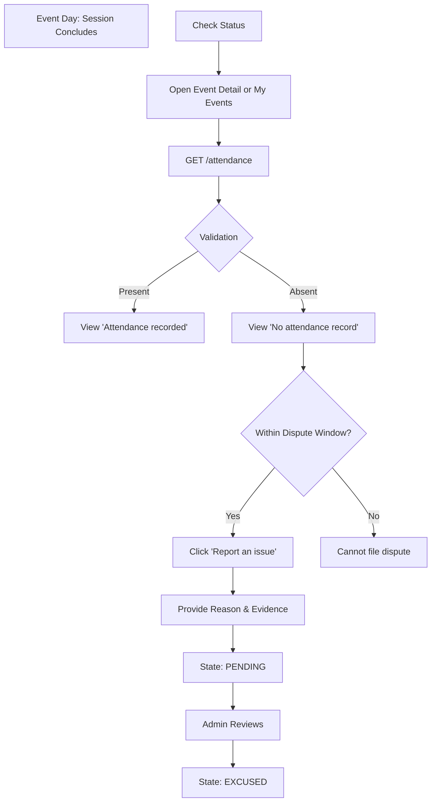

# Attendance & Dispute Journey

This journey maps the student experience for checking attendance outcomes and filing a dispute when an error occurs.

*Note: The physical check-in and QR scanning occur externally. The Web App reflects the results.*

## Backend References
- **Routes**: `GET /users/me/attendance`, `POST /attendance/disputes`
- **Models**: `AttendanceRecord`, `AttendanceDispute`
