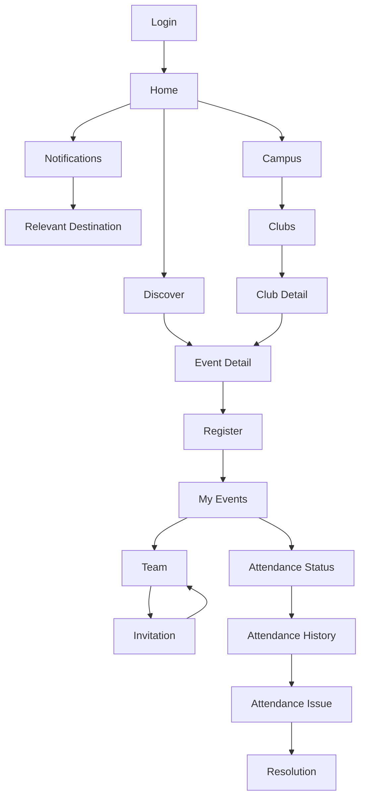

# Student Day-in-the-Life UX Audit

## 1. Purpose

The Day-in-the-Life audit validates whether the individual student screens actually work together as one coherent product.

Do not treat the screens as isolated specifications.

Simulate realistic student behavior and identify:

```text
Unnecessary screens
Unnecessary decisions
Repeated information
Hidden actions
Context loss
Confusing states
Excessive clicks
Dead ends
Inconsistent terminology
```

The objective is to make the complete product feel effortless.

---

## 2. Core Audit Principle

For every journey, ask:

```text
Can we remove a screen?
Can we remove a decision?
Can we prefill something?
Can we surface the action earlier?
Can we avoid making the student remember something?
Can we preserve their context?
Can we show the answer before they ask for it?
```

---

## 3. Realistic Student Scenarios

### Day 1 — Nothing Planned

```text
Open app
→ Home
→ Discover
→ Find interesting event
→ Event Detail
→ Register
→ Confirmation
→ Registered
→ My Events
```

Evaluate whether the student can go from opening the app to having a clear upcoming commitment with minimum interaction.

Questions:

```text
Can the student discover something useful immediately?
Is the event worth opening based on the Discover card alone?
Does Event Detail answer all commitment questions before registration?
Is registration confirmation concise?
Does the new commitment immediately appear in My Events?
```

---

## 4. Day 2 — Team Event

```text
Receive team invitation
→ Open invitation
→ Understand inviter/team/event
→ Accept
→ Team
→ See current team state
→ Invite members if necessary
→ Team becomes ready
```

Evaluate:

```text
Can the student understand the invitation without opening multiple pages?
Is Accept a one-decision interaction?
Does accepting immediately establish team membership?
Does Team immediately explain whether the team is ready?
Can the student invite another person with minimal interaction?
```

---

## 5. Day 3 — Normal Participation

```text
Open app
→ Home
→ My Events
→ Upcoming event
→ Event Detail
→ Attend physically
→ Attendance later appears as recorded
```

The web application does not perform QR scanning.

The student should only use the web application to understand their resulting attendance state.

Evaluate:

```text
Does the student know what they are attending?
Does the student know their attendance was recorded?
Is attendance status visible without searching through the application?
```

---

## 6. Day 4 — Attendance Problem

```text
Open My Events / Attendance
→ Find event
→ See attendance problem
→ Check eligibility
→ Report issue
→ Submit
→ PENDING
→ Receive resolution
→ View result
```

Evaluate:

```text
Can the student immediately identify the problematic record?
Is Report an Issue available only when appropriate?
Does the form ask only for information genuinely required?
Does the student understand what happens after submission?
Can they find the resolution without searching?
```

---

## 7. Day 5 — Waitlist

```text
Discover event
→ Event Detail
→ Join waitlist
→ WAITLISTED
→ Capacity opens
→ Automatic promotion
→ Notification
→ REGISTERED
→ My Events
```

Evaluate:

```text
Does the student understand that no further action is required?
Does the promotion feel automatic?
Does the notification clearly explain the change?
Does the event move naturally from Waiting to Next?
```

There should be no manual "accept your place" step.

---

## 8. Day 6 — Campus Exploration

```text
Campus
→ Clubs
→ Browse communities
→ Find interesting club
→ Club Detail
→ See NEXT UP
→ Open event
→ Event Detail
→ Participate
```

Evaluate:

```text
Does the club feel active?
Can the student understand what the club does quickly?
Can they see what the club is doing next?
Can they move naturally from club discovery to event participation?
```

---

## 9. Day 7 — Returning Student

The student simply opens the application.

```text
Open app
→ Home
```

The Home screen should immediately communicate:

```text
What needs my attention?
What am I doing next?
Is anything waiting for me?
What is worth discovering?
```

The student should not need to manually inspect every section.

---

## 10. Notification Journey

Test notifications independently.

```text
Event occurs
→ Notification arrives
→ Student opens notification
→ Exact relevant destination
→ Student completes action
```

Examples:

```text
Team invitation
→ Team Invitation

Waitlist promotion
→ Event Detail / My Events

Attendance-related update
→ Attendance context

Dispute resolution
→ Dispute / Attendance context
```

The student should never land on a generic page and have to search for the thing mentioned in the notification.

---

## 11. Shared Event URL

Test:

```text
Student receives event link
→ Opens URL
→ Not authenticated
→ Login
→ Google
→ Original Event Detail
```

After authentication, the student should return to the intended event whenever the architecture safely supports deep-link preservation.

---

## 12. Session Expiration

Test:

```text
Student is using the application
→ Session expires
→ Login
→ Authentication
→ Return to intended destination
```

The student should not lose context unnecessarily.

No technical session/token terminology should appear.

---

## 13. Concurrent Team Change

Test:

```text
Student opens Team
→ Another member accepts invitation
→ Team updates
→ Student sees new member
→ Member count/readiness updates
```

The interface should not require unnecessary manual refreshing where realtime support exists.

---

## 14. Event Capacity Race

Test:

```text
Student opens Event Detail
→ Event shows available
→ Student clicks Register
→ Another student takes final spot
→ Backend responds
```

The UI must use the backend result as authoritative.

Possible result:

```text
REGISTERED
or
WAITLISTED
```

The application must never display a false registered state.

---

## 15. Dispute Resolution While App Is Open

Test:

```text
Student has PENDING dispute
→ Student remains in application
→ Backend resolves dispute
→ Student receives update
→ Attendance/dispute state changes
```

The update should appear naturally without forcing an unrelated navigation event.

---

## 16. Student Information Memory Test

For every major workflow ask:

```text
Does the student have to remember something from a previous screen?
```

Good:

```text
Event Detail already contains event context.
Team already contains event context.
Notification contains relevant event/team context.
```

Bad:

```text
"Go back and remember which event you opened."
```

The interface should carry context forward.

---

## 17. Click Reduction Audit

For every common journey, count meaningful interactions.

Target:

```text
Discover → Event Detail → Register → Confirm
```

rather than:

```text
Discover
→ Event
→ Registration
→ Registration Details
→ Confirmation
→ Success
→ My Events
```

Similarly:

```text
Notification → Invitation → Accept → Team
```

rather than:

```text
Notification
→ Notifications
→ Team
→ Invitation
→ Team Detail
→ Accept
→ Back
```

---

## 18. Decision Reduction Audit

Every screen should minimize unnecessary decisions.

Ask:

```text
Does the student need to choose?
Can the system already know?
Can the application infer the next action?
Can one default be used?
Can irrelevant options disappear?
```

Example:

```text
Attendance open
→ show Check In contextually
```

instead of:

```text
Student decides whether to navigate to Attendance
→ finds event
→ searches for session
```

The web application does not perform the physical check-in, so this principle applies to attendance status rather than QR scanning.

---

## 19. Context Preservation Audit

Verify:

```text
Discover search preserved
Discover filters preserved
My Events tab preserved
Club context preserved
Event context preserved
Team context preserved
Notification destination preserved
Deep-link destination preserved
```

The student's previous context should survive normal browser navigation wherever technically appropriate.

---

## 20. State Consistency Audit

A state change should propagate across every relevant surface.

Example:

```text
WAITLISTED
```

appears consistently as:

```text
Event Detail → WAITLISTED
My Events → WAITING
Notification → You're now on the waitlist
```

After promotion:

```text
REGISTERED
```

appears consistently as:

```text
Event Detail → REGISTERED
My Events → NEXT
Notification → You're in
```

Do the same for:

```text
Team membership
Attendance
Disputes
Notifications
Club membership
```

---

## 21. Terminology Audit

The same state should have one student-facing name everywhere.

Prefer:

```text
Registered
Waitlisted
Attendance recorded
Attendance issue
Under review
Approved
Rejected
Member
```

Avoid multiple competing labels for the same concept.

Never expose backend enums directly.

---

## 22. Action Hierarchy Audit

Every screen should answer:

```text
What's the most important thing I can do now?
```

There should generally be:

```text
One primary action
Few secondary actions
No irrelevant actions
```

Examples:

```text
Event not registered
→ Register

Team incomplete
→ Invite members

Invitation
→ Accept

Attendance issue
→ Report issue
```

---

## 23. Dead-End Audit

Walk through every possible state and verify that the student has somewhere sensible to go.

Examples:

```text
Event unavailable
→ Back to Discover

Invitation expired
→ Return to origin

Dispute rejected
→ View resolution

No clubs
→ Explore Clubs

No upcoming events
→ Discover Events
```

There should be no screen that leaves the student asking:

> "Now what?"

---

## 24. Empty-State Audit

Verify:

```text
No events
No waitlisted events
No past events
No clubs
No notifications
No attendance records
No disputes
```

Every empty state should either:

```text
explain the situation
```

or:

```text
provide a useful next action
```

but never invent activity.

---

## 25. Error-Recovery Audit

For every mutation:

```text
Submit
↓
Failure
↓
Can the student recover?
```

Verify:

```text
Registration failure
Team action failure
Invitation failure
Preference failure
Dispute submission failure
```

The student should understand:

```text
Did it succeed?
Did it fail?
Was anything changed?
What can I do next?
```

---

## 26. Realtime Audit

For each realtime-supported transition:

```text
Backend change
→ Student-visible change
```

Verify:

```text
Waitlist promotion
Attendance state
Dispute resolution
Team changes
Notification arrival
```

Do not add realtime behavior where the backend does not support it.

---

## 27. Student Effort Score

For each common journey, evaluate:

```text
Clicks
Decisions
Screens visited
Information remembered
Waiting points
Potential confusion
Recovery difficulty
```

Classify each journey:

```text
Excellent
Acceptable
Needs optimization
```

The target should be:

```text
Few screens
Few decisions
Clear state
Obvious next step
```

---

## 28. Final "Student Day" Test

A complete final simulation should look like:



The audit should prove that all of these experiences feel like one product.

---

## 29. Final Optimization Questions

Before declaring the student UX complete, ask:

```text
Can the student understand Home in seconds?

Can they discover an event without confusion?

Can they decide whether to participate without missing important information?

Can they register with minimum interaction?

Can they understand waitlist behavior without anxiety?

Can they manage a team without learning the backend model?

Can notifications take them directly to useful actions?

Can they verify attendance without needing the web app to perform check-in?

Can they report an attendance issue without bureaucracy?

Can they understand the result of every important action?

Can they recover from failure?

Can they navigate backwards without losing context?

Can they return tomorrow and immediately understand what matters?
```

---

## 30. Final Quality Bar

The finished student experience should feel like:

```text
OPEN
↓
UNDERSTAND
↓
ACT
↓
KNOW THE RESULT
```

not:

```text
OPEN
↓
SEARCH
↓
FIGURE OUT WHERE TO GO
↓
FIND THE RIGHT SCREEN
↓
UNDERSTAND TECHNICAL STATES
↓
ACT
↓
HOPE IT WORKED
```

The final UX should remove as much thinking as possible from routine student interactions while preserving complete visibility into the student's own state.

---

## 31. Final Deliverable

After performing this audit, create:

```text
ux/student/journeys/
├── new-student.md
├── normal-day.md
├── team-event.md
├── attendance-problem.md
├── waitlist.md
└── returning-student.md
```

Each journey should include:

```text
Scenario
Student goal
Starting state
Exact path
Screens visited
Actions
Backend state changes
Realtime changes
Notifications
Potential failures
Recovery
UX optimization opportunities
```

The final document must explicitly list every unnecessary interaction discovered during the audit and the recommended reduction.
