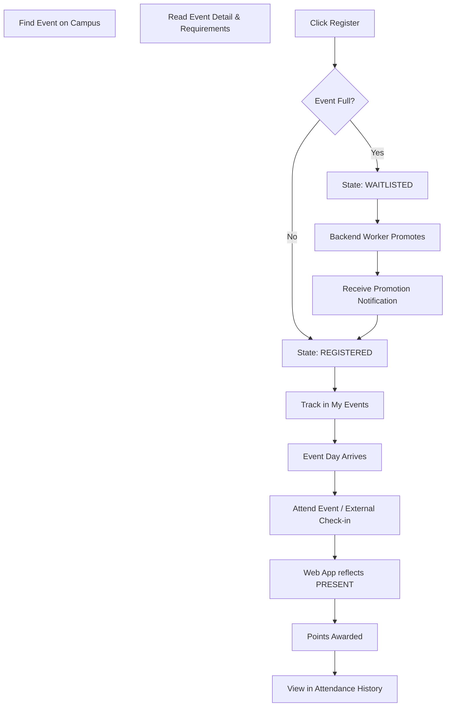

# Event Participation Journey

This journey maps the standard end-to-end flow for participating in a solo event, including waitlisting and attendance.

## Backend References
- **Routes**: `POST /events/:id/register`, `GET /users/me/attendance`
- **Models**: `EventRegistration`, `AttendanceRecord`, `Notification`
- **Workers**: `NotificationJob` for asynchronous waitlist promotion.
