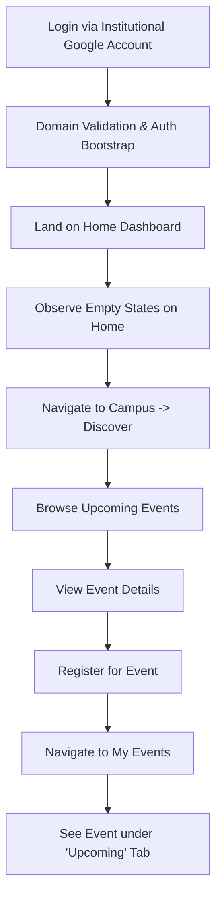

# New Student Journey

This journey maps the end-to-end experience of a student interacting with the NST Events web application for the very first time.

## Backend References
- **Routes**: `GET /auth/google`, `GET /users/me`, `GET /events`, `POST /events/:id/register`
- **Logic**: The `AuthorizedStudent` model validates the domain. If valid, the `User` is created with a `STUDENT` global role and a fresh session.
