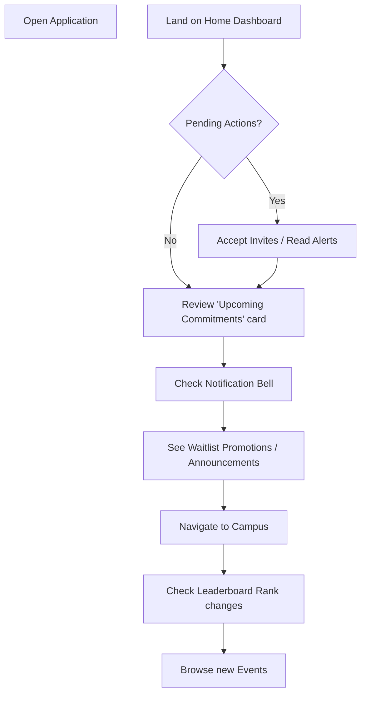

# Returning Student Journey

This journey maps the experience of an active student opening the application on a typical day.

## Backend References
- **Routes**: `GET /users/me/team-invitations`, `GET /users/me/registrations`, `GET /notifications`, `GET /leaderboard/students`
- **UX Goal**: The Home screen immediately captures attention if action is required, otherwise seamlessly transitions the student into community discovery.
