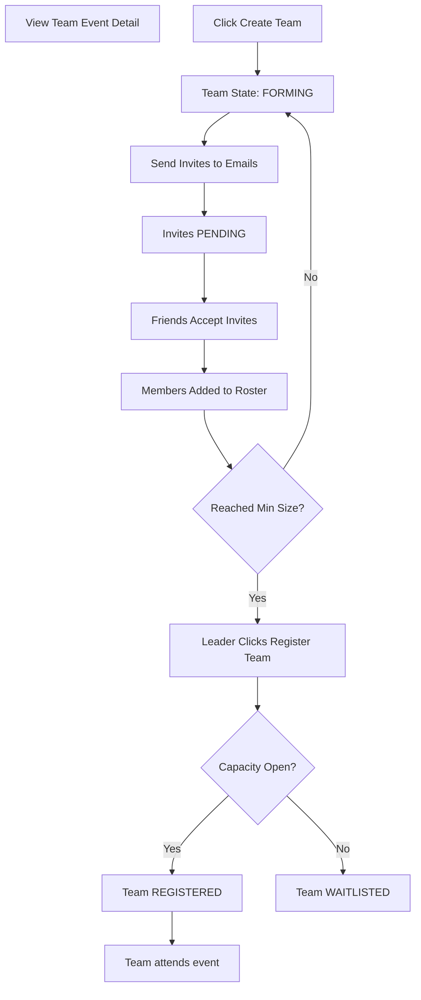

# Team Event Journey

This journey maps the complex flow required to participate in an event with `registrationType === TEAM`.

## Backend References
- **Routes**: `POST /events/:id/teams`, `POST /teams/:id/invitations`, `POST /teams/:id/invitations/:invId/accept`
- **Models**: `Team`, `TeamInvitation`, `EventRegistration`
- **Constraints**: Minimum size validation occurs on the API during the final `POST /teams/:id/register` (or equivalent team promotion) action.
