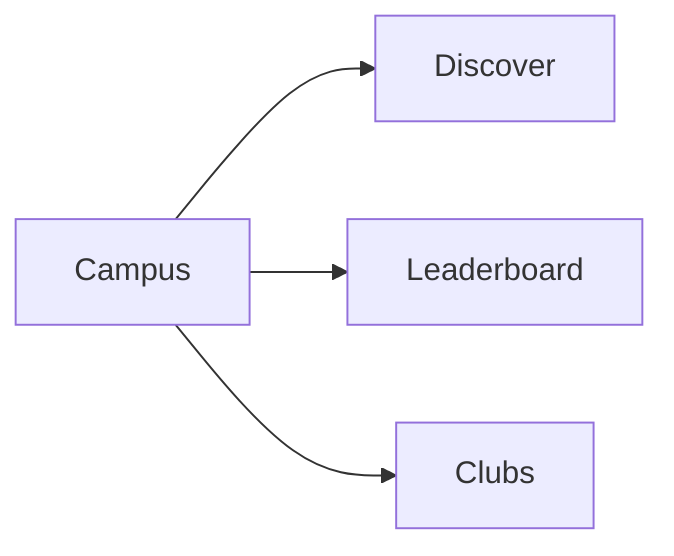
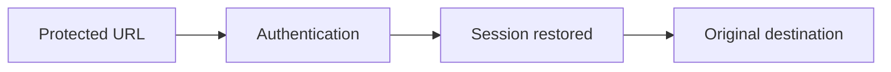

# Student Web UX — Global Student App Shell

## 1. Product Job

The global shell provides orientation and continuity across the entire student web application.

Its job is to make the student always understand:

```text
Where am I?
What can I do here?
How do I get somewhere else?
How do I get back?
```

The shell should disappear into the experience rather than compete with it.

---

## 2. Core Navigation Model

Primary navigation contains only the places students regularly go:

```text
Home
Campus
My Events
Profile
```

Everything else is contextual.

```text
PRIMARY NAVIGATION
= places

CONTEXTUAL NAVIGATION
= actions
```

---

## 3. Primary Navigation

Recommended desktop structure:

```text
┌─────────────────────┐
│ NST Events          │
│                     │
│ ● Home              │
│                     │
│ Campus              │
│                     │
│ My Events           │
│                     │
│ Profile             │
└─────────────────────┘
```

Campus contains:

```text
Discover
Leaderboard
Clubs
```

These are not separate global destinations.

---

## 4. Global Header

The header provides persistent high-value utilities.

```text
┌──────────────────────────────────────────────────────────────┐
│ NST Events                              🔔      Avatar       │
└──────────────────────────────────────────────────────────────┘
```

Primary controls:

```text
Notifications
Profile
```

Do not duplicate the primary navigation in the header.

---

## 5. Notification Access

The notification icon is always available inside authenticated app chrome.

Unread state:

```text
🔔 3
```

or:

```text
🔔 ●
```

The exact treatment depends on the design system.

Clicking opens:

```text
Notifications
```

Notifications themselves deep-link into contextual destinations.

---

## 6. Profile Access

The student's avatar/name opens:

```text
Profile
```

Do not use a large profile dropdown containing every setting.

Profile is a destination.

---

## 7. Campus Navigation

Campus is an internal navigation group:

```text
Campus
├── Discover
├── Leaderboard
└── Clubs
```

The active Campus destination must be obvious.

The student should feel like they are moving between views of the same campus rather than entering three unrelated products.



---

## 8. Contextual Navigation

Major workflows should not become global navigation items.

Examples:

```text
Event Detail
→ Registration
→ Team
→ Attendance
→ Dispute
```

```text
Club Detail
→ Event Detail
```

```text
Notification
→ Team / Event / Attendance / Dispute
```

This keeps the primary navigation small.

---

## 9. Event Context

When entering a deeper workflow, preserve context.

Example:

```text
Discover
↓
AI/ML Workshop
↓
Team
```

The Team experience should still identify:

```text
AI/ML Workshop
```

The student should never feel like they left the event ecosystem.

---

## 10. Back Navigation

Every deep experience must provide a clear way back.

Examples:

```text
Event Detail
← Discover
```

```text
Team
← Event
```

```text
Club Detail
← Clubs
```

```text
Notification Preferences
← Profile
```

Back navigation should preserve the student's previous context where practical.

---

## 11. Browser Navigation

The web application must respect browser expectations.

Example:

```text
Discover
→ Search "hackathon"
→ Filter
→ Event Detail
→ Browser Back
```

should return to:

```text
Search "hackathon"
+ same filter
+ previous browsing context
```

Do not reset users unnecessarily.

---

## 12. URL State

Persist meaningful navigation state in the URL where appropriate.

Examples:

```text
/campus/discover?q=hackathon
/campus/clubs?q=coding
/my-events?tab=waiting
```

Do not put transient UI state in URLs.

---

## 13. Deep Links

A student should be able to arrive directly at a meaningful experience.

Examples:

```text
Notification
→ Event Detail

Notification
→ Team Invitation

Notification
→ Dispute

Shared event URL
→ Event Detail
```

The destination must work independently of how the student arrived there.

---

## 14. Authentication + Deep Link

For protected deep links:



Do not force the student to navigate manually back to the destination after signing in if the intended destination can safely be preserved.

---

## 15. Global Context Rules

The shell should preserve these concepts consistently:

```text
Current student
Current event
Current team
Current club
Current notification state
```

The application should not lose context simply because the student navigated deeper.

---

## 16. Contextual Action Principle

Actions should appear where they are relevant.

Examples:

```text
Event Detail
→ Register

Registered Event
→ Check attendance status

Team
→ Invite member

Attendance History
→ Report issue
```

Do not create global navigation for these actions.

---

## 17. Action Priority

Within a screen:

```text
Primary action
↓
Secondary action
↓
Destructive / low-frequency action
```

The shell must not compete with page-level primary actions.

---

## 18. Global Feedback

The shell should support lightweight feedback for mutations.

Examples:

```text
Registration successful
Team invitation sent
Preferences saved
Dispute submitted
```

Feedback should be:

```text
clear
brief
non-blocking
contextual
```

Avoid unnecessary global modals.

---

## 19. Loading Transitions

Navigation should remain stable while content changes.

Prefer:

```text
Stable shell
+
page skeleton
```

over:

```text
Blank screen
+
large spinner
```

The student should always retain orientation.

---

## 20. Error Handling

Errors should be scoped to the failed experience.

Example:

```text
Event list failed
→ Discover shows Retry
```

not:

```text
Entire application becomes an error page
```

The shell should remain usable unless authentication/session failure prevents access.

---

## 21. Session Expiration

If authentication expires:

```text
Authenticated screen
↓
Session invalid
↓
Login
```

The student should receive a clear, non-technical explanation.

Where possible:

```text
Login
↓
Restore intended destination
```

---

## 22. Logout

Logout belongs inside Profile.

After logout:

```text
Session ends
↓
Authenticated shell disappears
↓
Login
```

No authenticated navigation should remain accessible.

---

## 23. Responsive Navigation

### Desktop

Persistent sidebar:

```text
Home
Campus
My Events
Profile
```

### Mobile Web

Use a compact navigation model.

Recommended:

```text
Home
Campus
My Events
Profile
```

as the primary mobile destinations.

The header retains:

```text
NST Events
Notifications
```

The exact mobile implementation can be bottom navigation, compact header navigation, or another established pattern, but it must preserve the same information architecture.

---

## 24. Mobile Contextual Navigation

When inside a deep workflow:

```text
Event
Team
Attendance
Dispute
```

do not show the entire application navigation as competing content.

Prioritize:

```text
Back
Page context
Primary action
```

---

## 25. Breadcrumbs

Breadcrumbs should be used selectively.

Useful examples:

```text
Campus / Discover / Event
```

Less useful:

```text
Home / Campus / Clubs / Coding Club / Event
```

Do not turn breadcrumbs into visual noise on mobile.

For mobile, a simple back action is usually better.

---

## 26. Current Location

The navigation must clearly identify the current top-level destination.

Examples:

```text
Home     ← active
Campus
My Events
Profile
```

Inside Campus:

```text
Discover ← active
Leaderboard
Clubs
```

The student should never need to infer location from page content alone.

---

## 27. Cross-Screen State Consistency

The same student state must be reflected consistently.

Example:

```text
Event Detail
REGISTERED
        ↓
My Events
REGISTERED
        ↓
Home
Upcoming event
        ↓
Notification
You're registered
```

Similarly:

```text
WAITLISTED
→ promoted
→ REGISTERED
```

should eventually be reflected throughout the application.

---

## 28. Team State Consistency

A team change should propagate to relevant screens.

Example:

```text
Team
3 / 4 members
        ↓
My Events
Merge Conflicts · 3 / 4
        ↓
Event Detail
View Team
```

No screen should continue displaying stale membership information after confirmed backend changes.

---

## 29. Attendance State Consistency

Attendance is reflected across:

```text
Home
My Events
Event Detail
Attendance History
```

Example:

```text
Before:
REGISTERED

After attendance is recorded:
ATTENDANCE RECORDED
```

The scanner/check-in mechanism is outside the Student Web App.

---

## 30. Notification State Consistency

When a notification is opened:

```text
Notification
↓
read state
↓
destination
```

The global unread indicator should update consistently with the persisted notification state.

---

## 31. Global Empty-State Philosophy

Empty states should explain what the student can do next where useful.

Examples:

```text
My Events
→ Discover events

My Clubs
→ Explore clubs

Notifications
→ You're all caught up
```

Don't create empty-state CTAs when there is genuinely nothing useful to do.

---

## 32. Global Error Philosophy

Never expose implementation details.

Avoid:

```text
HTTP 403
JWT expired
RPC failed
RLS denied
```

Prefer:

```text
You no longer have access to this.
Your session has expired.
Couldn't load this page.
```

Use more specific language only when it helps the student recover.

---

## 33. Global Accessibility

The shell must provide:

```text
Keyboard navigation
Visible focus
Semantic navigation
Clear current-page state
Accessible notification indicator
Accessible profile control
Accessible mobile navigation
```

Primary navigation must remain understandable to assistive technology.

---

## 34. Global Visual Hierarchy

The shell should remain visually subordinate to the page.

Priority:

```text
Page content
↓
Primary action
↓
Contextual navigation
↓
Global navigation
```

The sidebar and header should provide orientation, not dominate the experience.

---

## 35. Final Shell Architecture

```text
NST EVENTS
│
├── Global Header
│   ├── Notifications
│   └── Profile
│
└── Primary Navigation
    ├── Home
    ├── Campus
    │   ├── Discover
    │   ├── Leaderboard
    │   └── Clubs
    ├── My Events
    └── Profile
        ├── My Clubs
        └── Notification Preferences
```

Contextual experiences remain outside the primary navigation:

```text
Event
├── Registration
├── Team
├── Attendance
└── Dispute

Club
└── Event

Notification
└── Relevant destination
```

---

## 36. Core Product Principle

The shell should make the application feel like one coherent campus product.

The student should always know:

```text
Where am I?
↓
What am I doing?
↓
What is my next action?
↓
How do I get back?
```

without thinking about the navigation system itself.

---

## 37. Backend / Frontend Contract

Before implementation, verify:

```text
Authentication state
Current-user context
Notification unread state
Deep-link routing
Existing route architecture
Browser history behavior
Responsive navigation architecture
Realtime state propagation
Session expiration behavior
```

The final implementation should preserve the UX model across every student workflow.
